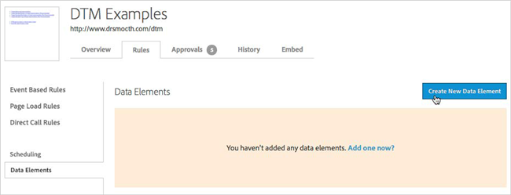
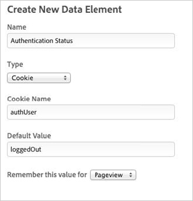

# Adding Data Elements{#adding-data-elements}

Information to help you add dynamic tag management data elements.

1. In the **[!UICONTROL Rules]** section, select **[!UICONTROL Data Elements]** in the left navigation.
1. Click **[!UICONTROL Create New Data Element]**.

   

1. Name the data element.
1. Choose the date element type.

   Note that you can build an element based on any available object, element, cookie, or URL parameter. The [!DNL Custom Script] option lets you enter your own code to build the element. 
1. Complete the remaining fields, which vary depending on the type of data element.
1. Choose the persistency of the data element value: [!DNL Pageview], [!DNL Session], or [!DNL Visitor].
1. Save the data element.
1. Follow the instructions in [QA, Approval, and Deployal Steps](../../../qa-approval-deployal-steps/qa-approval-deployal-steps.md#concept-8e4631e9f3c440edac488139576849ba).
>The example below creates a data element called “Authentication Status” to reflect whether the visitor is “loggedIn” or “loggedOut.” The website sets a cookie “authUser=loggedIn” when the visitor logs in. The data element uses a default value of “loggedOut” to represent the visitor’s status when the “authUser” cookie is not set. Note that the value is remembered only for the Pageview—as soon as the visitor logs in, the data element can change from “loggedOut” to “loggedIn.” This data element could be used to populate an mbox parameter with similar information or as a rule condition to trigger mbox calls. 
>
>>

