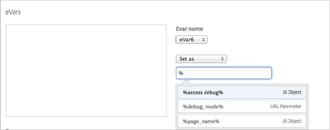

# Using Data Elements{#using-data-elements}

Information to help you use dynamic tag management data elements in your Target implementation.

You can use data elements in the rule-editing interface by using the percent sign (%) syntax. Type a percent sign into the field and you will see a drop-down menu appear with the data elements that you created.



You can use data elements in custom scripts by using the `_satellite` object syntax: 

```
_satellite.getVar('data element name');
```

