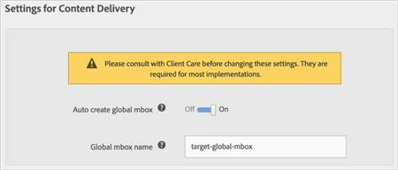

# Global Mbox{#global-mbox}

Information about creating a global mbox using dynamic tag management.

For most [!DNL Target] customers, your main mbox is automatically included in your [!DNL mbox.js] file. If you need an Order Confirmation mbox to track orders, see [Order Confirmation Mbox](../../../adobe-target-tool/configure-target-tool/mboxes/order-confirmation-mbox.md#concept-b3ff6e1b0df14965bdd16d75a5d92dad).

[!DNL Dynamic tag management] is great for placing a top-of-page, empty mbox globally across every page of your site. This type of mbox can be used in both the [!DNL Target Classic] and the new [!DNL Target] user interfaces.

In the [!DNL Target] interface, on the **[!UICONTROL Setup]** > **[!UICONTROL Implementation]** > **[!UICONTROL Edit Mbox.js Settings]** page, ensure that the **[!UICONTROL Auto Create Global Mbox]** option is enabled. When you import the library into DTM using one of the automatic options, it will contain all of the settings from the [!DNL Target] UI.

For more information about the automatic options, see:

* [Option 1: Implement Target Automatically via the Marketing Cloud (Easiest and Recommended)](../../../adobe-target-tool/step-1-add-adobe-target-tool/t-implementing-target-automatically-via-marketing-cloud.md#task-03e9936791684888bf6edd9490c3b975) 
* [Option 2: Implement Target Automatically with Manual Entry of Your Target Client Code](../../../adobe-target-tool/step-1-add-adobe-target-tool/t-implementing-target-automatically-client-code.md#task-388935898be843909bc4701aae8fec47)

Be sure to update the Adobe Target Tool in DTM after making any changes to these settings. For more information, see [Update the Adobe Target Tool](../../../adobe-target-tool/update-target-tool.md#concept-4cef117ee3be4be589f03fafdb38eeeb). 
