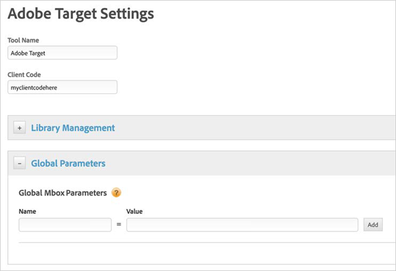
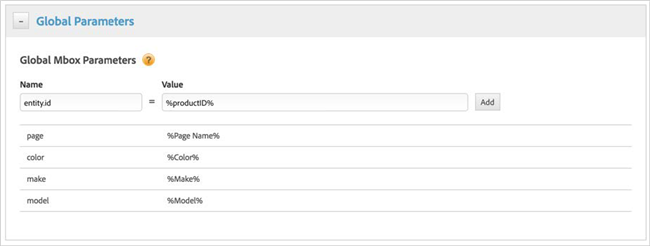
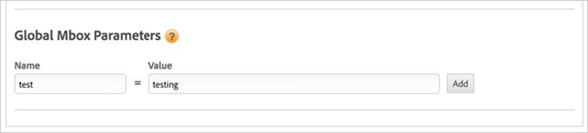
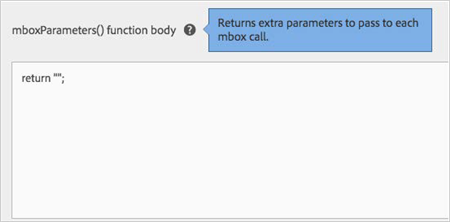

# Mbox Parameters{#mbox-parameters}

Information to help you pass parameters with mbox calls to Adobe Target.

Parameters can be passed with mbox calls to provide rich data to your [!DNL Target] implementation for segmentation and targeting. This section shows you how to enrich your implementation via DTM.

## Adding Parameters to the Auto-Generated Global Mbox {#section-3c8c64a6b5eb42aa8b7c2d4bf0d04427}

<!-- 

Can't figure out which video this is referring to. Commenting out because iframe videos not supported -Bob

This video explains how to add mbox parameters using DTM.

<table id="table_C56F4BE9B867463380013C584D97DAD2"> 
 <thead> 
  <tr> 
   <th class="entry" colspan="2"> Adding mbox Parameters via Activation (DTM) </th> 
   <th colname="col3" class="entry"> 4:25 </th> 
  </tr>
 </thead>
 <tbody> 
  <tr> 
   <td colspan="2"> 
 
     
 
      <iframe src="" frameborder="0" webkitallowfullscreen="true" mozallowfullscreen="true" oallowfullscreen="true" msallowfullscreen="true" allowfullscreen="allowfullscreen" scrolling="no" width="550" height="345"></iframe>
     
 
 </td> 
   <td colname="col3"> 
 
     <ul id="ul_B17C3EFA4B664415AE0159E418FF45C4"> 
      <li id="li_916224D2105348BE93D60015B2F43D4F">Map a static name/value pair to a parameter or profile parameter in the target-global-mbox </li> 
      <li id="li_0FED234A3A054DEAB62C4F58BAB47F7F">understand the basics of a data element </li> 
      <li id="li_6C4D1871E45D40118D7D9D4DF81547B5">Map a dynamic data element value to a parameter or profile parameter in the target-global-mbox </li> 
     </ul> 
 </td> 
  </tr> 
 </tbody> 
</table>
-->

1. On the [!DNL Target Tool] settings page (click the gear icon next to the Adobe Target tool on the [!DNL Overview] page of your property), then expand the **[!UICONTROL Global Parameters]** section:

   

1. Enter the name and value of the parameter(s) you’d like to add to the auto-created global mbox.

    * These global parameters work only with the auto-created global mbox, generated by [!DNL mbox.js]. 
    * Using single or double quotes (' or ") are not allowed in the [!DNL Name] field. 
    * Type % into the value box to auto-suggest any data elements that you’ve already defined.

1. When you’re done defining each global mbox parameter, click **[!UICONTROL Add]**.

   

1. Click **[!UICONTROL Save Changes]**.

## Adding Parameters to the Auto-Generated Global Mbox on Specific Pages {#section-f70f77c5445d4d75b0831d49d91e0d08}

If you want to only include global parameters on specific pages, you can set up a page load rule and add specific global parameters that will fire only with that page-load rule. A common example of this is with a [!DNL Recommendations] implementation where you want to pass entity parameters only on your product details pages.

>[!NOTE]
>
>When a specific page loads, if you have both global mbox parameters set up for all pages and global mbox parameters set up within page- load rules, both sets of parameters are added to the mbox request.

1. Begin by creating a page-load rule. Or use an existing rule.

   See the first four steps in [Wrapping Mboxes](../../../adobe-target-tool/configure-target-tool/mboxes/wrapping-mboxes.md#concept-2820db4642684528a4f24a35a79c362e) for instructions on creating a new page-load rule. 

1. Expand the **[!UICONTROL Adobe Target]** section and enter your global mbox parameter name(s) and value(s) in the **[!UICONTROL Global Mbox Parameters]** section. Leave the rest of the fields in the section as is.

   

1. Click **[!UICONTROL Add]** after entering the information for each parameter. 
1. Click **[!UICONTROL Save Rule]**.

## Using the DTM Interface for DTM-Placed Wrapping Mboxes {#section-40326d1797c24f0da227d0c282a39eac}

For DTM-placed wrapping mboxes, the user interface provides an intuitive, marketer-friendly way to add dynamic mbox parameters.

See [Wrapping Mboxes](../../../adobe-target-tool/configure-target-tool/mboxes/wrapping-mboxes.md#concept-2820db4642684528a4f24a35a79c362e).

## Using the mboxParameters() Function for Every Mbox Call {#section-e3e9711d8a1342b6a6afc1bceaef209e}

The `mboxParameters()` function allows you to automatically append parameters to every mbox call. The function is editable on the Setup > Implementation > Edit Mbox.js Settings > Code page. Make your changes, save, and export the updated library in DTM. Be sure to always return something with this function—even if just empty quotes.

