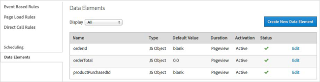
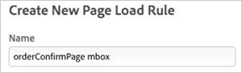
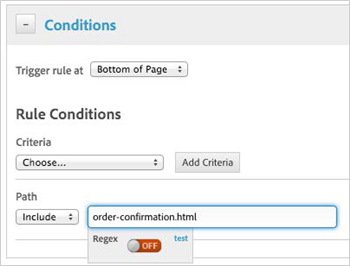
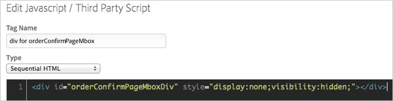
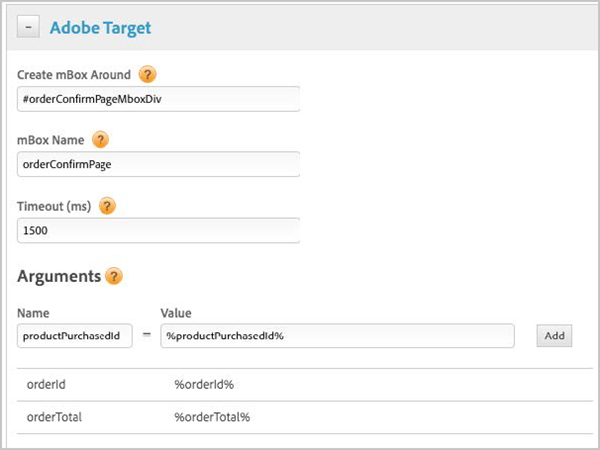

# Order Confirmation Mbox{#order-confirmation-mbox}

Information to help you configure an order confirmation mbox to record details about purchases.

The order confirmation mbox records details about purchases, permitting reports revenue, orders, and derived metrics such as [!DNL Revenue per Visitor] and [!DNL Average Order Value].

It is placed on the order confirmation page(s) of your site and needs to report three specific, dynamic parameters:

* **orderId:** Unique value to identify an order for conversion counting. The [!DNL orderId] must be unique. Duplicate orders are ignored in reports. 
* **orderTotal:** Monetary value of the purchase. Do not pass the currency symbol. Use a decimal point (not a comma) to indicate decimal values. 
* **productPurchasedId:** Comma-separated list of product IDs purchased in the order. These product IDs display in the audit report to support additional reporting analysis.

For more information, see [Create an orderConfirmPage Mbox](https://marketing.adobe.com/resources/help/en_US/tnt/help/t_Creating_a_Place_Order_Mbox.html) in the *Adobe Target Classic* product documentation.

To create an order confirmation mbox perform the instructions in the following sections:

* [Build Data Elements for Dynamic Order Parameters](../../../adobe-target-tool/configure-target-tool/mboxes/order-confirmation-mbox.md#section-562e48b1a2d2490fa00596399ef1f0a2) 
* [Add a DTM Mbox to Pass Up Dynamic Order Parameters...](../../../adobe-target-tool/configure-target-tool/mboxes/order-confirmation-mbox.md#section-e3c00c597752452c96f34b6e6e296e4a)

## Build Data Elements for Dynamic Order Parameters {#section-562e48b1a2d2490fa00596399ef1f0a2}

Follow the instructions in the [Data Elements](../../../adobe-target-tool/configure-target-tool/data-elements/data-elements.md#concept-13e03aed47b145e99d3754c3283e2051) section of this document to construct data elements representing the order ID, order total, and list of products purchased.

## Add a DTM Mbox to Pass Up Dynamic Order Parameters {#section-e3c00c597752452c96f34b6e6e296e4a}

1. Create a new Page Load Rule named “orderConfirmPage mbox.”

   

1. Under **[!UICONTROL Conditions]**, trigger the rule at the bottom of the page and use the other options to target the rule to your site’s confirmation page (e.g. path includes “order-confirmation.html”):

   

1. In the **[!UICONTROL JavaScript/Third Party Tags]** section and add a sequential HTML rule that defines a

   hidden div element with an id.

   

1. In the Adobe Target section, wrap an mbox around the new div element. Name the mbox “orderConfirmPage” and include the required parameters: `orderId`, `orderTotal`, and `productPurchasedId` using your data elements.

   >[!NOTE]
   >
   >The parameter names are case-sensitive.

   

1. Save the rule. 
1. Follow the instructions in [QA, Approval, and Deployal Steps](../../../qa-approval-deployal-steps/qa-approval-deployal-steps.md#concept-8e4631e9f3c440edac488139576849ba).

