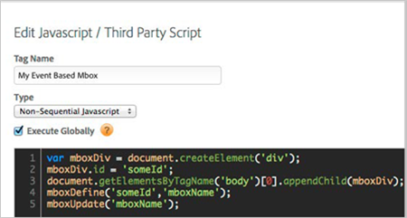

# Mboxes on JavaScript Events{#mboxes-on-javascript-events}

Information to help you trigger mboxes off of JavaScript events.

To trigger mboxes off of JavaScript events, dynamic mboxes can be added to your site using dynamic tag management event-based rules.

For example, you could trigger an `mboxUpdate` when the user clicks an element, plays a video, changes a form field, or scrolls to a certain part of the page. For single-page applications, you can trigger mboxes off of hashchange or custom events. The out-of-the-box options offer powerful ways to add dynamic mboxes. For more information, see [Creating a Dynamic Mbox](https://marketing.adobe.com/resources/help/en_US/rec/r_Creating_a_Dynamic_Mbox.html) in the *Adobe Recommendations* documentation.

**To create an event-based mbox:** 

1. Navigate to **[!UICONTROL Rules]** > **[!UICONTROL Event Based Rules]**.
1. Click **[!UICONTROL Create New Rule]**.

   

1. Name your rule.
1. Under **[!UICONTROL Conditions]**, choose the desired event type.

   

   There are a large number of out-of-the-box event options. Depending on which type of event you choose, other relevant options appear. For example, if you select a “click” event attached to a standard HTML hyperlink, you can use the [!DNL Delay] option to give extra time for your mbox call to go out before the page unloads. (The delay is 500ms by default and is configurable in the DTM property [!DNL Advanced Settings]). 
1. Under **[!UICONTROL Rule Conditions]**, specify any other conditions you have for your rule.

   For example, you might want to restrict this rule to specific URLs on your site. 
1. Under **[!UICONTROL JavaScript/Third Party Tags]** add a new [!DNL Non-Sequential JavaScript] set to [!DNL Execute Globally].

   >[!NOTE]
   >
   >“Globally” here does not mean “on every page” like a “global” mbox. Globally here refers specifically to the JavaScript scope of the tag.

1. In the code box, specify your `mboxDefine/mboxUpdate` code. You have several options:

    * Update an existing mbox:

      

    * Turn an existing element within an ID into an mbox:

      

    * Create a new element and turn it into an mbox (the Target offer contents are delivered into this new element):

      

       You can also populate dynamic parameters using your dynamic tag management data elements in the code editor. See [Using Data Elements](../../../adobe-target-tool/configure-target-tool/data-elements/using-data-elements.md#concept-5d81a662c9554753a160ae399b8aeb44)

       Additionally, the `mboxTrack()` plugin can be used in this context. Contact your Target consultant to add this plugin to you [!DNL mbox.js] file. Use `mboxTrack` when you only need to use the call to trigger a metric or report profile information—it cannot be used to serve content. 
    
