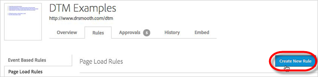
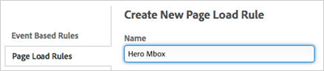
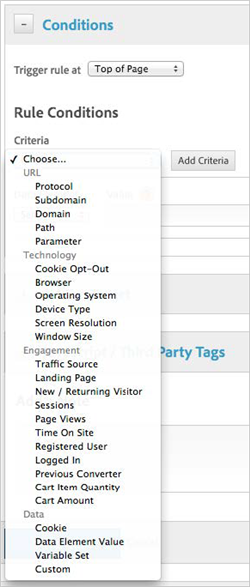
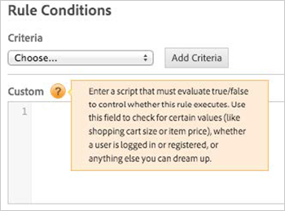
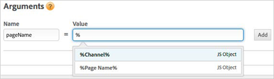
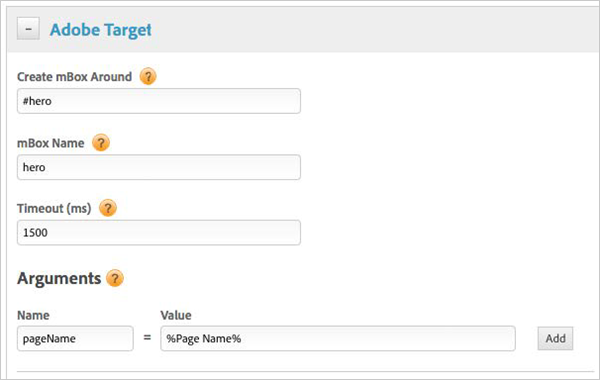

# Wrapping Mboxes{#wrapping-mboxes}

If you are a Target Classic Workflow user and aren’t able to use the global mbox for all of your campaigns, the Adobe Target Tool provides an easy method to place wrapping mboxes with built-in flicker handling.

The Adobe Target Tool integration currently uses the `mboxUpdate` method to make mbox calls, so keep the following in mind:

* The `mboxUpdate` call waist for the `window onload` event before the call is made. Test content takes longer to appear than when using `mboxCreate`. 
* `<style>` blocks served through offers don’t work in Microsoft Internet Explorer 8 and below (use JavaScript to set the styles). 
* HTML is delivered first and JavaScript last, regardless of the order in the offer. 
* All JavaScript in the offer is encapsulated, so additional steps must be taken if you want any variables or functions to be usable elsewhere on the page. 
* Extra `SiteCatalyst` calls will be made if using the legacy Test&Target > SiteCatalyst integration plugin. Consider switching to the “Analytics for Target” back-end integration.

**To add an mbox placed by [!DNL dynamic tag management]:**

1. Navigate to **[!UICONTROL Rules]** > **[!UICONTROL Page Load Rules]**. 
1. Click **[!UICONTROL Create New Rule]**.

   

1. Name the rule.

   

1. Add conditions.

   

    1. Trigger the rule at **[!UICONTROL Top of Page]** to ensure that the default content is hidden until the mbox response has been received. 
    1. Use rule conditions to help you define the general location (e.g. page URL) and other conditions (e.g. “Cookie X contains”) under which your mbox should fire. For experienced [!DNL Target] users, this is similar to defining targeting conditions within the [!DNL Target] UI for your campaign; however, here you are placing targeting conditions around the firing of the mbox call. For global rule deployments across the DTM property, leave the selection on “Choose….”

       Note that you can even enter your own JavaScript code when you select the [!DNL Custom] option.

       

1. Add the mbox:

    1. Expand the **[!UICONTROL Adobe Target]** section. 
    1. Choose the element to wrap with the mbox using a CSS selector. 
    1. Name the mbox. 
    1. Use the default Timeout value of 1500ms. 
    1. Add parameters.

1. Save the rule. 
1. Perform the instructions in [QA, Approval, and Deployal Steps](../../../qa-approval-deployal-steps/qa-approval-deployal-steps.md#concept-8e4631e9f3c440edac488139576849ba).

You can add parameters to your mbox calls with static or dynamic values. Parameters can be regular mbox parameters or profile parameters. To make the parameter a profile parameter, use “profile.” in the name (e.g., “profile.customerType”).

Additionally, if you’re using an auto-created global mbox, you can add global mbox parameters that will be included with the auto-created global mbox. See [Mbox Parameters](../../../adobe-target-tool/configure-target-tool/mboxes/mbox-parameters.md#concept-8c18a1c19df145f5ba2aee522c377faa) for details.

To use a dynamic value from a [Data Element](../../../adobe-target-tool/configure-target-tool/data-elements/data-elements.md#concept-13e03aed47b145e99d3754c3283e2051), in the [!DNL Value] field, type the % symbol to display the list of available data elements, then select the one you want.

Below is an example of an mbox named “hero” that wraps an element with an ID of “hero” and includes an mbox parameter named “pageName” with a value that is dynamically populated by a data element called “Page Name.”

