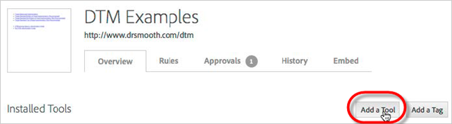
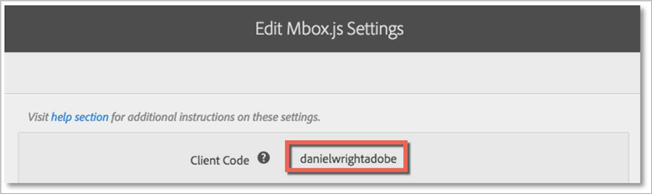

# Add the Adobe Target Tool{#add-the-adobe-target-tool}

Overview information to help you determine the best option to implement Adobe Target using the Adobe Target Tool in dynamic tag management.

Adding the [!DNL Adobe Target Tool] takes care of most implementation aspects needed for [!DNL Adobe Target], including the following:

* Implementation of the [!DNL mbox.js] file 
* Implementation of the global mbox 
* Inclusion of dynamic parameters in the global mbox

To add the [!DNL Adobe Target Tool] in [!DNL dynamic tag management], click * **[!UICONTROL Web Property Name]*** > **[!UICONTROL Overview]** > **[!UICONTROL Add a Tool]**.

There are four options to add the [!DNL Target Tool], in order of simplicity:

1. Automatically via the [!DNL Marketing Cloud] (easiest and recommended) 
1. Automatically with manual entry of your Client Code 
1. Manually with the [!DNL Target] JavaScript library hosted by [!DNL dynamic tag management] 
1. Manually with the [!DNL Target] JavaScript library hosted externally

Important: For Options 2, 3, and 4, you will need your Adobe Target Client Code. This can be retrieved from [!DNL Target] as follows:

1. In Adobe Target, click **[!UICONTROL Setup]** > **[!UICONTROL Implementation]** > **[!UICONTROL Edit Mbox.js Settings]**. 
1. The Client Code is the first value on the screen, labeled [!DNL Client Code].

   

