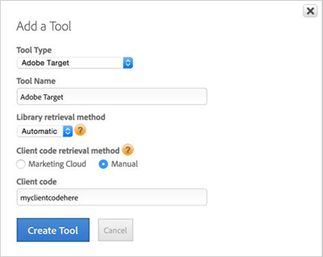

# Option 2: Implement Target Automatically with Manual Entry of Your Target Client Code{#option-implement-target-automatically-with-manual-entry-of-your-target-client-code}

Information to help you implement Adobe Target automatically in dynamic tag management by manually entering your Target Client Code.

If you have not linked your [!DNL dynamic tag management] user account to your [!DNL Marketing Cloud] user account: 

1. On a property's **[!UICONTROL Overview]** page in [!DNL dynamic tag management], click **[!UICONTROL Add a Tool]**.
1. From the **[!UICONTROL Tool Type]** drop-down list, select **[!UICONTROL Adobe Target]**.
1. In the **[!UICONTROL Tool Name]** box, type "Adobe Target."
1. From the **[!UICONTROL Library Retrieval Method]** drop-down list, select **[!UICONTROL Automatic]**.
1. Under **[!UICONTROL Client Code Retrieval Method]**, select **[!UICONTROL Manual]**, then specify your [!DNL Target] Client Code.

   For information on how to obtain your Client Code, see [Step 1: Add the Adobe Target Tool](../../adobe-target-tool/step-1-add-adobe-target-tool/step-1-add-adobe-target-tool.md#concept-f9bfd490b0264f8693810eaed8a68203).

   Your settings should look like the following example:

   

1. Click **[!UICONTROL Create Tool]**.
1. Click **[!UICONTROL Save Changes]**.
