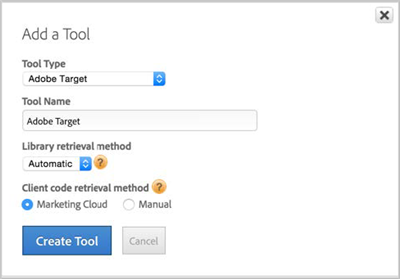

# Option 1: Implement Target Automatically via the Marketing Cloud (Easiest and Recommended){#option-implement-target-automatically-via-the-marketing-cloud-easiest-and-recommended}

Information to help you use the easiest and recommended option to implement Adobe Target in dynamic tag management automatically via the Adobe Marketing Cloud.

If you have linked your [!DNL dynamic tag management] user account to your [!DNL Marketing Cloud] user account: 

1. On a property's **[!UICONTROL Overview]** page in [!DNL dynamic tag management], click **[!UICONTROL Add a Tool]**.
1. From the **[!UICONTROL Tool Type]** drop-down list, select **[!UICONTROL Adobe Target]**.
1. In the **[!UICONTROL Tool Name]** box, type "Adobe Target."
1. From the **[!UICONTROL Library Retrieval Method]** drop-down list, select **[!UICONTROL Automatic]**.
1. Under **[!UICONTROL Client Code Retrieval Method]**, select **[!UICONTROL Marketing Cloud]**.

   Your settings should look like the following example:

   

1. Click **[!UICONTROL Create Tool]**.
1. Click **[!UICONTROL Save Changes]**.
