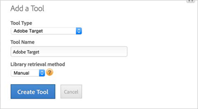
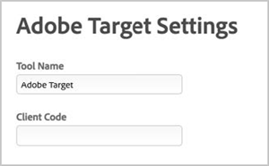
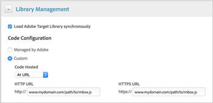

# Option 4: Implement Target Manually with the Target JavaScript Library Hosted Outside of DTM{#option-implement-target-manually-with-the-target-javascript-library-hosted-outside-of-dtm}

Information to help you implement Adobe Target manually by hosting the Target JavaScript Library outside of dynamic tag management.

If you prefer to manage the [!DNL mbox.js] file yourself and host it outside of [!DNL dynamic tag management]: 

1. On a property's **[!UICONTROL Overview]** page in [!DNL dynamic tag management], click **[!UICONTROL Add a Tool]**.
1. From the **[!UICONTROL Tool Type]** drop-down list, select **[!UICONTROL Adobe Target]**.
1. In the **[!UICONTROL Tool Name]** box, type "Adobe Target."
1. From the **[!UICONTROL Library Retrieval Method]** drop-down list, select **[!UICONTROL Manual]**.
1. Click **[!UICONTROL Create Tool]**.

   

1. Specify your [!DNL Target] Client Code on the resulting screen.

   

   For information on how to obtain your client code, see [Step 1: Add the Adobe Target Tool](../../adobe-target-tool/step-1-add-adobe-target-tool/step-1-add-adobe-target-tool.md#concept-f9bfd490b0264f8693810eaed8a68203). 
1. Expand the **[!UICONTROL Library Management]** section of the page, then select the **[!UICONTROL At URL]** option from the **[!UICONTROL Code Hosted]** drop-down list within the [!DNL Custom] section.
1. Ensure that the **[!UICONTROL Load Adobe Target Library Synchronously]** option is selected.

   

1. Specify the HTTP and HTTPS URLs.
1. Click **[!UICONTROL Save Changes]** on the **[!UICONTROL Adobe Target Tool]** page.
