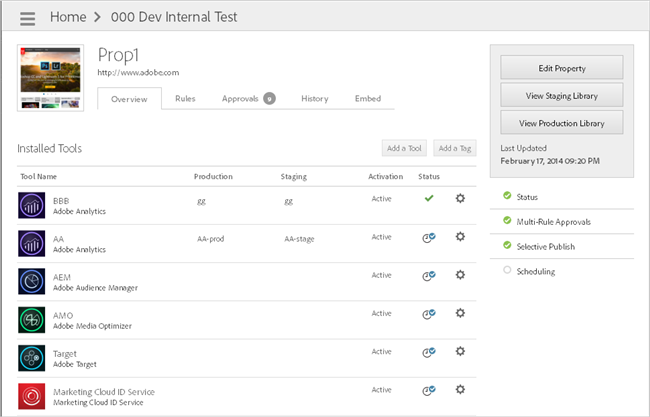
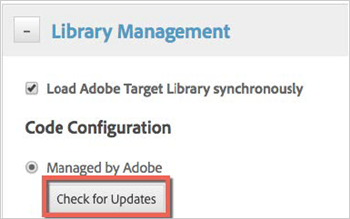

# Update the Adobe Target Tool{#update-the-adobe-target-tool}

If you used one of the automatic options when adding the Adobe Target Tool, you can easily update the file whenever Adobe releases a new version of the mbox.js library or if you modify your library settings in the Target UI.

For more information about the automatic options, see the following topics:

* [Option 1: Implement Target Automatically via the Marketing Cloud (Easiest and Recommended)](../adobe-target-tool/step-1-add-adobe-target-tool/t-implementing-target-automatically-via-marketing-cloud.md#task-03e9936791684888bf6edd9490c3b975) 
* [Option 2: Implement Target Automatically with Manual Entry of Your Target Client Code](../adobe-target-tool/step-1-add-adobe-target-tool/t-implementing-target-automatically-client-code.md#task-388935898be843909bc4701aae8fec47)

1. From the property's **[!UICONTROL Overview]** page, click the gear icon (  ) next to the desired tool.

   

1. Expand the **[!UICONTROL Library Management]** section. 
1. Click **[!UICONTROL Check for Updates]** and follow the instructions in the dialog boxes to update the file.

   

