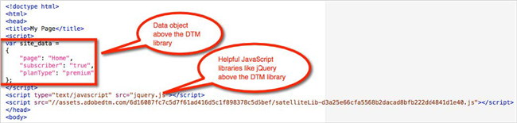

# Dynamic Tag Management Implementation{#dynamic-tag-management-implementation}

Information to help you properly manage the dynamic tag management embed code while implementing Adobe Target.

Place or move rich data objects before the DTM header embed code in order to leverage them most powerfully in your [!DNL Target] implementation. Although your data layer might continue to grow as the rest of the page loads, anything loaded after the header embed code is not available for use in the global Mbox or other [!DNL Target] requests made at the top of the page. This limits your targeting and segmentation capabilities.

Also, if you use JavaScript libraries, such as jQuery, place them above the DTM header embed code so you can leverage them within [!DNL dynamic tag management] and [!DNL Target].

The following illustration shows sample embed code with a data object and JavaScript library properly configured:

