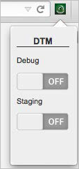

# Installing the Debugging Tools{#installing-the-debugging-tools}

In addition to your web browsers’ built-in developer tools, we recommend installing two additional Adobe tools to help QA and troubleshoot Target and dynamic tag management: the Adobe Marketing Cloud Debugger and the DTM Switch.

The following sections contain more information:

* [Installing the Adobe Marketing Cloud Debugger](../qa-approval-deployal-steps/installing-debugging-tools.md#section-b8920f4a3b7c46a995424a58082b4845) 
* [Installing the DTM Switch](../qa-approval-deployal-steps/installing-debugging-tools.md#section-89add95b14014ecda46d2287c174ec8b)

## Installing the Adobe Marketing Cloud Debugger {#section-b8920f4a3b7c46a995424a58082b4845}

For general Marketing Cloud pixel debugging, install the Adobe Marketing Cloud Debugger bookmarklet.

See [Adobe Debugger](https://docs.adobe.com/content/help/en/analytics/implementation/validate/debugger.html).

## Installing the DTM Switch {#section-89add95b14014ecda46d2287c174ec8b}

DTM Switch is a browser plugin for easy switching of debug mode and staging mode for DTM users. It is available for both Chrome and Firefox. You do not need to publish a new rule or tag in order to use this, though you do need to host DTM on Akamai.

For more information about the DTM Switch and to obtain the switches, see [DTM Switch Plugins for Debugging (Chrome and Firefox)](https://docs.adobe.com/content/help/en/dtm/using/resources/plugins/search-discovery-plugins.html) in the Dynamic Tag Management Product Documentation.

When you visit a site with DTM, the Marketing Cloud icon appears to the right of your browser’s URL bar. Clicking the icon exposes the following options:

[!DNL Debug] turns on debugging statements in your browser console. [!DNL Staging] loads files from DTM's staging library.

Microsoft Internet Explorer and Safari users can get the same functionality by using these statements in their browser console:

* For Debug Statements: `_satellite.setDebug(true)` 
* To Load the Staging library: `localStorage.setItem('sdsat_stagingLibrary',true)`

