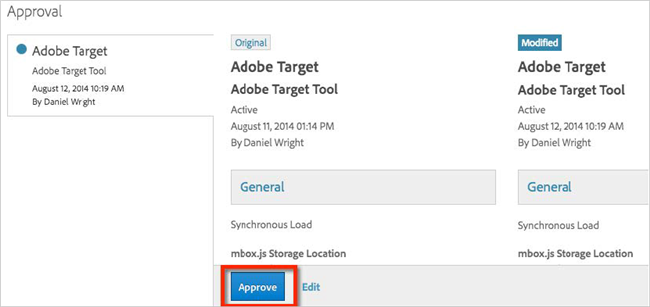
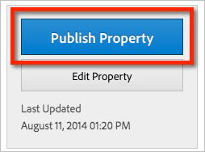

# Performing Approval and Publishing Steps{#performing-approval-and-publishing-steps}

Information to help you approve and publish changes to your DTM account after you have performed debugging and QA steps.

Depending on your DTM user-level access, you may or may not be able to approve or publish changes to your DTM account. Typically, organizations divide access rights among users to ensure that a code review process is enforced before any new code is added to the website by DTM. Therefore, it is strongly encouraged that you add descriptive information in the [!DNL Notes] field before saving any changes in DTM. This helps other DTM users vetting new DTM rules to understand the intent of the changes being made.

The following sections contain more information:

* [Approving Changes](../qa-approval-deployal-steps/performing-approval-publishing-steps.md#section-735b4ab03ec84bc0b99986f6eda60b92) 
* [Publishing Changes](../qa-approval-deployal-steps/performing-approval-publishing-steps.md#section-bcfcd334a59c4bd3a39abcd98a434ea2)

## Approving Changes {#section-735b4ab03ec84bc0b99986f6eda60b92}

If you have [!DNL Approver] privileges, unapproved changes are flagged in the [!DNL Approvals] navigation tab.

The [!DNL Approvals] page highlights the individual changes that were made. To approve the change, click **[!UICONTROL Approve]**.

## Publishing Changes {#section-bcfcd334a59c4bd3a39abcd98a434ea2}

If you have [!DNL Publishing] privileges, click **[!UICONTROL Publish Property]** in the upper right corner of the DTM property’s [!DNL Overview] page to publish all approved changes.

