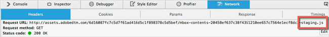
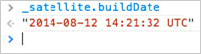
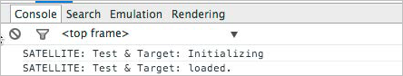
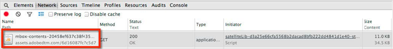
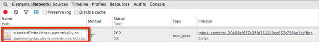
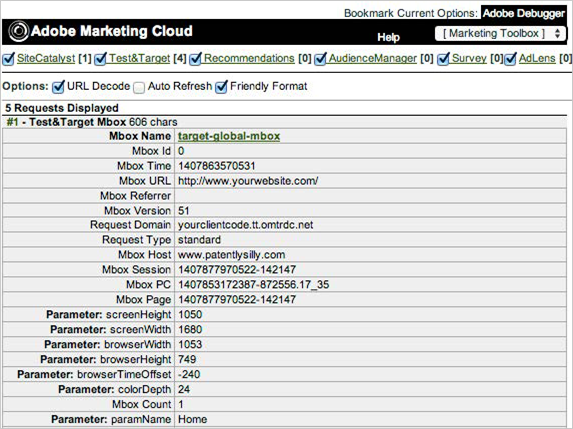

# Performing QA Steps{#performing-qa-steps}

Steps to help you perform QA steps before approving and deploying your Target implementation.

The following sections contain more information:

* [Previewing DTM Changes on Your Production Website](../qa-approval-deployal-steps/performing-qa-steps.md#section-e0d9de8dc08a44f9adb866818a7d1f5a) 
* [Ensuring that the Target Tool is Loading Properly](../qa-approval-deployal-steps/performing-qa-steps.md#section-5fa021d0cbfa409dbfb671c7f78f217c) 
* [Ensuring that Target Mboxes are Firing Properly](../qa-approval-deployal-steps/performing-qa-steps.md#section-3e8b7942395e4d36ab71a1adda651d94)

## Previewing DTM Changes on Your Production Website {#section-e0d9de8dc08a44f9adb866818a7d1f5a}

Changes saved within DTM are immediately available in DTM’s staging library and should be QA’d before they are published. At most, they will take a minute or two to roll out across the Akamai network. To QA DTM changes on your production website:

1. Load your production website in your browser. 
1. Use the DTM Switch tool or console commands to force DTM to load your staging library. 
1. Reload the page to preview the changes made in DTM.

When you use the DTM Switch or console statements to load the staging library, you should see “-staging” appended to the end of the file via your developer tool’s Network tab:

If you are ever concerned that you are not seeing the latest changes, you can run the Console statement “_satellite.buildDate” to confirm the timestamp of the build you are loading.

## Ensuring that the Target Tool is Loading Properly {#section-5fa021d0cbfa409dbfb671c7f78f217c}

1. Open your web browser’s developer console. 
1. Turn on “Debug” mode with the DTM Switch plugin.

When the [!DNL Target Tool] loads the following statements display in the console:

Also, using the Network tab, you can verify that the [!DNL mbox.js] file has loaded. It will look something like this:

## Ensuring that Target Mboxes are Firing Properly {#section-3e8b7942395e4d36ab71a1adda651d94}

In the Network tab, you can verify that your mboxes are firing (they typically begin with “standard?” or “ajax?”):

The Adobe Marketing Cloud Debugger is also tremendously helpful to verify the calls and parameters:

