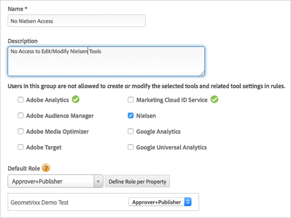

# Create and manage groups for DTM in the Adobe Admin Console

Information to help you create new user groups in the Experience Cloud and to manage Dynamic Tag Management property access.

## Create new user groups in the Experience Cloud {#section_08040874355948F8951A15ADE6BD9DE0}

1. Log in to the Adobe Admin Console via [adminconsole.adobe.com](https://adminconsole.adobe.com/).
1. Click **[!UICONTROL Products]** > **[!UICONTROL Dynamic Tag Management]**. 
1. Click the **[!UICONTROL Add]** icon to add a new group (product configuration).

   

1. To select DTM user group types, click the drop-down list under Select Group, select the user group types, then save the product configuration.

   

   For the group to display in the list, it must be added in the Adobe Admin Console, as explained in [Manage Web Property Access in DTM](../administration/c-create-manage-groups-enterprise-dashboard.md#section_9BDEC92A8D284D1F952192C9373D82FA).

   If a user has already been added as a user to the [!DNL Experience Cloud], that user can be added to the group by clicking into the Users tab. Adding a user creates or updates the user in DTM and assigns the user to the appropriate DTM group.

   >[!IMPORTANT]
   >
   >Adding an Admin allows the user to manage the group in the Experience Cloud. It does not add the user as an admin in DTM.

   For more information on user roles, see [Create and Manage Groups in DTM](../administration/groups.md#concept_6494F1EF2400457ABCED8D860951CD36).

## Manage web property access in DTM {#section_9BDEC92A8D284D1F952192C9373D82FA}

1. Log in to DTM by clicking the **[!UICONTROL Product Selection]** icon > **[!UICONTROL Activation]**.

   

1. Click **[!UICONTROL Groups]**.

   

1. Click **[!UICONTROL Create New Group]**. 
1. Select which tools users in this group are not allowed to modify. In this example, users in this group can't modify the Nielsen tool for the Geometrixx Demo Test web property.

   

1. Select the **[!UICONTROL Default Role]** for the user group.

   

   This role can be defined by property if multiple properties are present in the company, as shown in the following illustration:

   

1. Save the group.
1. Add the user group in the [!UICONTROL Adobe Admin Console].
   1. Log in to the [!UICONTROL Adobe Admin Console] by clicking **[!UICONTROL Product Selection]** > **[!UICONTROL Administration]**.
   1. Click **[!UICONTROL Products]** > **[!UICONTROL Dynamic Tag Management]**.
   1. Click **[!UICONTROL Add New Group]**.
   1. The new group displays in the [!UICONTROL Select Group] drop-down list. Save the group.
   1. Add users to the new group by clicking **[!UICONTROL Users]** > **[!UICONTROL Add New User]**.

