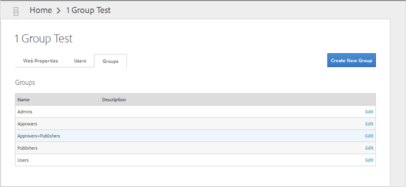
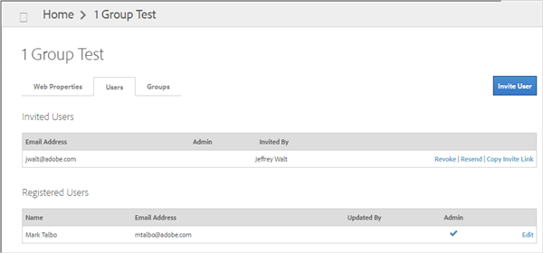
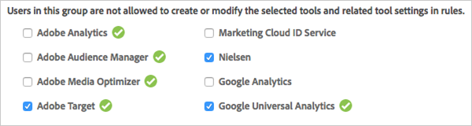
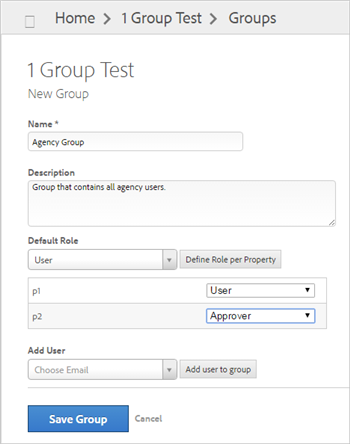

# Create and manage groups in DTM{#create-and-manage-groups-in-dtm}

Create user groups, assign group members, and specify default roles.

Group management makes it easy to organize users and control their access levels. The [!UICONTROL Groups] page lists all of the user groups that are set up within the account. Permissions are set at the user group level, so all users in the group inherit the group permissions.

To access the [!UICONTROL Groups] page, from your company dashboard, click **[!UICONTROL Groups]**.

## Default roles {#section_929207D4799848D39EC775B82494C2BE}

Dynamic Tag Management has five different user roles with varying sets of permissions:

The following table illustrates the permissions that each default role inherits: 

|  User Role  | Create Rules  | Edit Rules  | Test Rules  | Approve Rules  | Publish Rules  | Create/Edit Users  | Create Property  |
|---|---|---|---|---|---|---|---|
|  **User** | Yes  | Yes  | Yes  |  |  |  |  |
|  **Approver** | Yes  | Yes  | Yes  | Yes  |  |  |  |
|  **Publisher** | Yes  | Yes  | Yes  |  | Yes  |  |  |
|  **Approver and Publisher** | Yes  | Yes  | Yes  | Yes  | Yes  |  |  |
|  **Admin** | Yes  | Yes  | Yes  | Yes  | Yes  | Yes  | Yes  |

## Migrated groups for existing customers {#section_5C1B163F872B49D180BC06205964288D}

In addition to these default roles, if you are an existing Dynamic Tag Management customer, you might see one or more migrated legacy groups with appended date and time stamps.

For example: [!DNL Group - 2015-07-21 21:19:57:884].

If you are an existing customer and certain users have the User role for every property, these users are automatically migrated to the new User group. However, if other users have the User role for some properties and the Publisher role for other properties, they will be put into a migrated group with a date and time stamp. A legacy group will be created for each scenario in your system. In our testing, we have seen some companies with as many as ten legacy groups.

Another example is if you have users who have not accepted invitations to join your Dynamic Tag Management company in the past and there are no matching default groups. These users, after accepting the invitations, will be added to legacy groups according to their associated properties and roles.

These legacy groups can be edited as needed and should be renamed with descriptive names that make sense. 

## Add users to groups {#task_1A482EF670454416A9664CF668A7CC3B}

Add (invite) users to existing groups. 

<!-- 

t_add_users_groups.xml

 -->

1. From your company dashboard, click **[!UICONTROL Groups]**.
1. Click **[!UICONTROL Edit]** next to an existing group.

   You can also invite users while creating new groups as explained in [Create a New Group](../administration/groups.md#task_D08D33C542C444469636CA288B631FB5). 

1. From the **[!UICONTROL Add User]** drop-down list, select a user's email address, then click **[!UICONTROL Add User to Group]**.

   The drop-down list is populated with the available users in your system. As you add users, their email addresses are removed from the drop-down list.

   Each user will receive an email message with a link to accept group membership. Users will not display in the list until they accept invitations. 

1. Add additional users as needed.
1. Click **[!UICONTROL Save Group]**.
From your company dashboard, you can click the **[!UICONTROL Users]** tab to view a list of users and see related information: name, email address, updated by, and which groups they belong to (Admin, Users, and so forth).

If a user belongs to multiple groups, the displayed role is the role with the highest level of access. For example, if a user has the User role for some properties and the Admin role for other properties, Admin displays in the list, as shown below:

You can click **[!UICONTROL Revoke]** to rescind an invitation for a specific user or click **[!UICONTROL Resend]** to send the invitation email message to the user again.

You can also add users to groups for a specific property by navigating to the property (your company dashboard > the desired property) and then by clicking the **[!UICONTROL Manage Groups]** button. 

## Create a new group {#task_D08D33C542C444469636CA288B631FB5}

Create a new user group, select its default role, and add users to the group. 

<!-- 

t_create_group.xml

 -->

>[!NOTE]
>
>You must be a company administrator to create a new group.

1. From your company dashboard, click **[!UICONTROL Groups]**.
1. Click **[!UICONTROL Create New Group]**.
1. Fill in the fields:

   **Name:** (Required) Specify a descriptive name for the group.

   **Description:** Specify an optional description for the group. The description displays on the [!UICONTROL Groups] page and can help you locate a specific group and determine its purpose.

   **Tool Check Boxes:** (Optional) Select the desired check box next to any tools to restrict access to those tools. If the check box is selected, users in this group cannot create or modify the selected tools and related tool settings in rules. By default, all users in the group have access to all tools.

   

   A green checkmark next to a tool indicates that the corresponding tool is currently installed for this property.

   If a user is a member of two groups and one group restricts tool access and the other group allows access, access rights are restricted for any selected tools.

   Note that all users in the Admins group have full access to create and modify all tools and related tool settings in rules. If you are creating or editing an Admins group, the tool check boxes do not display in the UI.

   **Default Role:** (Optional) Select a default role. All newly created properties going forward inherit this role. 

   |  User Role  | Create Rules  | Edit Rules  | Test Rules  | Approve Rules  | Publish Rules  | Create/Edit Users  | Create Property  |
   |---|---|---|---|---|---|---|---|
   |  **User** | Yes  | Yes  | Yes  |  |  |  |  |
   |  **Approver** | Yes  | Yes  | Yes  | Yes  |  |  |  |
   |  **Publisher** | Yes  | Yes  | Yes  |  | Yes  |  |  |
   |  **Approver and Publisher** | Yes  | Yes  | Yes  | Yes  | Yes  |  |  |
   |  **Admin** | Yes  | Yes  | Yes  | Yes  | Yes  | Yes  | Yes  |

   Note that if you add users to the Approver group and to the Publisher group, those users have the same roles as those in the Approver and Publisher group.

   In most situations, the roles in the previous table are sufficient. You can, however, create custom default roles. 
1. (Optional) To create a custom default role, click **[!UICONTROL Define Role Per Property]**, then choose a different default role for each property, as needed.

   In the following illustration, the default role for Property1 is `User` and the default role for Property2 is `Approver`.

   

   A use-case for having different roles for each property is in an agency in which you might want some users to have access to certain properties, but not have access to other properties. Another benefit of having groups with different access to varying properties is if you have users who come and go from the agency. You can simply delete an existing user from the group and add a new user without spending considerable time setting up access rights to different properties.

   If you specify different default roles for each property, ensure that you name the group with a descriptive name and provide an optional description.

   >[!NOTE]
   >
   >Be aware that if you collapse the [!UICONTROL Default Role]section by clicking [!UICONTROL Define Role per Property] again, all roles are set to the default role, regardless of how they were set before collapsing the section.

1. From the **[!UICONTROL Add User]** drop-down list, select a user's email address, then click **[!UICONTROL Add User to Group]**.

   The drop-down list is populated with the available users in your system. As you add users, their email addresses are removed from the drop-down list.

   Each user will receive an email message with a link to accept group membership. Users will not display in the list until they accept invitations. 

1. Add additional users as needed.
1. Click **[!UICONTROL Save Group]**.

## Edit a group {#task_2E0A2D7D793845818C586943C7FA3F7F}

Edit an existing user group to change its name, description, default role, or add users to the group. 

<!-- 

t_edit_group.xml

 -->

>[!NOTE]
>
>You must be a company administrator to edit a group.

1. From your company dashboard, click **[!UICONTROL Groups]**.
1. Click **[!UICONTROL Edit]** next to the desired group.
1. Edit the desired fields, as explained in [Create a New Group](../administration/groups.md#task_D08D33C542C444469636CA288B631FB5).
1. Click **[!UICONTROL Save Group]**.

## Delete a group {#task_CFAA137ED18D4363B1826DF504CF993F}

Delete an existing user group if it is no longer necessary. 

<!-- 

t_delete_group.xml

 -->

>[!NOTE]
>
>You must be a company administrator to delete a group.

1. From your company dashboard, click **[!UICONTROL Groups]**.
1. Click **[!UICONTROL Edit]** next to the desired group.
1. Click **[!UICONTROL Delete]**.
1. Click **[!UICONTROL Yes]** to confirm that you want to delete the group.

   Users in this group might not have access to any associated properties.

   >[!NOTE]
   >
   >Do not delete the Admin group. Doing so might require that you call Adobe to re-add users to the Admin group.

1. Click **[!UICONTROL Save Group]**.
