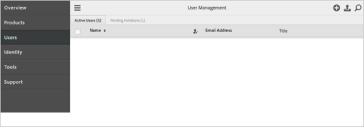
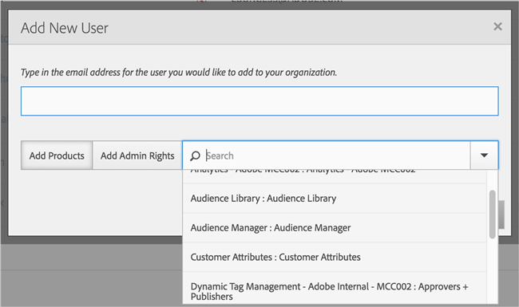
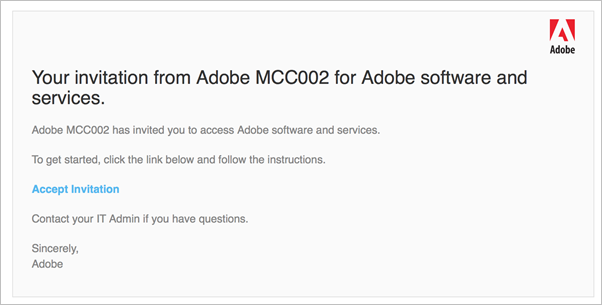

# Users and permissions{#users-and-permissions}

You can invite users to Dynamic Tag Management and assign user roles and add users to groups.

You must have administrative privileges to invite a new user in Dynamic Tag Management. Administrators are automatically granted permissions to a new property.

## Manage users {#concept_6255E7CCF212439CA8593CD6A75C7E47}

You can invite users to the [!DNL Adobe Experience Cloud] with the [!DNL Adobe Admin Console] (the preferred method) or you can use the legacy provisioning process in [!DNL Dynamic Tag Management].

<!--

c_add_users.xml

 -->

>[!NOTE]
>
>If you link your DTM company to the Experience Cloud, you must manage your users in the Experience Cloud.

>[!IMPORTANT]
>DTM accounts created after April 5, 2016 are managed by administrators using the Adobe Admin Console in the Adobe Experience Cloud. To manage other users, the DTM administrator must be an Experience Cloud administrator in the Adobe Admin Console. For more information, see [Delegate Administrative Roles to Users](https://marketing.adobe.com/resources/help/en_US/mcloud/index.html?f=t_admin-roles) in the _Experience Cloud and Core Services Product Documentation_. 
>
>For accounts created before April 5, 2016, users are managed using the Users page in DTM. 
>
>There are a few scenarios to keep in mind when deciding whether to provision new users with the Experience Cloud using the Adobe Admin Console or by using the legacy provisioning process in DTM.
>
>**Use the Adobe Admin Console:** If the user has already authenticated to DTM for a company that does not manage users with the Adobe Admin Console (the company was provisioned before April 5, 2016), that user can be added to a new company that does manage users with the Adobe Admin Console. 
>**Use the Legacy Provisioning Process:** If the user has already authenticated to the Adobe Experience Cloud and the account was created by using the Adobe Admin Console (the company was provisioned after April 5, 2016), that user cannot be added to an existing company that uses the legacy login. If this is the case, you must create a new email address to use for authentication.
>
>Recommended best practice is to provision new users using the Adobe Admin Console. However, if there is any chance that these new users (consultants or agency representatives, for example) will need to access an account provisioned using the legacy process, you should provision that user in DTM and then link the account to the Experience Cloud.
>
>The provisioning process in the Adobe Admin Console is forward-looking and not backwards compatible.

>[!VIDEO](https://video.tv.adobe.com/v/17181/)

By then end of this video you should be able to:

* Understand user management
* Understand roles
* Understand default user groups
* Understand how to add users to a group
* Understand how to create a group

## Manage users for DTM in the Adobe Experience Cloud {#section_712E6F57A456425BBDCD0B1ABF0FBA86}

<!--

manage-users-groups-for-dtm.xml

 -->

Information to help you create user groups in the [!DNL Adobe Experience Cloud], invite new users to the [!DNL Experience Cloud], and to manage web property access in [!DNL Dynamic Tag Management] (DTM).

>[!IMPORTANT]
>
>Before deciding to add users using either the Adobe Admin Console or directly in DTM, read the note in [Add Users](../administration/users.md#concept_6255E7CCF212439CA8593CD6A75C7E47).

1. From within the [!UICONTROL Adobe Admin Console], click **[!UICONTROL Users]**.

   

1. Click the **[!UICONTROL Add]** icon to add a new user.
1. (Conditional) To add the user to multiple groups click the drop-down list, then select the product.

   

After the user is invited, they receive an invite email to the [!DNL Experience Cloud].

>[!VIDEO](https://video.tv.adobe.com/v/17180/)

By the end of this video you should be able to:

* Create a user
* Set permissions

## Manage users for DTM using the legacy process {#section_CD17C00012DC42C2BA4CC0EA785F1567}

<!--

c_manage-users-groups-legacy.xml

 -->

>[!IMPORTANT]
>
>Before deciding to add users using either the Adobe Admin Console or directly in DTM, read the note in [Add Users](../administration/users.md#concept_6255E7CCF212439CA8593CD6A75C7E47).

**Invite new users to DTM using the legacy provisioning process**

1. From your company dashboard, click **[!UICONTROL Users]**.
1. (Conditional) Click **[!UICONTROL Restrict to Experience Cloud]** to force all users in the company to log in to [!DNL Dynamic Tag Management] using [!DNL Adobe Experience Cloud] credentials rather than using the legacy/company login process.

   >[!IMPORTANT]
   >
   >If you are a DTM company admin, you must authenticate via the [!DNL Experience Cloud] and have your DTM account linked before activating this option, otherwise you will essentially lock yourself out of DTM.

   If this option is selected, all users for the company must authenticate via the Experience Cloud and link their DTM accounts. If users log in to DTM using legacy/company credentials, they will be able to view their company account, but they won't be able to access it. A message will display informing them that they must log in via the [!DNL Experience Cloud].

   The company admin can reverse this option at any time by deselecting this option.

   >[!NOTE]
   >
   >This option is for current customers only. New customers provisioned to DTM will have user management and authentication automatically restricted to the [!DNL Experience Cloud] and [!DNL Adobe Admin Console].

   For more information about logging in to the Experience Cloud, see [Sign in to the Adobe Experience Cloud](https://marketing.adobe.com/resources/help/en_US/mcloud/index.html?f=t_sign_in). For more information about the Experience Cloud, see the [Experience Cloud and Core Services Product Documentation](https://marketing.adobe.com/resources/help/en_US/mcloud/).

1. Click **[!UICONTROL Invite User]**.
1. Enter the user's email address.
1. (Conditional) Select the [group](../administration/groups.md#concept_6494F1EF2400457ABCED8D860951CD36) for the user.

   Group management makes it easy to organize users and control their access levels. Permissions are set at the user group level, so all users in the group inherit the group permissions, including access to specific properties.

1. Click **[!UICONTROL Invite User]**.

   An email message with a link is sent to the user. This email lets the user select a password and complete the setup process.

   Until the user completes this setup process, they appear in the [!UICONTROL Invited Users] section on the [!UICONTROL Users] tab. They move to [!UICONTROL Registered Users] when the setup is complete.

## Frequently asked questions about users and permissions {#concept_EFA178B40137485CA8EADEF6E585B5B4}

List of Frequently asked questions (FAQs) about users and permissions in the [!DNL Experience Cloud] and in [!DNL Dynamic Tag Management].

<!--

c_faq-users-permissions.xml

 -->

### I added a user using the [!UICONTROL Admin] tab for the DTM product in the [!UICONTROL Adobe Admin Console], but that user was not added as a user in DTM. Why wasn’t the user created in DTM?

Adding a user to the [!UICONTROL Admin] tab in a group does not grant permissions in DTM. That process allows the user to edit the [!UICONTROL Product Configuration Groups] in the [!DNL Adobe Admin Console]. In order to add the user to DTM, they need to be added using the [!UICONTROL Users] tab.

### My DTM account was created prior to April 5, 2016, how do I manage my users?

If [!UICONTROL User Management] in the [!DNL Adobe Admin Console] is not enabled, DTM users are managed from within DTM on the [!UICONTROL Users] tab.

### My DTM account was created prior to April 5, 2016 and I want to migrate my users to log in through the Experience Cloud. How do I accomplish this?

Contact Customer Care to restrict login access to the [!DNL Experience Cloud].

### I invited a user through DTM, but I want the user to log in through the Experience Cloud.

An account can be linked to a Experience Cloud user by selecting the Product Selection box > Activation > Link Account. For more information, see [Link Accounts in the Experience Cloud](https://marketing.adobe.com/resources/help/en_US/mcloud/organizations.html).

### Why do I see the error “Failed to fetch permission groups for this product”?

This is a provisioning error. Contact Customer Care to resolve this error.

### I was invited to a DTM company, who do I get an error that my password is wrong?

If your DTM account is enabled for the [!DNL Experience Cloud], but the login company for the new invite is a legacy company, the account might be the issue.

First, try accepting the link by logging into the DTM account through DTM (not through the Experience Cloud). If you receive an error that the password is wrong, use the password reset option.

If the account was created through the [!DNL Experience Cloud] and was not ever used to log in directly at [!DNL dtm.adobe.com], a new email address must be used. This is only the case if the account was created via [!DNL marketing.adobe.com] and has never logged in via [!DNL dtm.adobe.com]. This scenario occurs when the invite comes from a legacy company that has not migrated to the [!DNL Experience Cloud]and the user was created through the [!DNL Experience Cloud].

For more information, see the note in [Manage Users](../administration/users.md#concept_6255E7CCF212439CA8593CD6A75C7E47).
