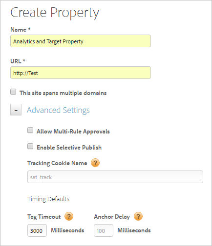
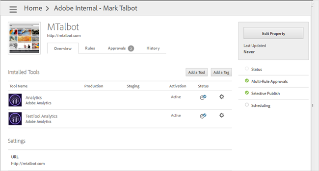
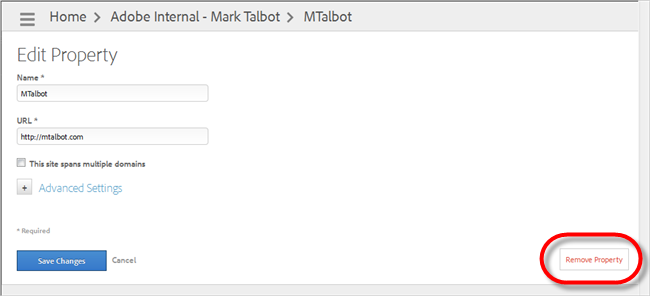

# Web properties{#web-properties}

A web property is a library of rules and one embed code. A web property can be any grouping of one or more domains and subdomains. You can manage and track these assets similarly. For example, suppose that you have multiple websites based on one template, and you want to track the same assets on all of them. You can apply one web property to multiple domains.

## Web properties {#concept_8413810BEAEC4AA48996BE9AFCF141DD}

A web property is a library of rules and one embed code. A web property can be any grouping of one or more domains and subdomains. You can manage and track these assets similarly. For example, suppose that you have multiple websites based on one template, and you want to track the same assets on all of them. You can apply one web property to multiple domains. 

>[!VIDEO](https://video.tv.adobe.com/v/17182/)

By then end of this video you should be able to:

* Explain what a web property is 
* Set up a web property 
* Understand the web property's relationship with the embed code and report suites

This section contains the following information:

* [Best Practices for Planning Web Properties](../administration/web-property.md#section_E34FD37B5F2A41D3B40C850A49DE067F) 
* [How Web Properties Compare to Analytics Report Suites](../administration/web-property.md#section_0C440F337C614C1A972B3E1EF107C53F) 
* [Separating the DTM Environment for Multiple Entities](../administration/web-property.md#section_3F0608BEA6B344D09DE071635017CA3F) 
* [Deactivating a Web Property](../administration/web-property.md#section_CE19CAE345CD49668D903626F935E24B)

## Best practices for planning web properties {#section_E34FD37B5F2A41D3B40C850A49DE067F}

Considering the following when planning web properties:

* Data

  For all of your websites, is the data you are going to collect very similar, somewhat similar, or unique?

  If the data you need to collect is similar across websites, it might make sense to group those sites into one web property to avoid duplicating rules or copying rules from one property to another.

  If your data collection needs are unique for each site, it might make sense to separate those sites in their own web properties. This method lets you control the data collection more specifically for each site, without using large amounts of conditional logic in custom scripts.

  For example, if 80 percent of the data you are collecting across your sites is the same, or similar, it makes sense to group those sites together into the same web property. If the data is unique for each site, it makes sense to put each site into its own web property. 

* Variables

  Similar to data, for all of your websites, are the variables you are going to set in your [!DNL Analytics] and other tools very similar, somewhat similar, or unique?

  For example, if eVar27 is used for the same source value across all of your websites, it might make sense to group those sites together so you can set those common variables across your sites in just one web property.

  If your variable usage is unique for each site, it might make more sense to separate those sites into their own web properties so you can control the variables more specifically for each site without using large amounts of conditional logic in custom scripts. 

* Tools, Tags, and Systems

  Are the tools, tags and systems you are going to deploy through dynamic tag management very similar, somewhat similar, or unique?

  If the tools, tags, and systems you are going to deploy through dynamic tag management are very similar across your sites, you might want to include those sites in the same web property.

  If you are deploying [!DNL Adobe Analytics] on only one site, and your other tools and tags are also unique to certain sites, you might want to create separate web properties for those sites so you can control those specific tools in one web property.

  For example, If you are deploying Adobe Analytics, Target, and the same 3rd-party tags and tools across your sites, that is a reason to group sites together. 

* People

  For the individuals, teams, and organizations that are working in dynamic tag management, will they need access to all of your websites, some of them, or just one of your domains or sub-domains?

  The User Management features allow you to assign different roles to different people for all of your web properties, or on a per-property basis. The only role that includes all web properties within a dynamic tag management company account is the Admin role. If someone is an Admin, that person can perform administrative actions across all the web properties in that dynamic tag management company. All the other roles can be assigned on a per-property basis. You can even hide a web property from certain users (non-admins) by not giving them any role in that web property.

Each implementation can be very different in dynamic tag management, with a wide variety of data-collection needs, variable usage, tools, third-party tags, other systems and technologies, people, teams, geographic regions, and so on. Using the flexible User Management features and web properties, you can create a configuration that matches your workflow and processes.

If the scenarios you are tracking, the data you are collecting, the tools you are deploying, and the variables you are setting are similar across all or some of your domains and subdomains, it is easier to have those domains and subdomains grouped into the same web property in dynamic tag management. If those are unique for each domain and subdomain, it is easier to have those domains and subdomains in their own web property. If you choose to group domains and subdomains in a single property now, you can always change your mind and later create several web properties.

## How web properties compare to Analytics report suites {#section_0C440F337C614C1A972B3E1EF107C53F}

In [!DNL Adobe Analytics], you can dynamically determine the report suite to which you want to send the data, if you are not tracking all the websites in one suite of reports.

A web property can contain any number of domains or subdomains. It can also send analytics data to one or several report suites in [!DNL Analytics]. You can set multi-suite tagging, or you can use conditional logic that sets *`s.account`* according to your particular needs.

If you want to send data to two report suites for every page view and event, you would add a comma-separated list of report suite IDs in the user interface in dynamic tag management, in the Account Numbers fields, on the Adobe [!DNL Analytics] Global Settings page.

If you want to send data to a particular report suite based on conditional logic, you would add your logic in the Editor, in the [!UICONTROL General] section of the Adobe [!DNL Analytics] Global Settings page.

## Separating the DTM environment for multiple entities {#section_3F0608BEA6B344D09DE071635017CA3F}

There are a few ways to handle multiple geo markets, business units, domains, and subdomains in dynamic tag management.

First, you can have one or several dynamic tag management Company accounts. Companies contain web properties. You can have one or several or any number of web properties within a Company account. Within a web property, you can have one or any number of domains or subdomains.

Some customers have one Company that contains all of their web properties. Some have a Company that contains many web properties, one for each domain. Some have a Company that contains several web properties, one for each type of site they manage.

For example, you might have three web properties within your Company account where one contains all of your blog sites, another contains all of your ecommerce sites, and the third contains all of your lead-generation sites.

>[!NOTE]
>
>Each web property requires its own Embed Codes in your page templates. Any domains or subdomains you want included in a particular web property would have the same Embed Codes in the page templates when dynamic tag management is first installed on your site.

**Can we use separate instances for each?**

As described above, you can use separate Company accounts for your three entities, or you can combine the entities into one Company account and split the domains / subdomains into different web properties within that Company account.

**Is there a clear way to separate domains and settings within the same dynamic tag management instance?**

Within a Company account, you can use multiple web properties to separate domains and settings, or you can put multiple domains into the same web property.

**What are the pros and cons for using one dynamic tag management instance?**

With one web property that contains multiple domains and subdomains, you will eventually add conditional logic to separate unique data collection and tracking needs that only apply to individual domains, subdomains, or subsets of domains / subdomains.

**What is the approach recommended by Adobe: one or separate companies?**

Most clients use one Company account that contains all of their web properties. Information on this page can help you determine the best plan for your particular needs within those properties.

## Deactivating a web property {#section_CE19CAE345CD49668D903626F935E24B}

Deactivating a web property does not deactivate everything within the property, it just prevents the associated library files from getting rebuilt (i.e. the staging and production libraries remain in the state they were in when the property was deactivated).

If you deactivate a property and expect a tool or rule to stop firing, you should deactivate those item(s) in the property and then publish that change, if applicable, before deactivating the property.

If the property is already deactivated, you might need to reactivate the property, inactivate the desired items, publish (if applicable), and then deactivate the property again. 

## Create a web property {#task_AE34E23EC47B4E9C8634782C05D9DC09}

Create a web property in dynamic tag management. 

<!-- 

t_create_web_property.xml

 -->

>[!NOTE]
>
>Only a user with Admin rights can create a property. For more information about roles, see [Create and Manage Groups in DTM](../administration/groups.md#concept_6494F1EF2400457ABCED8D860951CD36).

Before beginning, review the [Best Practices](../administration/web-property.md#section_E34FD37B5F2A41D3B40C850A49DE067F) for web properties. 

1. Navigate to your company page, then click **[!UICONTROL Add Property]**.

   

1. Fill in the fields:

<table id="table_376D72251C4D4C4CA878D10C18D2532C"> 
 <thead> 
  <tr> 
   <th colname="col1" class="entry"> Element </th> 
   <th colname="col2" class="entry"> Description </th> 
  </tr> 
 </thead>
 <tbody> 
  <tr> 
   <td colname="col1">  Name </td> 
   <td colname="col2"> 
The name of your property. 
 </td> 
  </tr> 
  <tr> 
   <td colname="col1">  URL </td> 
   <td colname="col2"> 
The base URL of the property. 
 </td> 
  </tr> 
  <tr> 
   <td colname="col1">  This site spans multiple domains  </td> 
   <td colname="col2"> 
You can add and remove domains if you want visitor data to persist between domains. This setting lets you specify how you would like to track traffic moving between your associated <a href="../administration/web-property.md#concept_8413810BEAEC4AA48996BE9AFCF141DD" format="dita" scope="local"> subdomains or domains</a>. If you do not intend to integrate an analytics tool, this step is unnecessary and does not affect processing. 
 </td> 
  </tr> 
 </tbody> 
</table>

1. (Optional) Configure [!UICONTROL Advanced Settings].

<table id="table_6E687FBE6ACC4301BCCD837F4DCBB9C9"> 
 <thead> 
  <tr> 
   <th colname="col1" class="entry"> Element </th> 
   <th colname="col2" class="entry"> Description </th> 
  </tr> 
 </thead>
 <tbody> 
  <tr> 
   <td colname="col1">  Allow Multi-Rule Approvals </td> 
   <td colname="col2"> 
Allows multiple rules for this property to be approved at one time. (The default approval allows only single-rule approval.) 
 </td> 
  </tr> 
  <tr> 
   <td colname="col1">  Enable Selective Publish </td> 
   <td colname="col2"> 
Specifies whether to allow users to selectively publish approved rules. (This is the default option.) 
 </td> 
  </tr> 
  <tr> 
   <td colname="col1">  Tracking Cookie Name </td> 
   <td colname="col2"> 
Overrides the default tracking cookie name. You can customize the name that dynamic tag management uses to track your opt-out status for receiving other cookies. 
 </td> 
  </tr> 
  <tr> 
   <td colname="col1">  Tag Timeout </td> 
   <td colname="col2"> 
Specifies how long dynamic tag management waits for a tag to fire before timing out. Because of how dynamic tag management works, don't worry about this being a high number, as we have other, better methods of ensuring that slow tags do not affect the user experience. 
 </td> 
  </tr> 
  <tr> 
   <td colname="col1">  Anchor Delay </td> 
   <td colname="col2"> 
Specifies how long dynamic tag management waits for tags to fire on clicked links before moving to the next page. The default value is 100 milliseconds. Longer delays improve tracking accuracy. Adobe recommends a delay of 500 milliseconds or less, which the user will not perceive. Dynamic Tag Management will wait up to the time specified, but if the beacon fires sooner, the delay is cut short. (That is, user won't always wait the full length of the delay.) 
 </td> 
  </tr> 
 </tbody> 
</table>

1. Click **[!UICONTROL Create Property]**.

## Delete a web property {#task_98FAD87F2E574E54B2705CDE6C804695}

Delete a web property from dynamic tag management. 

<!-- 

t_delete_web_property.xml

 -->

>[!NOTE]
>
>Property removal cannot be reversed. The requestor must be an admin-level user. This request cannot be undone.

1. Navigate to the [!UICONTROL Overview] page for the desired property.

   

1. Click **[!UICONTROL Edit Property]** > **[!UICONTROL Remove Property]**, then confirm the removal of the property.

   

