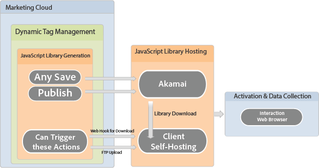
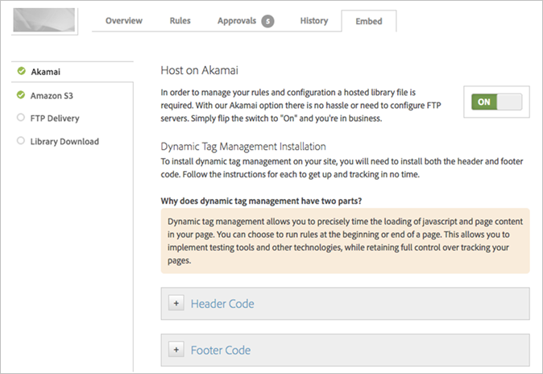
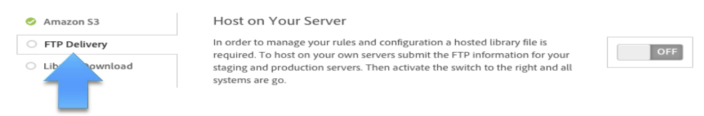
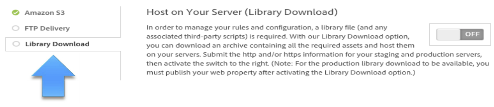

# Embed Code and Hosting Options

Information about the various hosting options in dynamic tag management: Akamai, self-hosting FTP delivery, and self-hosting library download.

## Embed Code and Hosting Options {#concept_09612483C4934E16B20F5E9DA3B7EB7D}

Information about the various hosting options in dynamic tag management: Akamai, self-hosting FTP delivery, and self-hosting library download.

>[!IMPORTANT]
>
>For a successful implementation, it is critical that you follow these instructions as they appear in Adobe Help. Specifically, you must place the header code in the `<head>` section of your document templates. Also, you must place the footer code just before the closing `</body>` tag. Placing either of these embed codes elsewhere in your markup, or using asynchronous methods to append the embed codes, are *not* a supported implementation of dynamic tag management. 
>
>An unsupported implementation will yield unexpected results and prevent Customer Care and Engineering from assisting with your implementation. 
>
>Including multiple embed codes on a single page is not supported, as it can cause conflicts.

This section contains the following information:

* [Hosting Workflow](../deployment/deployment.md#section_A82AE50045D644F89069AB4523307964) 
* [Hosting Options](../deployment/deployment.md#section_A6D88EAD84D5473187AD786319927E63)

## Hosting Workflow {#section_A82AE50045D644F89069AB4523307964}

The following illustration shows the hosting workflow in dynamic tag management:

## Hosting Options {#section_A6D88EAD84D5473187AD786319927E63}

You can deploy dynamic tag management using one or more of the following options, found on the [!UICONTROL Embed] tab:

<table id="table_229298207DB64838B6F2477DFFAE073F"> 
 <thead> 
  <tr> 
   <th colname="col1" class="entry"> Hosting Option </th> 
   <th colname="col2" class="entry"> Description </th> 
   <th colname="col3" class="entry"> Implementation </th> 
  </tr> 
 </thead>
 <tbody> 
  <tr> 
   <td colname="col1"> 
Akamai (migrated from Amazon S3) 
 </td> 
   <td colname="col2"> 
 The simplest hosting option to implement. 
 
Globally distributed delivery network. 
 
Adds additional third-party infrastructure dependencies (DNS lookup, Akamai availability). 
 
See <a format="dita" href="../deployment/deployment.md#concept_722B01555D0441ACBB052BC34DC5B67D" scope="local"> Akamai</a> for information about migrating from Amazon S3 to Akamai. 
 </td> 
   <td colname="col3"> 
    <ol id="ol_EF148EF091A645B3962B084963B3C0B0"> 
     <li id="li_7ECE0C331EEE4907A563D581DF1DFEFE">Dynamic tag management generates custom JavaScript libraries. </li> 
     <li id="li_8E2C858290EF4665B2F45ACAFA121CB3">Dynamic tag management exports the custom JavaScript libraries to Akamai. </li> 
     <li id="li_CE88B10B6E844A56BBB8C575A9363BA9">The target website references the Akamai-hosted dynamic tag management libraries directly at the page level. </li> 
    </ol> </td> 
  </tr> 
  <tr> 
   <td colname="col1"> Amazon S3 </td> 
   <td colname="col2"> 
 
Note:  After July 31, 2015 Adobe will no longer support Amazon S3. Your dynamic tag management libraries on Amazon S3 will continue to be served until December 31, 2015, but in a read-only state. Any changes made in dynamic tag management will no longer be reflected in these files. 
 
 
To deploy additional changes to your site after July 31, 2015, you must select one of our other hosting options. Self-hosting (FTP Delivery or Library Download) is always the suggested best practice, but our 3rd-party Akamai hosting is a world-class option as well. 
 </td> 
   <td colname="col3"> </td> 
  </tr> 
  <tr> 
   <td colname="col1"> Self-hosting: FTP Delivery </td> 
   <td colname="col2"> 
A  push approach, whereby dynamic tag management exports custom JavaScript libraries directly to the web content server host via the FTP protocol. 
 
This solution requires an FTP server and credentials to be available on the web content server to publish changes to the custom dynamic tag management libraries. 
 
For more detailed information, see <a href="../deployment/deployment.md#task_A7B37CB2C89941A4A4D1F9AF06FC493D" format="dita" scope="local"> FTP</a>. 
 </td> 
   <td colname="col3"> 
    <ol id="ol_60348F9C991D4F2B9457006B0F98C834"> 
     <li id="li_24A141C3C7074BF9897C022A22CAE78C">Dynamic tag management generates custom JavaScript libraries. </li> 
     <li id="li_E1E0843060F7447E853EA416A0B033BE">Dynamic tag management exports the custom JavaScript libraries to host server via FTP. </li> 
     <li id="li_EAF5D2ABD03B4911A0CFA464AD8791CE">The target website locally references the custom dynamic tag management libraries. </li> 
    </ol> </td> 
  </tr> 
  <tr> 
   <td colname="col1"> Self-hosting: Library Download </td> 
   <td colname="col2"> 
A  pull approach, whereby the application exports custom JavaScript libraries to Amazon S3. There, the libraries can be accessed by a hosted server-side process. 
 
Additionally, the libraries are available via web download directly from the dynamic tag management interface. 
 
This solution requires either a manual retrieval and publication of the dynamic tag management libraries or the creation of an automated process that pulls the libraries from Akamai onto the web content server. 
 
This approach takes the most time to set up, but is also the most secure and flexible option. 
 
For more detailed information, see <a href="../deployment/deployment.md#task_B7A42F3B1D3E4B71B0BADD17C181F22A" format="dita" scope="local"> Library Download</a>. 
 
    <!--
To check if the latest version of your library file is being referenced, use the command <filepath>_satellite.publishDate</filepath> in the web console. This will return the date and time of publish for the library file currently being referenced. Compare this to the time and date of your latest publish shown in the History tab of your property to determine if the file has been updated. 
--> </td> 
   <td colname="col3"> 
    <ol id="ol_F40B721306FE473496BD657262DFD585"> 
     <li id="li_4EA4D6B555CE4E9CA476C7550C18C061">Dynamic tag management generates custom JavaScript libraries. </li> 
     <li id="li_BA40EBD7AD1546F29D8A209034D06477">Dynamic tag management exports the custom JavaScript libraries to Akamai. </li> 
     <li id="li_E107E69E386A40F3B067F9991C2979AF">Custom dynamic tag management libraries are manually or programmatically moved to the web content server. </li> 
     <li id="li_0809038453B544168A20CE09D7E5AC59">The target website locally references the custom dynamic tag management libraries. </li> 
    </ol> </td> 
  </tr> 
 </tbody> 
</table>

You can expect improved performance and more control over security by hosting the FTP Delivery and the Library Download options on your CDN or infrastructure.

<table id="table_945212E5A33F414DB053569EAE2840DC"> 
 <thead> 
  <tr> 
   <th colname="col1" class="entry"> DTM Basics: Library Hosting Options </th> 
   <th colname="col2" class="entry"> Time: 4:00 </th> 
  </tr>
 </thead>
 <tbody> 
  <tr> 
   <td colname="col1"> 
 
     
 
      <iframe src="https://video.tv.adobe.com/v/17175/" frameborder="0" webkitallowfullscreen="true" mozallowfullscreen="true" oallowfullscreen="true" msallowfullscreen="true" allowfullscreen="allowfullscreen" scrolling="no" width="550" height="345">https://video.tv.adobe.com/v/17175/</iframe>
     
 
 </td> 
   <td colname="col2"> 
By then end of this video you should be able to: 
 
 
     <ul id="ul_6D341D136F5944F98229AD62937310F5"> 
      <li id="li_32CDF16E61EB42BC9A7CC10997ED7AC7">Explain the different hosting options </li> 
     </ul> 
 </td> 
  </tr> 
 </tbody> 
</table>

## Hosting Considerations (FAQ) {#concept_B38C7659E3EC4324A42A199C761EF1F4}

Questions to consider when deciding on a hosting option. 

<!-- 

hosting.xml

 -->

You might consider the following questions when deciding which hosting option is best for your organization: 

<table id="table_A62E86EB7F074EF7B10FDEDACE022C51"> 
 <thead> 
  <tr> 
   <th colname="col1" class="entry"> </th> 
   <th colname="col2" class="entry"> </th> 
  </tr> 
 </thead>
 <tbody> 
  <tr> 
   <td colname="col1"> 
How do I choose a hosting option? 
 </td> 
   <td colname="col2"> 
Dynamic tag management creates and uses various JavaScript files that contain all the code needed to run the system. These “library files” can be hosted by Adobe, or they can be hosted on your own servers within your own Web architecture. 
 
The Library Download hosting option also allows you to self-host the library files. When an authorized dynamic tag management user makes a change in the software, our system writes those changes out to the library files. When you host the library files on your servers with this option, our system needs a way to get those changes to your servers. With the Library Download hosting option, our system sends a ping (an http post) to your system to let your servers know there’s been an update to the library files. Your IT team can create a cron job, or other scripted process, so your servers can pick up the changed files. In this way, whenever a change is made in dynamic tag management, the files you’re hosting on your servers can be updated in an automated manner. 
 
You can use one or more of these hosting options for a web property, just don’t use more than one embed code in any single page. For example, you could use Akamai in your staging environments and one of the self-hosted options in your production environments. Or, you could use the Akamai option for any sites, domains, or subdomains hosted by one of your agency partners. These options give you more flexibility to host the library files according to your specific needs. 
 </td> 
  </tr> 
  <tr> 
   <td colname="col1"> 
What is your current policy regarding website content sources? 
 </td> 
   <td colname="col2"> 
The answer to this question helps determine whether the JavaScript library can be hosted on Akamai, pushed to the website file structure via FTP, or manually pulled into the file structure by a server-side process. 
 
    <ul id="ul_9CD47DCA29CD4E6A9FFDA795C75AE78A"> 
     <li id="li_81097BD34768424A95DB4F576A497D8C"> <a href="../deployment/deployment.md#concept_722B01555D0441ACBB052BC34DC5B67D" format="dita" scope="local"> Akamai</a> </li> 
     <li id="li_2B51623387EB414C87EBEBF1E48C0321"> <a href="../deployment/deployment.md#task_A7B37CB2C89941A4A4D1F9AF06FC493D" format="dita" scope="local"> FTP delivery</a> </li> 
     <li id="li_1DE6957C5CB44F79BC2EC9F59EA866A9"> <a href="../deployment/deployment.md#task_B7A42F3B1D3E4B71B0BADD17C181F22A" format="dita" scope="local"> Library download</a> </li> 
    </ul> </td> 
  </tr> 
  <tr> 
   <td colname="col1"> 
Can I use more than one dynamic tag management library hosting option at once? 
 </td> 
   <td colname="col2"> 
Yes, you can turn on and use any number of the hosting options and use different embed codes for different domains or subdomains. 
 
For example, you might want to use the Akamai option for your lower-level, non-production environments such as staging, dev, test, or UAT. At the same time, you might use one of the self-hosted options, such as Library Download, for your production environments. 
 
Remember that you cannot use more than one option on the same page. You should not implement more than one Header Embed code on any page. 
 </td> 
  </tr> 
  <tr> 
   <td colname="col1"> 
What is your current website content deployment process? 
 </td> 
   <td colname="col2"> 
The deployment process affects how quickly changes can be deployed to the site from the dynamic tag management administrative interface. It also affects how long it takes to initially install dynamic tag management on the website. 
 </td> 
  </tr> 
  <tr> 
   <td colname="col1"> 
What is the current page-level markup and structure of the website? 
 </td> 
   <td colname="col2"> 
An understanding of the basic page-level markup and structural decisions on the website helps with the proper installation of dynamic tag management and the construction of rules within the administrative interface. 
 
Key items to identify include: 
 
    <ul id="ul_E52367C62CA74C9386911E8027374FBA"> 
     <li id="li_305B97B5721546C19F67D781C01181BA">Which JavaScript libraries are referenced within the  &lt;head&gt; section of the web page. </li> 
     <li id="li_705E8E6F71394D8999F0DA8145C9A81F">Whether the individual sections of the page, such as headers and footers, are dynamically generated. </li> 
    </ul> 
Knowledge of any content management systems that are used is helpful in determining the appropriate hosting methodology. 
 </td> 
  </tr> 
 </tbody> 
</table>

## Akamai {#concept_722B01555D0441ACBB052BC34DC5B67D}

Akamai is the primary external hosting option. Akamai provides you with a reliable hosting experience and is the simplest option to implement. Akamai provides the greatest third-party infrastructure dependencies, such as DNS lookup, faster load times, and faster round-trip delivery times. 

<!-- 

akamai.xml

 -->

The Akamai hosting option allows you to store your web property library files on Adobe’s Edge CDN, which sits on the Akamai architecture. This option allows you to install the Embed codes in your page templates and quickly get up and running with dynamic tag management without involving your internal IT teams and servers.

>[!NOTE]
>
>After July 31, 2015 Adobe will no longer support Amazon S3. Your dynamic tag management libraries on Amazon S3 will continue to be served until December 31, 2015, but in a read-only state. Any changes made in dynamic tag management will no longer be reflected in these files. 
>
>To deploy additional changes to your site after July 31, 2015, you must select one of our other hosting options. Self-hosting (FTP Delivery or Library Download) is always the suggested best practice, but our 3rd-party Akamai hosting is a world-class option as well.

## Akamai Cache Control Headers {#section_E004368DEA0143B4B17B2D5966A4664E}

Cache control headers are automatically set for libraries hosted on Akamai (assets.adobedtm.com).

* Production builds: Cache control headers are set to 60 minutes 
* Staging builds with "-staging" in the filename: Cache control headers are set to 0 minutes

>[!NOTE]
>
>It is up to browsers to receive and respect the cache control headers. Some browsers might ignore them.

## Why Choose Akamai Hosting for Library Files? {#section_36B2C1C4EBB946898E430F52F8991F3C}

When you choose the Akamai option in the Embed section of dynamic tag management, it means that your dynamic tag management library files are served to your visitors from Adobe’s Edge CDN, which runs on Akamai architecture.

Akamai is robust when serving content to a global, high-volume audience of Web visitors. Akamai runs redundant networks of load-balanced, geo-optimized nodes to serve content as quickly as possible to visitors wherever they are located throughout the world.

Specifically, Akamai runs more than 137,000 servers in 87 countries within more than 1,150 networks. In terms of redundancy, Akamai does not just route from one server to another, Akamai routes from one node of servers to another node of servers as-needed. In other words, each node consists of multiple servers for redundancy within a node, so a box going down is not an issue because he other boxes in the node take over. If a node goes down, Akamai serves from the next closest one, with the same cached content. Nodes are dynamically selected based on visitor location, traffic load, and other factors so content is consistently served from the best local node for each visitor.

## Can I Avoid Errors in Case of Akamai Unavailability? {#section_40E66A23608441A09BD433FC18B00E68}

No. Dynamic tag management can do nothing from the client side if the library is unavailable. However, it is extremely unlikely that Akamai would be unavailable. 

## Migrate from Amazon S3 to Akamai {#task_20543879440C4154B01F517FABE636C2}

Migrate from Amazon S3 hosting to Akamai by replacing Amazon S3 code. 

<!-- 

t_akamai_migrate.xml

 -->

>[!NOTE]
>
>After July 31, 2015 Adobe will no longer support Amazon S3. Your dynamic tag management libraries on Amazon S3 will continue to be served until December 31, 2015, but in a read-only state. Any changes made in dynamic tag management will no longer be reflected in these files. 
>
>To deploy additional changes to your site after July 31, 2015, you must select one of our other hosting options. Self-hosting (FTP Delivery or Library Download) is always the suggested best practice, but our 3rd party Akamai hosting is a world class option as well.

1. Navigate to the [!UICONTROL Embed] tab.
1. Replace your existing Amazon S3 header codes with the new Akamai header codes.

   No change is necessary in the footer code. 

1. Click **[!UICONTROL Akamai]** to the **[!UICONTROL On]** position.

    
1. Click the **[!UICONTROL Amazon S3]** option to the **[!UICONTROL Off]** position.

   >[!NOTE]
   >
   >After you disable Amazon S3, you can no longer use Amazon S3 hosting. Ensure that you no longer need Amazon S3 before turning it off.

   Akamai hosting in dynamic tag management functions independently of any Akamai hosting you currently use for your website. 

## FTP {#task_A7B37CB2C89941A4A4D1F9AF06FC493D}

Steps to deploy dynamic tag management using FTP (the *`push`* methodology). 

<!-- 

deployment_ftp.xml

 -->

The FTP Delivery hosting option lets you self-host the library files. When an authorized dynamic tag management user makes a change in the software, dynamic tag management writes those changes to the library files. When you host the library files on your servers with this option, dynamic tag management must get those changes to your servers. With the FTP Delivery hosting option, dynamic tag management connects to your system, using credentials and server locations you enter into the system, and delivers any changed files. In this way, whenever a change is made in dynamic tag management, the files you are hosting on your servers can be updated automatically.

You must be an administrator to be able to deploy via FTP. 

1. In the web property, click the **[!UICONTROL Embed]** tab.
1. Click **[!UICONTROL FTP Delivery]**. 
1. Provide the required FTP information for the staging and production servers, then click **[!UICONTROL Save FTP Information]**.

   >[!NOTE]
   >
   >Click **[!UICONTROL Enable Relative Hostnames for Staging and Production Library Hosting]**, if desired. Enabling relative hostname prepends the provided library paths with "window.location.hostname". This allows DTM to load hosted scripts from relative paths, giving you the ability to host your library without editing your path for each deploy.

1. Toggle the switch in the top right corner to **[!UICONTROL ON]**.
1. Click **[!UICONTROL Header Code]** and **[!UICONTROL Footer Code]** to expand those sections.
1. Click the appropriate **[!UICONTROL Copy Embed Code]** button to copy header and footer codes for your staging or development environments.

   >[!NOTE]
   >
   >The staging code should go only into your staging or development environment. Production code should be placed on the live production site.

1. Copy the header code and place it within the HEAD section of the site HTML, on every page of the website. Place it as close to the beginning *`<head>`* tag as possible.
1. Copy the footer code and place it within the BODY section of the site HTML, on every page of the website. Place it as close to the closing *`</body>`* tag as possible

## Library Download {#task_B7A42F3B1D3E4B71B0BADD17C181F22A}

Steps to deploy dynamic tag management using Library Download (the *`pull`* methodology). 

<!-- 

deployment_download.xml

 -->

The Library Download hosting option also lets you self-host the library files. When an authorized dynamic tag management user makes a change in the software, dynamic tag management writes those changes to the library files. When you host the library files on your servers with this option, dynamic tag management must get those changes to your servers. With the Library Download hosting option, dynamic tag management sends a ping (an HTTP post) to your system to let your servers know there has been an update to the library files. Your IT team can create a cron job, or other scripted process, so your servers can pick up the changed files. In this way, whenever a change is made in dynamic tag management, the files you are hosting on your servers can be updated automatically.

You must be an administrator to deploy using the Library Download. 

1. In the web property, click the **[!UICONTROL Embed]** tab.
1. Click **[!UICONTROL Library Download]** in the left navigation. 
1. Fill out one or both of the following optional fields:

    <table id="choicetable_54FF4C9A87C446A89BAE80F165D03A41"> 
 <thead class="chhead sthead"> 
  <th class="choptionhd"> Option</th> 
  <th class="chdeschd"> Description</th> 
 </thead> 
 <tr class="chrow strow"> 
  <td class="choption"><strong>Shared Secret</strong></td> 
  <td class="chdesc stentry"> 
Encrypts the dynamic tag management library during download. 
 
If you enter a shared secret, we use AES-256 to encrypt your  .zip file using this passphrase. 
 </td> 
 </tr> 
 <tr class="chrow strow"> 
  <td class="choption"><strong>Deploy Hook URL</strong></td> 
  <td class="chdesc stentry"> 
The process of deploying dynamic tag management files to the server can be automated whenever there is an update. Create a script that is accessible via the specified public URL. 
 
If you enter a deploy hook URL, we make an HTTP POST to it every time we successfully update your bundle. The body of the post will include a payload containing the download URL of the bundle. 
 </td> 
 </tr> 
</table>    
    
1. Complete the fields under [!UICONTROL Domain and Paths to Tracking File], for staging and production.

   Specify the location where the files reside when deployed to your server. Do not include the protocol or any leading or trailing slashes. Dynamic tag management requires a domain and a path for HTTP or HTTPS for the production and staging environments.

   >[!NOTE]
   >
   >Click **[!UICONTROL Enable Relative Hostnames for Staging and Production Library Hosting]**, if desired. Enabling relative hostname prepends the provided library paths with "window.location.hostname". This allows DTM to load hosted scripts from relative paths, giving you the ability to host your library without editing your path for each deploy.

1. Download the files from the specified URL for the respective environment (staging or production), and deploy them to the location specified in the settings.
1. Click the **[!UICONTROL Header Code]** and **[!UICONTROL Footer Code]** sections.
1. Click the appropriate **[!UICONTROL Copy Embed Code]** button to copy header and footer codes for your staging or development environments.

   >[!NOTE]
   >
   >The staging code should go only into your staging or development environment. Production code should be placed on the live production site.

1. Copy the header code and place it within the HEAD section of the site HTML, on every page of the website. Place it as close to the beginning *`<head>`* tag as possible.
1. Copy the footer code and place it within the BODY section of the site HTML, on every page of the website. Place it as close to the closing *`</body>`* tag as possible
