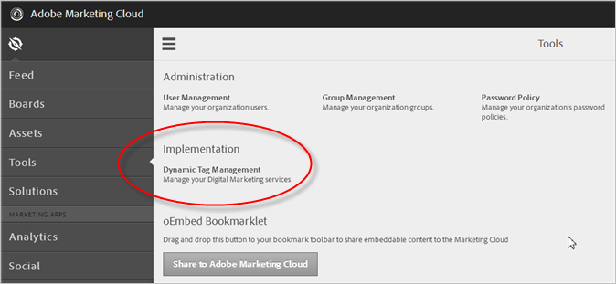

# Getting Started

Information for new users of Dynamic Tag Management.

## Getting Started {#concept_BCE87DF8A0EC48E99529AC0BE8D187FC}

Information for new users of Dynamic Tag Management. 

This section contains the following information:

* [Requesting Access to Dynamic Tag Management](get_started.md#section_9E826B582D0F4712ACD5FC9EDEC3BDC2) 
* [Logging In](get_started.md#section_88F2816938E94085A30745905D38731A) 
* [Getting Started Tasks](get_started.md#section_43ACA8689DAB4865895EFE47D0667A50)

## Requesting Access to Dynamic Tag Management {#section_9E826B582D0F4712ACD5FC9EDEC3BDC2}

Before you start using Dynamic Tag Management, someone from your company must request access. Please contact your Adobe account team and ask for access to Dynamic Tag Management. Your account team will use our internal Provisioning Hub tool to grant access. You should receive your login credentials within one to two business days.

If you have access to the [!DNL Adobe Experience Cloud], you can also request access to dynamic tag management from the [!UICONTROL Tools] menu. 

>[!NOTE]
>
>Administrators, see [Getting Started in the Experience Cloud](http://marketing.adobe.com/resources/help/en_US/mcloud/admin_getting_started.html) if you need access to the Experience Cloud.

## Logging In {#section_88F2816938E94085A30745905D38731A}

Browse to [https://dtm.adobe.com](https://dtm.adobe.com).

## Getting Started Tasks {#section_43ACA8689DAB4865895EFE47D0667A50}

The steps in the following table help you get up and running with Dynamic Tag Management: 

<table id="table_FA225AC1591F4DDFA42834EA1F8CB842"> 
 <thead> 
  <tr> 
   <th colname="col01" class="entry"> Step </th> 
   <th colname="col1" class="entry"> Getting Started Tasks </th> 
   <th colname="col3" class="entry"> Location </th> 
   <th colname="col2" class="entry"> Description </th> 
  </tr> 
 </thead>
 <tbody> 
  <tr> 
   <td colname="col01"> 
  
 </td> 
   <td colname="col1"> 
 Create a web property. 
 </td> 
   <td colname="col3"> 
Web Properties tab on the Dashboard 
 </td> 
   <td colname="col2"> 
 A web property is a library of rules and one embed code. A web property can be any grouping of one or more domains and subdomains. You can manage and track these assets similarly. For example, suppose that you have multiple websites based on one template and you want to track the same assets on all of these websites. You can apply one web property to multiple domains. 
 
For general information about web properties and best practices, see <a href="web_property.md#concept_8413810BEAEC4AA48996BE9AFCF141DD" format="dita" scope="local"> Web Properties</a>. 
 
 To get started, see <a href="web_property.md#task_AE34E23EC47B4E9C8634782C05D9DC09" format="dita" scope="local"> Create a web property</a>. 
 </td> 
  </tr> 
  <tr> 
   <td colname="col01"> 
  
 </td> 
   <td colname="col1"> 
Configure your hosting options. 
 </td> 
   <td colname="col3"> 
Embed tab 
 </td> 
   <td colname="col2"> 
Dynamic Tag Management provides a number of options to host the required JavaScript files: 
 
 
     <ul id="ul_58770505759C4E2C86EF650CC06DB131"> 
      <li id="li_FEE9BB4E764445508923E4A884F98BCE">Akamai </li> 
      <li id="li_60B212620D1941FBB7DBA706CE75C9C3">Self-hosting: FTP Delivery </li> 
      <li id="li_C7C8F798CD864D419B7AB460624A9691">Self-hosting: Library Download </li> 
     </ul> 
 
See <a href="deployment/deployment.md#concept_09612483C4934E16B20F5E9DA3B7EB7D" format="dita" scope="local"> Embed Code and Hosting Options</a>. 
 </td> 
  </tr> 
  <tr> 
   <td colname="col01"> 
  
 </td> 
   <td colname="col1"> 
Add header and footer code to each managed page. 
 </td> 
   <td colname="col3"> 
Embed tab 
 </td> 
   <td colname="col2"> 
Dynamic Tag Management allows you to precisely time the loading of JavaScript and page content in your page. You can choose to run rules at the beginning or end of a page. This allows you to implement testing tools and other technologies, while retaining full control over tracking your pages. 
 
Adobe provides staging and production embed code so you can test your changes in your staging environment before pushing changes to your production environment. 
 
See <a href="deployment/deployment.md#concept_3F6A0A508F294FCBABEBA1DF540B781B" format="dita" scope="local"> Header and Footer Code</a>. 
 </td> 
  </tr> 
  <tr> 
   <td colname="col01"> 
  
 </td> 
   <td colname="col1"> Deploy tools for solutions. </td> 
   <td colname="col3"> 
Overview tab 
 </td> 
   <td colname="col2"> 
Tools let you quickly integrate  Adobe Experience Cloud solutions on your site. Tools go beyond a basic tag, because they provide additional configuration options. A tool corresponds to Adobe solutions like Analytics and Target, as well as Google Analytics. After you add a tool to a property, it is available for inclusion in a rule. 
 
See <a href="tools/tools.md#concept_19C5BCE1F99E4EACBD4EA2D61F265184" format="dita" scope="local"> Tools (Overview Tab)</a>. 
 </td> 
  </tr> 
  <tr> 
   <td colname="col01"> 
  
 </td> 
   <td colname="col1"> 
Create data elements. 
 
And 
 
Create rules, conditions, and actions. 
 </td> 
   <td colname="col3"> 
Rules tab 
 </td> 
   <td colname="col2"> 
 Data elements are the building blocks for rules. Data elements let you create a data dictionary (or data map) of commonly used items on a page, regardless of where they originate (query strings, URLs, or cookie values) for any object that is contained on your site. You use data elements to build a data layer that can be used in rules for  Analytics and other data collection tools. 
 
Rules can be triggered at page load or when a specific event occurs. Dynamic Tag Management provides a powerful conditioning interface that provides granular control of when tags fire. 
 
To get started, you should set up a basic page-load rule with no conditions to collect analytics data on all pages. 
 
For more information, see <a href="data_elements.md#concept_8A4591BD0F4241B6925D976482C43CD2" format="dita" scope="local"> Data Elements</a> and <a href="rules/rules.md#concept_2D3F296DD3BD418BAB7A0E2415DD9C92" format="dita" scope="local"> Rules</a>. 
 </td> 
  </tr> 
  <tr> 
   <td colname="col01"> 
  
 </td> 
   <td colname="col1"> 
Publish tools and rules to the production server. 
 </td> 
   <td colname="col3"> </td> 
   <td colname="col2"> 
After a rule is created, it is funneled through a multi-step approval process before it is published to a production environment. 
 
See <a href="rules/rules.md#concept_300552C4F89E418F94A4D755960B44B0" format="dita" scope="local"> Rules</a>. 
 </td> 
  </tr> 
 </tbody> 
</table>

## Planning for Dynamic Tag Management {#concept_EC50FC4409014AF1A1C3F1527015849F}

Dynamic tag management is an evolution of tag management, designed around the mapping of user interactions to marketing technologies. Your tags and marketing tools are best used when reacting to visitors (or segments of your visitors) and their activity on your site in precise ways. 

<!-- 

success.xml

 -->

By starting with user interactions as the stimulus for marketing tool response, you can know how those interactions result in data collection, testing, or engagement with tools like chat, surveys, and more.

**Planning Ahead**

To make the most of dynamic tag management, establish a clear vision of how you want to use digital marketing. For help with planning, Adobe offers consulting on best practices. Also, a number of consulting agencies across the globe have extensive experience deploying dynamic tag management and helping transform your organization's productivity, workflows, and sophistication. 

## Browser Support {#concept_14C1D3046A1845AC8765584ECD28BD44}

DTM has been tested with the most commonly used browsers. 

<!-- 

browser-support.xml

 -->

The DTM user interface supports the latest version of Safari, Chrome, and Firefox, as well as version 9 and above of Internet Explorer.

The DTM library supports the latest version of Safari, Chrome, and Firefox, as well as version 8 and above of Internet Explorer. 

## Access DTM through Experience Cloud {#task_558CAA9062D646D5BC9252C4D574578F}

These instruction explain how to access DTM companies through the Experience Cloud. 

<!-- 

t_access-dtm-ec.xml

 -->

1. Open the solution picker and click **[!UICONTROL Activation]**.
1. Click **[!UICONTROL Dynamic Tag Management]**.

   Step Result 
## Managing Users and the Publish Workflow {#concept_D6E9196B4607429197D07B472A7F0BAC}

Dynamic tag management is based on a roles-oriented platform that lets you control the process. 

<!-- 

publish_workflow.xml

 -->

Roles include the following: 

|  Role  | Description  |
|---|---|
|  Users  | Create and test rules.  |
|  Approvers  | Review and approve rules, making approved states of rules publishable.  |
|  Publishers  | Publish rules to the production site. Only approved rules are published.  |
|  Administrators  | Create and manage users, as well as inheriting rights from the three preceding roles.  |

 <b>Publishing Workflow</b> 

1. A rule is saved. 
1. The rule is automatically pushed to your staging site where you can perform testing. 
1. The saved rule is funneled into the approval queue, where the details of the rule can be viewed in summary. 
1. The Approver, Approver & Publisher, or Administrator level user approves the rule. 
1. The rule goes into the publishing queue. 
1. In the publishing queue, the Admin, Publisher, or Approver & Publisher level user must publish the rule before it goes live.

   If you make changes to a published rule, the changes are not published to the site until they have been funneled through the approval process.

   This process ensures that only approved rules and rule revisions are published to your live site. This approval process also retains all past and present revision information. This retention makes it easy to follow a rule’s history and pin-points when an issue may have occurred.

For details, see [Users and Permissions](users.md#concept_2FA1011890C04E59845E8EB1E2345488). 

## Manage Account Settings {#task_BEC6AC7A5DB542CB9B442D318A0E0305}

Manage your user account settings, including settings for names, title, mobile number, time zone, language for the user interface, opt-out notifications, and password changes. 

<!-- 

t_manage_account_settings.xml

 -->

1. In the upper right corner of the dynamic tag management interface, click   > **[!UICONTROL Account Settings]**.
1. Edit the fields as necessary:

   **First Name: **Specify your first name.

   **Last Name: **Specify your last name.

   **Title: **Specify your title.

   **Mobile Number: **Specify your mobile telephone number.

   **Outside of US: **Select this option if you are outside of the United States. Ensure that you provide a country code in the [!UICONTROL Mobile Number] field if you choose this option.

   **Time Zone: **Specify your time zone.

   **Language: **Choose the desired language from the drop-down list. The user interface displays in the selected language.

   **Email Address: **Specify your email address. You can add multiple email addresses separated by commas.

   **Opt Out of All Notifications: **Opt out of all email notifications when one of your web properties is published. By opting out of email notifications, you will no longer receive publish request, property published, note, or approval email notifications. However, you will continue to receive other email notifications.

   **Current Password: **If you want to change your dynamic tag management password, specify your current password in this field.

   **Password: **Specify your new password.

   To maintain the utmost security possible for your account, all passwords must meet the following criteria:

* Must be at least seven characters in length 
* Must contain at least one number and at least one letter 
* Must contain at least one special character that is not a letter or number 
* Must not be one of your last five passwords

   **Password Confirmation: **Specify your new password for confirmation. 
1. Click **[!UICONTROL Save Changes]**.

## Architecture {#concept_03FEF75036BD4CD7822CEF47FAE443A9}

Information about dynamic tag management architecture. 

<!-- 

architecture.xml

 -->

Architecturally, dynamic tag management comprises two main components:

* **Management Application**: Offers an easy-to-use, tab-structured configuration user interface. 
* **JavaScript libraries**: Produced by the Management Application and transported to hosting servers. Dynamic tag management includes two types of JavaScript libraries:

    * **Staging Library:** Every change you make in the Management Application is immediately updated to use on the staging server. 
    * **Production Library: **Only the final, approved version of a tool or rules makes it onto the production server.

  This model fits well into the approval workflow, in that development or staging code is never accidentally included in the production library. See [Publish Workflow](get_started.md#concept_300552C4F89E418F94A4D755960B44B0).

<table id="table_0C277DDB4FD04C17B5279FC98B160326"> 
 <thead> 
  <tr> 
   <th colname="col1" class="entry"> DTM Basics: Architecture </th> 
   <th colname="col2" class="entry"> Time: 2:38 </th> 
  </tr>
 </thead>
 <tbody> 
  <tr> 
   <td colname="col1"> 
 
     
 
      <iframe src="https://video.tv.adobe.com/v/17166/" frameborder="0" webkitallowfullscreen="true" mozallowfullscreen="true" oallowfullscreen="true" msallowfullscreen="true" allowfullscreen="allowfullscreen" scrolling="no" width="550" height="345">https://video.tv.adobe.com/v/17166/</iframe>
     
 
 </td> 
   <td colname="col2"> 
By then end of this video you should be able to: 
 
 
     <ul id="ul_D2161525FCFE4C85955A470FD285F043"> 
      <li id="li_3F69AD222C334076A659D63E95340B84">Describe the basic elements of DTM's architecture </li> 
     </ul> 
 </td> 
  </tr> 
 </tbody> 
</table>

