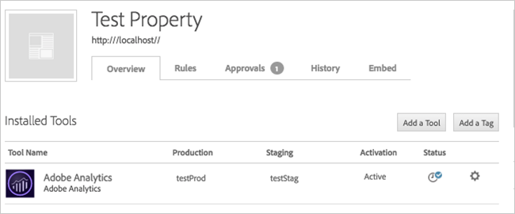
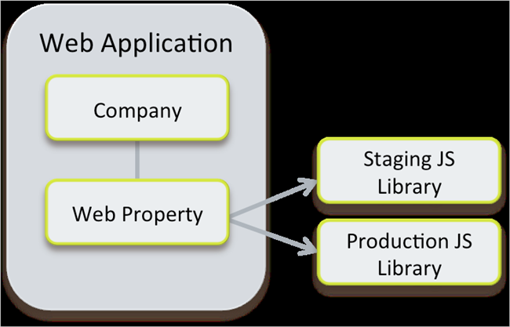
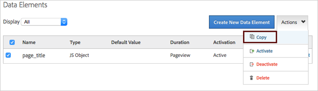

# Best practices for getting started with Adobe Dynamic Tag Management{#best-practices-for-getting-started-with-adobe-dynamic-tag-management}

If you are new to Adobe Dynamic Tag Management (DTM), getting ready to migrate to DTM, or brushing up on DTM, this guide is for you.

## Best practices for getting started with Adobe Dynamic Tag Management {#concept_F11685D84F0646C784F560827E2DE0AF}

If you are new to Adobe Dynamic Tag Management (DTM), getting ready to migrate to DTM, or brushing up on DTM, this guide is for you. 

**Last updated: January 30, 2017**

Dynamic Tag Management lets marketers quickly and easily manage tags and provides innovative tools for collecting and distributing data across digital marketing systems. DTM also enables responsive delivery of user-specific content-providing new levels of agility and control to companies seeking to thrive in today's fast-paced digital marketplace.

In addition to this Best Practices Guide, the following resources are available to help you get the most out of Dynamic Tag Management:

<table id="table_B41E90B9A77C4C60B1FEC551AF66F01C"> 
 <thead> 
  <tr> 
   <th colname="col1" class="entry"> Resource </th> 
   <th colname="col2" class="entry"> Details </th> 
  </tr> 
 </thead>
 <tbody> 
  <tr> 
   <td colname="col1"> <a href="https://marketing.adobe.com/resources/help/en_US/dtm/" format="https" scope="external"> Dynamic Tag Management Product Documentation </a> </td> 
   <td colname="col2"> 
In-depth information and step-by-step instructions about how to use Dynamic Tag Management. 
 </td> 
  </tr> 
  <tr> 
   <td colname="col1"> 
 <a href="../getting-started/get-started.md#concept_BCE87DF8A0EC48E99529AC0BE8D187FC" format="dita" scope="local"> Getting Started Guide </a> 
 </td> 
   <td colname="col2"> 
Information about how to start using Dynamic Tag Management. 
 </td> 
  </tr> 
 </tbody> 
</table>

## Basics for the first-time user {#concept_63BF0B06FD7E4BB1A769793E5876BFBB}

An introduction to the Dynamic Tag Management (DTM) user interface. 

<!-- 

gs-basics.xml

 -->

<table id="table_FF39660DB8734D53AB8981AD388522B6"> 
 <tbody> 
  <tr> 
   <td colname="col1"> 
This content was built <a href="https://www.searchdiscovery.com/" format="https" scope="external"> in partnership </a> with  
 </td> 
  </tr> 
 </tbody> 
</table>

This section contains the following information:

* [Dashboard](../getting-started/gs-best-practices.md#section_541984CAD949498BBE666B9FD497302B) 
* [Company Overview](../getting-started/gs-best-practices.md#section_AA783537B0A643598DA238B6C577A3D0) 
* [Property Overview](../getting-started/gs-best-practices.md#section_BFC4BF8CF78A4981890A0E79756986FB) 
* [Rules](../getting-started/gs-best-practices.md#section_9B27F695162D4E88B20DAE0093744F41) 
* [Data Elements](../getting-started/gs-best-practices.md#section_7D274B851CA54E61B2C269147AEE5B67) 
* [Workflows](../getting-started/gs-best-practices.md#section_03FD2B2A846F4038B79A8C61812D9570) 
* [Installation](../getting-started/gs-best-practices.md#section_71496DA7F9C641D4894497D0EAD15E39)

## Dashboard {#section_541984CAD949498BBE666B9FD497302B}

**Navigation: Home > Dashboard**

The first page seen in DTM after logging in is the dashboard. The dashboard contains a list of all of the companies to which you have access.

## Company overview {#section_AA783537B0A643598DA238B6C577A3D0}

**Navigation: Home > Dashboard > Company Overview**

Clicking into a company from the dashboard takes you to the company overview page.

>[!NOTE]
>
>If you have access to only one company, you are directed to the company overview page instead of the dashboard upon login.

In DTM, a company is a collection of web properties. A web property is a collection of tools, rules, and data elements.

All web properties in the company are accessed from the company overview page.

Admin-level users can add new web properties from the company overview page by clicking Add Property. The only required fields when configuring a web property are Name and URL, which can be changed at a later time if needed.

Admin-level users can also manage and provision users from the company overview page via the Users and Groups tabs.

## Property overview {#section_BFC4BF8CF78A4981890A0E79756986FB}

**Navigation: Company Overview > Property Overview**

Clicking into any property from the company overview page takes you to the property overview page.

The property overview page gives a brief summary of the property configuration and serves as a gateway to the main property components: tools, rules, data elements, the publish workflow, and the property embed codes.

**Navigation: Property Overview > Installed Tools**

DTM tools are built-in integrations that allow for quick deployment of solutions to your site.

Currently, DTM offers tool integrations for Adobe solutions as well as for Google Analytics and Nielsen. Each of these integrations is uniquely designed to make configuration and deployment of that particular solution easier.

>[!NOTE]
>
>Any third-party tool or tag without a native integration can be implemented in a rule through the 
>
>JavaScript / 3rd Party Tag section discussed below.

## Rules {#section_9B27F695162D4E88B20DAE0093744F41}

**Navigation: Property Overview > Rules**

Clicking the Rules tab from the property overview page takes you to the property rules.

Rules in DTM are used to conditionally execute tools, tags, scripts, and HTML.

Regardless of the type, rules in DTM have two main components: the condition and the trigger. The condition indicates the scenario in which the rule will fire and the trigger indicates the item(s) that will execute when the rule fires.

There are three types of rules in DTM:

* **Event-Based:** Event-based rules are interaction driven. For example, if I wanted to track when a user clicks a certain button, I would use an event-based rule. 
* **Page-Load:** Page-load rules are tied to the page load. For example, if I wanted to add a specific block of code on load of certain pages on my site, I would use a page-load rule. 
* **Direct-Call:** Direct-call rules are used in scenarios when DTM cannot detect an event in the DOM. For example, if I want to track an AJAX event that can't be detected in the DOM, I would use a direct call rule.

Regardless of the rule type, if the condition is met the trigger executes.

All rules types have the option to trigger third-party vendor tags or any other custom JavaScript or HTML via the Javascript / Third Party Tags modal.

Other trigger modals are enabled in rules when tools are added to the property. For example, if my property contains an Adobe Analytics tool and a Google Universal Analytics tool, the property rules will contain optional trigger modals for these tools.

Each tool modal offers easy methods to customize a trigger for that particular tool.

## Data elements {#section_7D274B851CA54E61B2C269147AEE5B67}

**Navigation: Property Overview > Rules > Data Elements**

Clicking the Data Elements tab within the Rules tab displays the data element overview page.

Data elements are used to build a data mapping in DTM. Defining common data points as data elements enables those data points to be easily captured and leveraged within rules and tools in DTM.

## Workflows {#section_03FD2B2A846F4038B79A8C61812D9570}

An important concept in DTM is the idea of a single web property having both a staging library and a production library.

The staging library contains all of the rules, tools, and data elements configured in the web property. The production library includes only the rules, tools, and data elements that are approved and published.

**Navigation: Property Overview > Approvals tab**

When a rule, tool, or data element is added or changed in a property an approval is automatically generated.

**Navigation: Property Overview > History tab**

After an item is approved, it becomes available in the Unpublished Changes queue 0n the History tab. After an item is published, it becomes available in the production library.

This separation of libraries and associated workflow allows for more effective testing in staging without affecting production.

## Installation {#section_71496DA7F9C641D4894497D0EAD15E39}

**Navigation: Property Overview > Embed tab**

Clicking the Embed tab takes you to the DTM installation page.

This tab contains the various library hosting options available. By default the property leverages Akamai hosting. This method is typically acceptable for most organizations; however, if additional control over the serving of the DTM library in needed two self-hosting options are available.

Expanding the Header Code section on the Embed tab reveals the staging and production embed codes for the property.

Notice there's one embed code for staging and one for production. This is how DTM differentiates between the staging and production libraries discussed above. When the staging embed code is installed, the staging library loads. When the production embed code is installed, the production library loads.

After the header and footer embed codes are properly installed on a site, the associated DTM library loads automatically on each page load.

Leverage the DTM Switch Plugin to test in the web console. This helps you understand what DTM is doing on the page and allows you to locally switch to the staging library for more effective testing. For more information, see [Search Discovery Plugins](../managing-resources/plugins/search-discovery-plugins.md#concept_8FAC0FBBDED24044BB413E381EA4F620) in the *Dynamic Tag Management Product Documentation*. 

## DTM technical architecture and hosting {#concept_8D39FE188D03478CB3ABBA384FE4E1D3}

Information about the technical architecture of Dynamic Tag Managment (DTM) and its hosting options. 

<!-- 

gs-tech-architecture-hosting.xml

 -->

<table id="table_A0EBB1D11643416590C8BA93C974D450"> 
 <tbody> 
  <tr> 
   <td colname="col1"> 
This content was built <a href="https://www.searchdiscovery.com/" format="https" scope="external"> in partnership </a> with  
 </td> 
  </tr> 
 </tbody> 
</table>

This section contains the following information:

* [Architecture](../getting-started/gs-best-practices.md#section_D7D17D4D06614FCEAFE1F1698C661B15) 
* [Hosting](../getting-started/gs-best-practices.md#section_06F8BFB50AA540E49DF4238CE2D9477B)

## Architecture {#section_D7D17D4D06614FCEAFE1F1698C661B15}

The primary components of the DTM technical architecture include the web management application, the staging and production JavaScript libraries, and the embed code.

The web management application is the online interface that you log in to and use to manage your DTM implementation. This is where you'll create and configure tools, rules, and data elements and manage the deployment of these configurations to your site(s).

A web property in DTM is a collection of tool, rule, and data element configurations.

Each web property is associated with one staging JavaScript library and one production JavaScript library. These libraries are generated by the web application and contain the unique set of configurations in that web property.

The staging JavaScript library contains all of the latest tool, rule, and data element configurations in the web property. This library is automatically updated with any change in the property and is intended for testing in staging environments or for local production testing via the DTM switch plugin.

For more information about the DTM switch plugin, see [Search Discovery Plugins](https://marketing.adobe.com/resources/help/en_US/dtm/index.html?f=search_discovery_plugins) in the Dynamic Tag Management Product Documentation.

The production JavaScript library contains only tool, rule, and data element configurations that have been approved and published through the web property workflow. This library is intended for the production environment.

## Hosting {#section_06F8BFB50AA540E49DF4238CE2D9477B}

Both the staging and production JavaScript libraries can be hosted in the following ways.

* External hosting via **Akamai**-library hosted on Akamai's servers 
* Self-hosting via **SFTP** or **library download**-library hosted on your servers

Choosing a hosting option(s) is a decision your business needs to make. Review the following option comparison and use-case examples to help facilitate this decision.

<table id="table_BCDD5C290BB04C81A150E13B46B47589"> 
 <thead> 
  <tr> 
   <th colname="col1" class="entry"> </th> 
   <th colname="col2" class="entry"> Advantages </th> 
   <th colname="col3" class="entry"> Disadvantages </th> 
  </tr> 
 </thead>
 <tbody> 
  <tr> 
   <td colname="col1"> 
<b>Akamai </b> 
 
External hosting 
 </td> 
   <td colname="col2"> 
    <ul id="ul_DE47B8B68BCA43C0AD8B901A4B13D0EE"> 
     <li id="li_702BC6B2343343FF8658A1BE0D2A28F3">Standard deployment method </li> 
     <li id="li_AC78B82078B04439BF2A22400E88F976">No configuration needed </li> 
     <li id="li_96FCBF0479DB48CD8C71D44A9F4606F9">Minimal dependence on IT </li> 
     <li id="li_C0EFB19F13934AF0BD56EB867DF45636">Automatic file updating </li> 
     <li id="li_EC668BBF6BEE40C0965223D11792875B">Reliable &amp; speedy file delivery via globally distributed Akamai network </li> 
    </ul> </td> 
   <td colname="col3"> 
    <ul id="ul_07E44C27BBA4495AAD6705413F449215"> 
     <li id="li_5FA75AD3470B474C90E78BCF36433A3C">Lack of control over file delivery </li> 
     <li id="li_B5709210808C48E59106DE4B75EE8C40">Dependence on third-party infrastructure (i.e. if Akamai is unavailable, so is your library) </li> 
    </ul> </td> 
  </tr> 
  <tr> 
   <td colname="col1"> 
<b>SFTP</b> 
 
Self hosting 
 </td> 
   <td colname="col2"> 
    <ul id="ul_5B6D2038812B45028221D642BD1E9C47"> 
     <li id="li_9AD86FC790394D64B1B8A0FE7E9BA7F3">Complete control over file delivery </li> 
     <li id="li_E24A9C641040438880D4ABDDB18CC946">More secure option: SSH file transfer </li> 
     <li id="li_A9B862CF6B574DA8BEE9F31D33A459EF">Automatic file updating </li> 
    </ul> </td> 
   <td colname="col3"> 
    <ul id="ul_ABAF6CFE309845FF84078C5EE8BCE582"> 
     <li id="li_A7D646A2756E4DD1B0AA5298D950EA77">Upfront configuration required </li> 
     <li id="li_C50F26AC635E49C682011021FEEF62D0">Greater dependence on IT </li> 
    </ul> </td> 
  </tr> 
  <tr> 
   <td colname="col1"> 
<b>Library Download</b> 
 
Self hosting 
 </td> 
   <td colname="col2"> 
    <ul id="ul_C7908AD803E3471C85BFB497BE2C2815"> 
     <li id="li_8157A9FDFB884811B5514D1DB9BEEDEA">Complete control over file delivery </li> 
     <li id="li_B317AE781585426F9B535A15E6AA2ECD">Most secure hosting option: AES 256 bundle encryption </li> 
    </ul> </td> 
   <td colname="col3"> 
    <ul id="ul_905C752A832B43ACB45C92236A28281A"> 
     <li id="li_7F8F76A323794AA99FC66900340FF067">Upfront configuration required </li> 
     <li id="li_BAE0341B7DA84CC382C9501921812205">Greater dependence on IT </li> 
     <li id="li_C5A6183560C144FAA08C9F7521C7A4E4">Additional configuration required for automatic file updating </li> 
    </ul> </td> 
  </tr> 
 </tbody> 
</table>

**Use case examples **

|  Scenario  | Solution  |
|---|---|
|  I prefer to involve IT as little as possible and have a need for a reliable file hosting method outside of my own site infrastructure.  | Leverage Akamai hosting in all environments.  |
|  I want to have complete control over file delivery in my production environment; however, speed and agility is more important than file control in my staging environment.  | Leverage Akamai hosting in staging environments and FTP delivery in production environment.  |
|  Certain sections of my site deal with highly confidential information. Security is the most important thing on these pages but isn't necessarily as important on other pages of my site.  | Leverage library download hosting on secure pages and Akamai hosting on non-secure pages.  |

All hosting options are available to enable and configure on the [!UICONTROL Embed] tab in your DTM property.

Regardless of the hosting option chosen, the JavaScript library is served on your site via the installed embed code. Each hosting option provides a unique set of embed codes that reference the applicable file location configured for that hosting option.

The embed code consists of two code snippets: the header and the footer code.

* **Header Code** 

  The header code is responsible for calling the associated JavaScript library from the host location and serving it on your site. This code snippet should be placed in the head section of the site code as close to the opening tag as possible. 

* **Footer Code** 

  The footer code is responsible for identifying the end of the page for timing control. This code snippet should be placed in the body section of the site code as close to the closing tag as possible.

The appropriate placement of both the header and footer embed code snippets is critical to the effective deployment of the DTM JavaScript library.

>[!NOTE]
>
>Although you can use more than one hosting option, you must ensure that only a single embed code reference is included on any given page. Duplicative or improper placement of the embed code can result in unexpected library behavior.

The following illustration show how the discussed DTM architecture components work together to effectively deploy and manage tools, tags, and scripts on your site.

For more information on hosting options, see [Embed Code and Hosting Options](../client-side-information/deployment.md#concept_09612483C4934E16B20F5E9DA3B7EB7D) in the *Dynamic Tag Management Product Documentation*. 

## Planning your migration to DTM {#concept_385443887380472383FDA7FF07D94D6B}

Information to consider as you plan your migration to [!DNL Dynamic Tag Management] (DTM) and best practices to help get your implementation started correctly. 

<!-- 

gs-planning-migration.xml

 -->

<table id="table_E359D977E26C43599B65D3D77503605C"> 
 <tbody> 
  <tr> 
   <td colname="col1"> 
This content was built <a href="https://www.searchdiscovery.com/" format="https" scope="external"> in partnership </a> with  
 </td> 
  </tr> 
 </tbody> 
</table>

This section contains the following information:

* [Planning Your DTM Setup: Component Overview](../getting-started/gs-best-practices.md#section_53F7BA8808974D86BE77C87D00399A3E) 
* [Planning Your DTM Setup: Decision Points](../getting-started/gs-best-practices.md#section_E3732619197944FF8E0250882CDED2CE) 
* [Migration Best Practices](../getting-started/gs-best-practices.md#section_8C06310344FA46CD95A4B44F6581F3AF)

## Planning your DTM setup: Component overview {#section_53F7BA8808974D86BE77C87D00399A3E}

This section contains a quick overview of the basic DTM company structure to prepare for the decisions involved in planning your DTM setup.

In DTM a company is a grouping of web properties.

A web property is a grouping of tools, rules, and data elements configured to collect data and deploy tags / scripts on your site(s).

Each web property is associated with one embed code that's responsible for loading the specific property configurations on your site(s).

Users are managed at the company level but can be permissioned for each property with the exception of the Admin role. The Admin role is global and has full permissions for all properties in a company.

For more information on user roles, see [Create and Manage Groups](../administration/groups.md#concept_6494F1EF2400457ABCED8D860951CD36) in the *Dynamic Tag Management Product Documentation*.

## Planning your DTM setup: Decision points {#section_E3732619197944FF8E0250882CDED2CE}

With the basic DTM company structure in mind, let's discuss the related decision points as you plan your DTM setup.

**How many companies do I need?**

In most cases one company will best meet business needs.

The primary reason for having more than one company is to accomplish complete separation of users and web properties.

This type of configuration is most typical for large businesses with numerous sets of web entities that are run by various business divisions.

**How should I distribute my domains and subdomains into web properties?**

Web properties can be configured as one-to-one or one-to-many with your domains.

To decide what will work best for your business, consider the cross-domain similarities and differences of the following variables.

* Data collection methods and sources 
* Tools and tags deployed 
* Site code structure 
* DTM user workflows

In most cases one web property per one domain will best meet business needs due to considerable differences in one or many of the above variables.

This type of setup most effectively accommodates each domain's needs while still allowing for easy duplication of cross-domain constants via the 'copy' functionality.

However, in cases where these variables are the same or very similar across domains, it may make more sense to have multiple domains within one web property. In these cases, this setup can reduce unnecessary duplication between properties.

This same reasoning can be used for subdomain distribution.

**Use-Case Examples**

|  Scenario  | Solution  |
|---|---|
|  My business division manages several domains. We're deploying Adobe Analytics across all domains, but each domain has its own reporting suite and tracking needs.  | Leverage one property for each domain.  |
|  My business division manages several domains. We're deploying Adobe Analytics across all domains and use one global reporting suite to collect all of our data. Data sources between domains are very different due to variations in site code structure.  | Leverage one property for each domain.  |
|  My business division manages several domains. We're deploying Adobe Analytics across all domains and use a global reporting suite and global data layer to collect all of our data. The rest of our tools and tags are mostly consistent between domains and we're planning to have the same users manage the publish workflow.  | Leverage one property for all domains.  |

## Migration best practices {#section_8C06310344FA46CD95A4B44F6581F3AF}

After determining the optimal company and property distribution, consider the following best practices as you begin your DTM migration.

**Process Workflow:** Develop a systematic process for migrating existing page code into DTM to help ensure a smooth transition.

It's generally recommended to start this process in lower-level staging environments and migrate code on a page-by-page or site section by site section basis.

This will allow you to fully vet DTM configurations before removing any pre-existing page code reducing the risk of implementation disruption.

**Working with IT:** It's important to work with your IT team upfront to determine current processes and deployment cycles.

This will help ensure proper and timely placement of the embed code and coordinated removal of effectively migrated page code.

**People Workflow & Governance:** Another important concept is establishing a user workflow. Thoughtfully assigning user roles provides governance to the DTM workflow.

|  User Role  | Create Rules  | Edit Rules  | Test Rules  | Approve Rules  | Publish Rules  | Create/Edit Users  | Create Property  |
|---|---|---|---|---|---|---|---|
|  **User ** | Yes  | Yes  | Yes  |  |  |  |  |
|  **Approver ** | Yes  | Yes  | Yes  | Yes  |  |  |  |
|  **Publisher ** | Yes  | Yes  | Yes  |  | Yes  |  |  |
|  **Approver and Publisher ** | Yes  | Yes  | Yes  | Yes  | Yes  |  |  |
|  **Admin ** | Yes  | Yes  | Yes  | Yes  | Yes  | Yes  | Yes  |

This will ensure that all items are fully vetted by the right members of your team before being pushed to production.

For more information, see [Migrating to Dynamic Tag Management](../migration-to-and-from-dtm/migration.md#concept_0900FD22CF94473E89F73D5A866CE799) in the *Dynamic Tag Management Product Documentation*. 

## Migrating to DTM: A closer look at Adobe Analytics {#concept_94614A4C3F4D479AB3266ADB14D27BEF}

Whether your current [!DNL Adobe Analytics] implementation is deployed via on-page methods or via another tag management system, this section helps you understand your options as you migrate to DTM. 

<!-- 

gs-migrate-analytics.xml

 -->

<table id="table_9017E7B2C4BA495088E907630AF89E6D"> 
 <tbody> 
  <tr> 
   <td colname="col1"> 
This content was built <a href="https://www.searchdiscovery.com/" format="https" scope="external"> in partnership </a> with  
 </td> 
  </tr> 
 </tbody> 
</table>

## Phase 1: Quick value add {#section_A0FE9FA8759C4E708E6D0A0FB78765BB}

<!-- 

gs-phase1-quick-value-add.xml

 -->

Because migrating [!DNL Adobe Analytics] code can be a lengthy process, DTM offers a feature that allows you to augment your existing [!DNL Analytics] implementation without disrupting it.

<table id="table_2E1D3C0CA4AC43ADAA06689B8BFE311A"> 
 <tbody> 
  <tr> 
   <td colname="col1"> 
This content was built <a href="https://www.searchdiscovery.com/" format="https" scope="external"> in partnership </a>with  
 </td> 
  </tr> 
 </tbody> 
</table>

This feature is called [!DNL Page Code is Already Present] and is located in the Analytics tools settings in your DTM property.

To access this feature, expand the Library Management section of the tool settings.

With this feature enabled, DTM is able to leverage the existing implementation to send supplemental `s.t() / s.tl()` calls via event-based and direct-call rules.

This functionality makes it easy to start using DTM to augment your Adobe Analytics implementation before migrating any code.

However, it's important to note the following limitations with this approach.

* Variables and settings configured in the DTM Adobe Analytics tool will not take effect. 
* Adobe Analytics variables set in page-load rules will not take effect.

These limitations occur because DTM is fully relying on the existing implementation to serve the AppMeasurement code and instantiate the s object.

## Phase 2: Full migration {#section_A761BCFF9CF94D61B0F4E82C59F2884A}

<!-- 

gs-phase2-full-migration.xml

 -->

To take full advantage of the integrated [!DNL Adobe Analytics] functionality in DTM, a complete migration of [!DNL Analytics] code is recommended.

<table id="table_5E23DA0E8CB64FA493970321259EBF1B"> 
 <tbody> 
  <tr> 
   <td colname="col1"> 
This content was built <a href="https://www.searchdiscovery.com/" format="https" scope="external"> in partnership </a> with  
 </td> 
  </tr> 
 </tbody> 
</table>

This migration should include all s object references in the page code and included scripts on pages where DTM is deploying Adobe Analytics.

The following sections contain more information:

* [Migrating Global Code](../getting-started/gs-best-practices.md#section_048DE9B54236440ABA8C8EB3F30DE1DA) 
* [Migrating Page-Level Code](../getting-started/gs-best-practices.md#section_3A5BC205A43D4A73834BB86FBDEB779F)

**Migrating global code**

The first step in migrating is to configure your global code in the Adobe Analytics tool settings in your DTM property.

The `AppMeasurement code / s_code` is configured in the Library Management section of the tool settings under Code Configuration.

If Page Code is Already Present from phase 1 is currently leveraged, you'll need to uncheck this option to reveal the Code Configuration options. This change will take effect only in staging so you can fully configure and vet the migrated code before pushing this change to production.

The Custom configuration option is typically preferred as an initial migration approach because it allows you to reference your existing `AppMeasurement / s_code` as-is without the need for additional tool configuration.

* **Custom - Hosted in DTM:** Paste existing code into editor.

  

* **Custom - Hosted at URL:** Reference existing code at URL location.

  

With the [!DNL Managed by Adobe] option, DTM automatically provides and hosts the selected AppMeasurement base code version. This method allows for easy code version updating making it a great long-term option.

Regardless of the Code Configuration option, items not included in the AppMeasurement code can be set in the tool settings via the provided interface fields or in the Customize Page Code editor.

The provided interface fields are a great long-term option for configuring global settings and variables as leveraging these fields in place of custom code ultimately reduces the overall complexity of your implementation.

>[!NOTE]
>
>Dynamically populate variables by leveraging data elements directly in any field using the `%dataElement%` syntax.

The Customize Page Code editor is a convenient alternative for items that require code, such as plug-ins and conditional settings. Any code placed here will work in tandem with the hosted `AppMeasurement code / s_code`.

**Migrating page-level code**

The next step in migrating is to configure non-global code in DTM rules.

Here's an overview of each rule-type and their typical usage for setting Adobe Analytics triggers.

<table id="table_CB98964D39D540C598B841FAB83C875B"> 
 <thead> 
  <tr> 
   <th colname="col1" class="entry"> Rule Type </th> 
   <th colname="col2" class="entry"> Details </th> 
  </tr> 
 </thead>
 <tbody> 
  <tr> 
   <td colname="col1"> <b>Page-load rules </b> </td> 
   <td colname="col2"> 
Use to append variables to the default page view beacon on all or certain pages. <b>Use Case Example: </b>Sending a particular eVar on load of my promotional page. 
 </td> 
  </tr> 
  <tr> 
   <td colname="col1"> <b>Event-based rule </b> </td> 
   <td colname="col2"> 
Use to trigger a  s.t()  or  s.tl()  beacon on specific user interactions. <b>Use Case Example: </b>Sending a custom page view beacon with a particular event when a popover is enabled. 
 </td> 
  </tr> 
  <tr> 
   <td colname="col1"> <b>Direct-call rule </b> </td> 
   <td colname="col2"> 
Use to trigger a  s.t()  or  s.tl()  beacon in scenarios when DOM event can' be detected. <b>Use Case Example:</b> Sending a  s.tl()  beacon with a particular event when a video is viewed. 
 </td> 
  </tr> 
 </tbody> 
</table>

Remember to follow [Migration Best Practices](../getting-started/gs-best-practices.md#concept_F11685D84F0646C784F560827E2DE0AF).

As discussed in the previous section, it's important to remember the following best practices as you work to migrate your Adobe Analytics code.

* Develop a systematic process 
* Start in lower-level staging environments to fully vet migration 
* Work with IT early to coordinate code removal

>[!NOTE]
>
>A possible approach for progressive migration is to determine a flag for identifying pages that have not yet been fully migrated. This flag can then be leveraged in the Customize Page Code editor in the tool settings to conditionally cancel the default DTM beacon on those pages by setting `'s.abort = true'`.

Please note that this approach only affects the Analytics tool beacon; rules configured to fire Adobe Analytics should be conditioned in the rule itself.

Please vet this approach fully in staging environments before leveraging in production. 

## Benefits of a tag management system: A focus on DTM {#concept_84A0B4C40A624768B0C4B6D40F3F1931}

Information about the basics of tag management and walks through how [!DNL Dynamic Tag Management] can specifically benefit your business. 

<!-- 

gs-benefits-of-tag-management-system.xml

 -->

<table id="table_364C7E6891F64644AA3C0355B3CB7001"> 
 <tbody> 
  <tr> 
   <td colname="col1"> 
This content was built <a href="https://www.searchdiscovery.com/" format="https" scope="external"> in partnership </a> with  
 </td> 
  </tr> 
 </tbody> 
</table>

The following sections contain more information:

* [What is a Tag Management System?](../getting-started/gs-best-practices.md#section_B918264F4399464CBF9FB28A04671D95) 
* [Why Dynamic Tag Management (DTM)?](../getting-started/gs-best-practices.md#section_468D7E41871847B3A963E57903FC9CDE)

## What is a tag management system? {#section_B918264F4399464CBF9FB28A04671D95}

Tag management systems are designed to make implementing and managing marketing and analytics tags on your site easier through the use of a container tag.

A container tag is a single code snippet that when placed in your site markup is capable of triggering countless tags on your site.

This approach reduces strain on the IT group and places the control in the marketers' hands.

## Why Dynamic Tag Management (DTM) {#section_468D7E41871847B3A963E57903FC9CDE}

Dynamic Tag Management takes the tag management approach described above and enhances it through a straightforward, yet, highly capable design with integrated scenario and timing control.

Consider the following as you decide if Dynamic Tag Management is right for your business:

* Improved site performance

  With Dynamic Tag Management, marketing and analytics tags are moved from the markup of your site into the DTM library. This in itself reduces page load time as the DTM library is optimized for file compression and speed.

  However, performance is enhanced even farther through the use of the conditional controls and asynchronous methods DTM offers.

  Conditional controls make it easy to ensure that tags are triggered only when needed, eliminating unnecessary code deployment.

  Asynchronous loading forces tags to stay out of the way of the page, greatly reducing the burden on page render. 

* Increased control, decreased risk

  With less reliance on IT, you'll be able to deploy and manage tags on your watch.

  This means less commitment and risk in deploying vendor tags and increased agility to keep up with new tool / tag features.

  Plus, DTM has built-in features to ensure compliance with data-privacy policies and to prevent vendor tags from interfering with your site or leaking data to third parties. 

* Work faster and more efficiently

  Dynamic Tag Management takes a behavior-centric approach and leverages comprehensive integrations and data-centralization to make tag deployment easy.

  The behavior-centric approach allows for countless tools / tags to be deployed at the same time based on a certain behavior rather than deploying each tag individually.

  DTM's built-in integrations facilitate easy configuration of tools such as Adobe Analytics and Google Analytics, eliminating the need for extensive custom code.

  Data elements centralize common data points, reducing code redundancy and optimizing data lookup time.

  Together these features save time and frustration so you can focus less on tag deployment and more on moving your business forward. 

* Use Dynamic Tag Management for free

  Best of all, if you're an Adobe Experience Cloud customer, Dynamic Tag Management is free.

  Contact your Adobe Account Manager for details.

