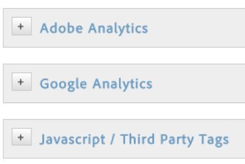
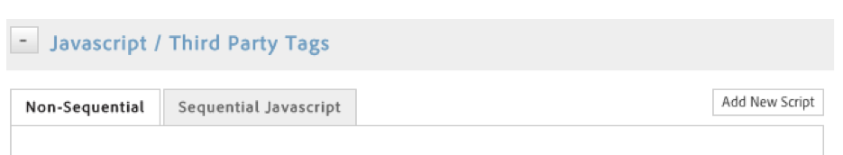
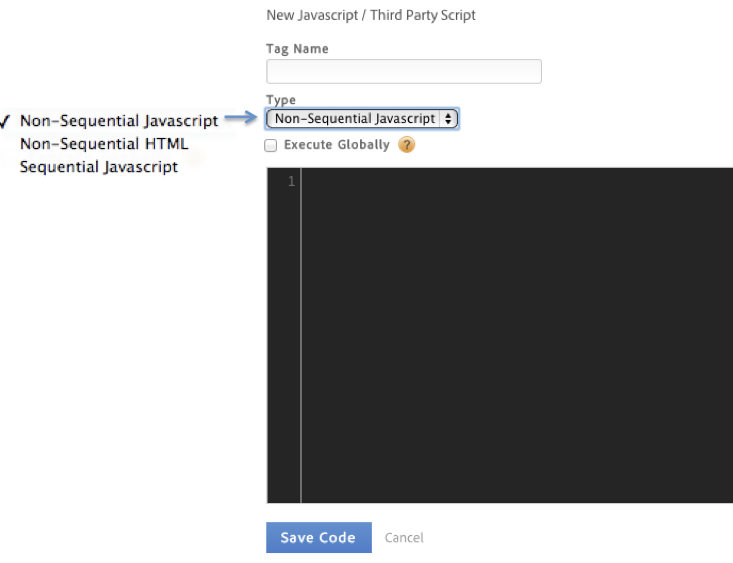
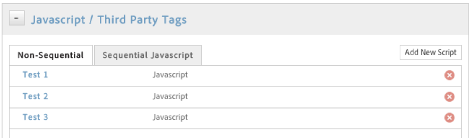

# Set up actions to trigger{#set-up-actions-for-the-condition-to-trigger}

Set up actions that you want the condition to trigger.

After setting up the condition, you must set up the actions that you want the condition to trigger. These actions can include [!DNL Analytics] events, third-party tags, and custom scripts. This example describes how to set up scripts or third-party tags.

Beyond integrated tools like [!DNL Adobe Analytics] and Google Analytics, Dynamic Tag Management can trigger any type of JavaScript or inject HTML into your site, in select pages or in specific scenarios.

Each rule can trigger as many scripts or HTML injections as you want.

>[!NOTE]
>
>Because DTM allows you to inject custom code into your page, please take care not to create cross-site scripting (XSS) vulnerabilities (see [OWASP’s guide](https://www.owasp.org/index.php/Cross-site_Scripting_(XSS)) for more info). Using data elements within a script requires particular attention. Always assume data element values might come from an untrusted source.

**To set up actions for the condition to trigger** 

1. Click **[!UICONTROL JavaScript / Third Party Tags]** to add a new script to your rule.

   {width="200"}

1. Click **[!UICONTROL Add New Script]**.

   {width="472"}

1. Name the script.
1. Specify how you want the script to trigger, and paste the desired content into the text area. {width="472"}

1. Click **[!UICONTROL Save Code]**, and the script will be added to the queue for the rule. {width="472"}

