# Create conditions for event-based rules{#create-conditions-for-event-based-rules}

Conditions determine when an event-based rule is triggered.

1. Select the type of interaction you want to track, such as mouse clicks, or submitting a form.  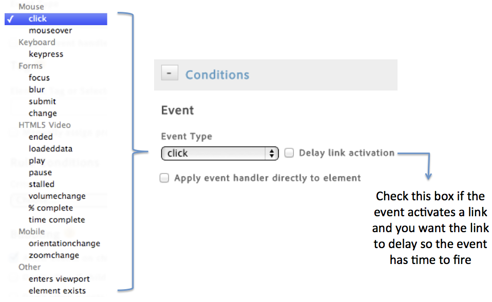{width="472"}

   For more information, see [Event Types](../../managing-resources/create-rules/t-rules-event-conditions.md#concept_B1C6169D8B354207AEE0E4965E6421B1). 

1. Enable the following options as necessary:

    |Element|Description|
    |---|---|
    |Delay Link Activation|Enable if the event activates a link and you want the link to delay until the event has time to fire.|
    |Apply event handler directly to element|Applies the event handler to the specific element that is targeted. This setting is tied to the bubbling and layering concept in a browser.|

    For example, when you click an image inside an anchor tag like `<a href="abc.html"></a>`, you might expect the click to be associated with the anchor tag, because the tag is in the bubble stream. However, when you inspect the click in the developer tools, the click may actually affect only the `` tag. To ensure that the event is handled correctly, associate the click with the `` tag and do not depend on the browser to bubble up the click to a parent element. An event like a click can potentially bubble up to `<body>`. It is important to understand where the event is actually bound, and target it specifically to make sure that the rule fires correctly.

   *Bubbling* means that the event is first captured and handled by the inner most element and then propagated to outer elements. 


1. Indicate the name of the tag you want to track, and additional properties the tag has that you want to match.

   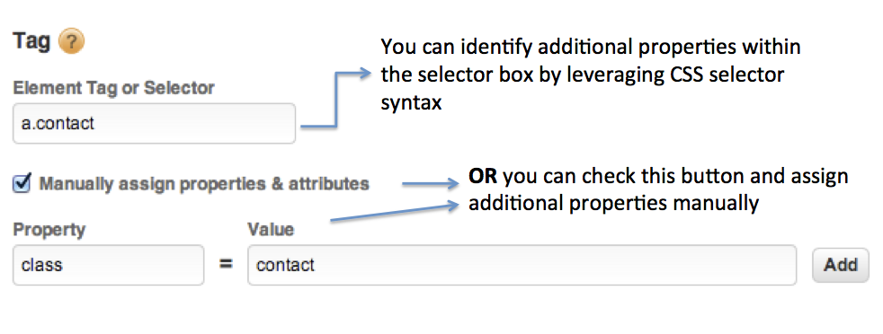

   See [Using the CSS Selector](../../managing-resources/create-rules/t-rules-event-conditions.md#concept_DDF500DCB8214658AEDECDE69ED1D4AF) for information about finding the correct element tag. 

1. Select and set up any additional criteria or condition types you wish to bind to the rule.  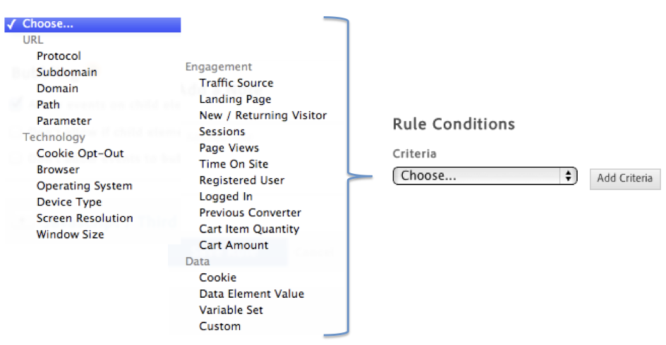

1. Indicate your preference regarding event bubbling.

   Event bubbling is one way of event propagation in HTML DOM.

    |Problem|Solution|
    |---|---|
    | Want related interactions on child elements of the rule selector you identified to fire the rule. | Allow events on child elements to bubble  |
    | Want to prevent bubbling when the child element already triggers its own event.| Do not allow if child element already triggers event.  |
    | Don't want the events of the rule selector you identified to go beyond the element itself in the event hierarchy. | Do not allow events to bubble upwards to parents  |

## Event types {#concept_B1C6169D8B354207AEE0E4965E6421B1}

List of built-in event types and how each is defined. 

<!-- 

event_types.xml

 -->

|Category|Event|Definition|
|---|---|---|
|Mouse|click|A pointing device button is pressed and released on an element.|
||mouseover|A pointing device is moved onto the element that has the listener attached or onto one of its children.|
|Keyboard|keypress|A key is pressed and that key normally produces a character value (use input instead).|
|Forms|focus|An element received focus (does not bubble).|
||blur|An element lost focus (does not bubble).|
||submit|A form is submitted.|
||change|An element loses focus and its value changed since gaining focus.|
|HMTL5 Video|ended|Playback stopped because the end of the media was reached.|
||loadeddata|The first frame of the media finished loading. |
||play|Playback began.|
||pause|Playback is paused.|
||stalled|The user agent is trying to fetch media data, but data is unexpectedly not forthcoming.|
||volumechange|The volume has changed.|
||% complete|Emits an event given a specified percentage of total playing time. For example, entering 10% indicates that this rule fires only when 10% of the total length of the video has been played.|
||time complete|Emits an event given a specified duration of playing time. For example, entering 10 indicates that this rule fires only when 10 seconds of the total length of the video has been played.|
|Mobile|orientationchange|The orientation of the device (portrait/landscape) has changed.|
||zoomchange|When a pinch or spread gesture is performed on a mobile device.|
|Browser|tab focus|Event is triggered when the content gains focus.|
||tab blur|Event is triggered when the content loses focus.|
|Other|custom|A custom event has been triggered on the DOM. Select **[!UICONTROL Custom]** from the **[!UICONTROL Event Type]** drop-down list, then specify the custom event name. For more information, see [CustomEvent](https://developer.mozilla.org/en-US/docs/Web/API/CustomEvent) on the Mozilla Developer Network.|
||enters viewport|When the element first comes into the view of the visitor. If the element is in view immediately upon page load, the rule fires immediately. If the element comes in view after scrolling, the rule fires then. An optional delay can be specified in the rule that determines how long the element has to be in view for before the event is triggered (the default value is 1 second).|
||element exists|When an element of a specified selector comes into existence-either because it is in the page markup or dynamically injected later on. Each rule fires only once.|
||pushState or hashchange|The URL path or the hash (fragment identifier) at the end of the URL changed. The `pushState` or `hashchange` event can be used with Single Page Apps (SPAs) in which a page does not reload but its content changes. Common development frameworks that can be used to create SPAs include Angular and React. This event type lets you create event-based rules without relying on developers. These rules fire when common functions in SPAs occur, such as: *The URL path changed based on use of the HTML5 History `pushState` API.* For more information about using `pushState`, see [Adding and Modifying History Entries](https://developer.mozilla.org/en-US/docs/Web/Guide/API/DOM/Manipulating_the_browser_history#Adding_and_modifying_history_entries) on the Mozilla Developer Network. *The hash changed due to the user changing views or locations on the page.* For more information about using `hashchange`, see [Hashchange](https://developer.mozilla.org/en-US/docs/Web/Events/hashchange) on the Mozilla Developer Network.|
||time passed|Value in seconds. The event is triggered after the specified number of seconds has passed.|
||dataelementchanged |A date element changed. This event lets you select a specific data element to use as a trigger. For more information on a possible use case, see [Add Adobe Experience Manager ContextHub Tool](../../tools-reference/add-aem-contextub-tool.md#concept_F0D713695CA54807B6E2B66842421C32).|

## Using the CSS selector {#concept_DDF500DCB8214658AEDECDE69ED1D4AF}

Use the [!UICONTROL CSS Selector] to quickly and easily select CSS elements to use as triggers for event-based rules without leaving the DTM rule builder. 

<!-- 

css-selector.xml

 -->

One of the biggest advantages of DTM is the ability to event off behaviors or page interactions on your website. However, finding the desired CSS elements to include in your rules is sometimes difficult and time-consuming.

## Example with unique element {#section_26F8A20D69624C398A64510C4554B633}

As an example, we want to create a rule that triggers when users click the "Sign In or Register" link on our website, as shown in the following illustration. This example is simple because the "Sign In or Register" link does not have any similar elements in the CSS.

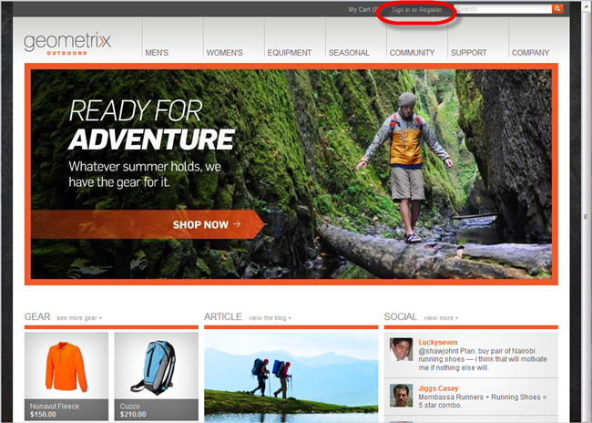

The more complex example described below illustrates how to use the [!UICONTROL CSS Selector] when there are many similar elements on the page, such as the tabs along the top ("Men's," "Women's," "Equipment," and so forth).

### To use the CSS Selector:

1. Access the [!UICONTROL CSS Selector] widget within DTM by clicking the [!UICONTROL Target] icon while [creating a rule](../../managing-resources/create-rules/t-rules-event-conditions.md#task_A122DE72110F4579A91F9D96D92D39FC).

   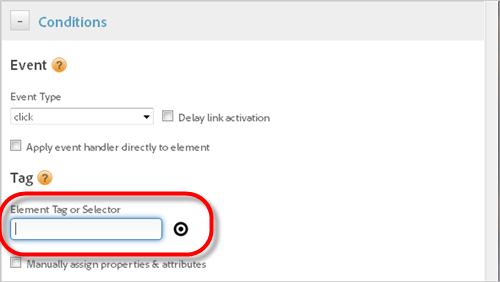

   In this example, we are creating an event-based rule that uses the [!UICONTROL Click] event type to trigger the rule when users click the "Sign in or Register" link. 

1. Specify the website's URL, then click **[!UICONTROL Load]**.

   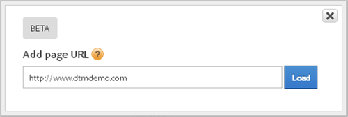

   >[!NOTE]
   >
   >Be as specific to the web page that you want to event off as possible. Be aware that CSS style sheets might change from one page to another, depending on your website and its architecture. It is helpful to experiment to see how often your style sheet changes.

   The website is now loaded in an iFrame with the CSS Selector widget embedded. Mouse over different elements to get a feel for how the tool works.

   

   If we were creating this rule without using the [!UICONTROL CSS Selector], we would inspect the desired page element to determine the proper CSS to use. Using the [!UICONTROL CSS Selector], simply click the element on the page that we want to trigger the rule. 

1. Click **[!UICONTROL Sign In or Register]**.

   When you click a page element that you want the selector to match, it turns green. The [!UICONTROL CSS Selector] then generates a minimal CSS selector for that element.

   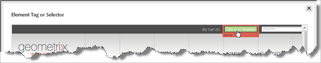

   Notice the panel at the bottom that contains information about the selected element and a button to send the information to DTM.

   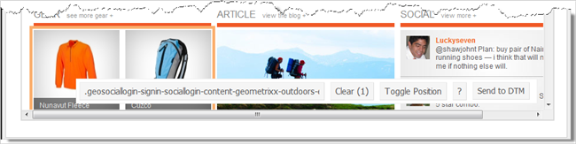

   The number in parenthesis next to [!UICONTROL Clear] indicates the number of items selected. In this example, the "Sign In or Register" link does not have anything similar to it on the specified page, so "1" displays. Click [!UICONTROL Clear] to remove selected items. Click [!UICONTROL Toggle Position] to move the panel to the top or bottom of the iFrame as desired. Click ? to view help information about the [!UICONTROL CSS Selector]. 

1. Click **[!UICONTROL Send to DTM]** to copy the CSS into the [!UICONTROL Element Tag or Selector] field within DTM.

   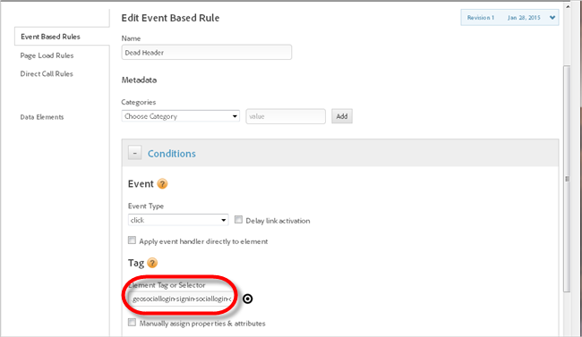

1. Finish configuring the rule as described in [Create conditions for event-based rules](../../managing-resources/create-rules/t-rules-event-conditions.md#task_A122DE72110F4579A91F9D96D92D39FC).

   Without writing any code or inspecting elements, we have created an event-based rule that triggers when users click **[!UICONTROL Sign In or Register]**.

## Example with similar elements {#section_C37AF283219445E885CBDF269DCB8E36}

Now let's suppose that you want to create a rule that triggers when users click the "Men's" tab at the top or your website. The difference between this example and the simple example discussed above is that the "Men's" tab has many similar elements on the page.

1. Access the [!UICONTROL CSS Selector] widget within DTM by clicking the [!UICONTROL Target] icon while [creating a rule](../../managing-resources/create-rules/t-rules-event-conditions.md#task_A122DE72110F4579A91F9D96D92D39FC). 
1. Specify the website's URL, then click **[!UICONTROL Load]**. 
1. Click the "Men's" tab to select it.

   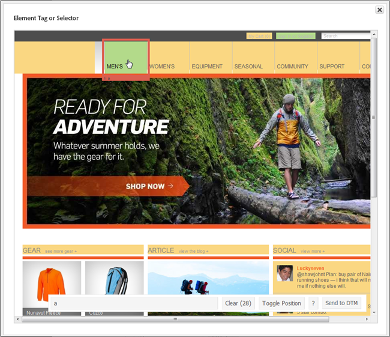

   Notice that many elements on the page are selected and are highlighted in yellow. The number next to [!UICONTROL Clear] in parenthesis is 28 in this example, which means there are 28 elements on the page that use the "a" tag.

   We want to trigger the rule when users click the "Men's" link, so we need to deselect the other similar elements.

   Mouse over any similar, highlighted element (for example "Women's) and you'll notice that a red box displays around the element.

   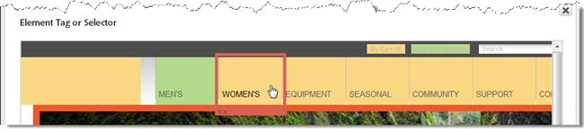

   When you click a page element that you want the selector to match, it turns green. The [!UICONTROL CSS Selector] then generates a minimal CSS selector for that element. In addition, the selector highlights everything that matches that element in yellow. The [!UICONTROL CSS Selector] starts out broad and then lets you narrow your selection.

   Click a highlighted element to reject it (red), or click an unhighlighted element to add it (green). Through this process of selection and rejection, you can come up with the perfect CSS selector for your needs. Pressing Shift while moving the mouse lets you select elements inside of other selected elements. 

1. Click the element with the red box (Women's) to deselect it and all other similar elements.

   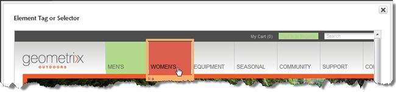

   Notice that the number in parenthesis next to [!UICONTROL Clear] is now 1.

   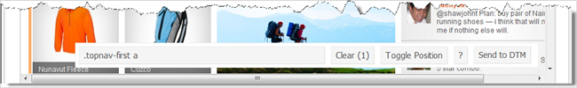

1. Click **[!UICONTROL Send to DTM]** to copy the CSS into the [!UICONTROL Element Tag or Selector] field within DTM. 
1. Finish configuring the rule as described in [Create conditions for event-based rules](../../managing-resources/create-rules/t-rules-event-conditions.md#task_A122DE72110F4579A91F9D96D92D39FC).

## CSS Selector limitations {#section_40A54DA0259743088337EB017432991F}

The [!UICONTROL CSS Selector] is in Beta and might not work well for some sites due to technical limitations. 

## Dynamically populate variables {#concept_600FB458500C4AF1934B5DFDDB64021F}

You can assign element attributes to variables dynamically. 

<!-- 

c_dynamically-populate-variables.xml

 -->

To dynamically assign element attributes to variables, use the following syntax:

```
%this.attributeName%
```

For example, suppose you have a search results page with multiple links to external web sites. You want to track which link is clicked by dynamically populating an eVar with the *`id`* of the element clicked.

Example Link: [!DNL `<a id='myFirstLink' href='www.exampleLink.com'>`]

To accomplish this, create an event-based rule to trigger on the click of the links on the page. Then, within the [!DNL Analytics] section of the rule, set the eVar to `%this.id%`.

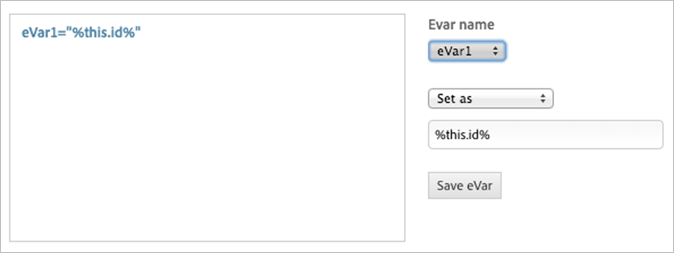

For non-standard attributes, you can similarly leverage the JavaScript function *`this.getAttribute()`* by wrapping it in '%' characters, as follows:

```
%this.getAttribute(attributeName)%
```

For example, suppose you have a similar search results page as the preceding example shows. However, these links contain a non-standard attribute, *`loc`* that you want to dynamically set to an eVar based on the link clicked.

Example link: [!DNL <a id='myFirstLink' loc='top' href='www.exampleLink.com'>]

To accomplish this, create an event-based rule to trigger on the click of the links on the page. Then, within the [!DNL Analytics] section of the rule, set the eVar to `%this.get Attribute(loc)%`.

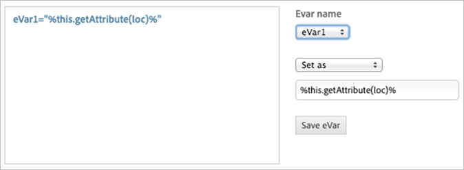

If you are unsure if the desired attribute is standard or non-standard, reference [w3schools.com](https://www.w3schools.com/) to learn more about standard HTML attributes. However, if in doubt, you can use the non-standard *`getAttribute()`* format, which will work in either scenario.

This functionality can be utilized in Dynamic Tag Management rule fields, including:

* [Analytics Variables](../../managing-resources/create-rules/t-rules-event-conditions.md#section_3A7FD01807314C878B308FE3D0FA2AAA) 
* [Custom Script](../../managing-resources/create-rules/t-rules-event-conditions.md#section_1603B0C6B6604EC98C19FC0C621D3AA5)

## Analytics variables {#section_3A7FD01807314C878B308FE3D0FA2AAA}

* Adobe Analytics:

    * Link Tracking, Page Data, Hierarchy 
    * Global Variables and Events

* Google Analytics

    * Pageviews, Events, Custom Variables

## Custom script {#section_1603B0C6B6604EC98C19FC0C621D3AA5}

Standard attributes can also be referenced using regular JavaScript in custom code. 
