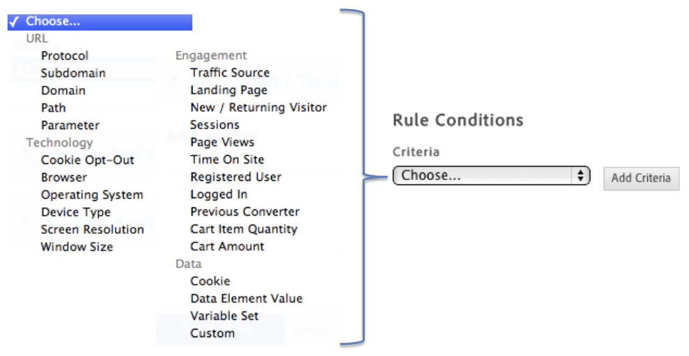

# Create conditions for page-load rules{#create-conditions-for-page-load-rules}

Create rules that determine on what pages a rule is triggered.

1. Specify where on the page you want the rule to trigger.

   The timing of where the rule fires on the page becomes more important when there are dependencies on page content within the rule.

   {width="400"}

1. Specify for which condition you would like the rule to fire.

   For example, you can select **[!UICONTROL Path]** to identify specific pages for which you want the rule to fire.

   {width="472"}

