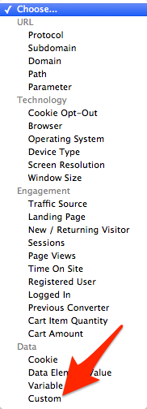

# Data elements{#data-elements}

Data elements are the building blocks for rules. Data elements let you create a data dictionary (or data map) of commonly used items on a page, regardless of where they originate (query strings, URLs, or cookie values) for any object that is contained on your site. You use data elements to build a data layer that can be used for Analytics and other data collection tools.

## Data elements {#concept_8A4591BD0F4241B6925D976482C43CD2}

Data elements are the building blocks for rules. Data elements let you create a data dictionary (or data map) of commonly used items on a page, regardless of where they originate (query strings, URLs, or cookie values) for any object that is contained on your site. You use data elements to build a data layer that can be used for Analytics and other data collection tools. 

  **[!UICONTROL Rules]** > **[!UICONTROL Data Elements]** > **[!UICONTROL Edit]** .

Use data elements as widely as possible throughout rule creation to consolidate the definition of dynamic data and to improve the efficiency of your tagging process. You define data rules once and then use them many times.

The concept of reusable data elements is very powerful and you should use them as best practice.

For example, if there is a particular way that you reference page names or product IDs, or grab information from query string parameters from an affiliate marketing link or from AdWords, and so forth, you can create a data dictionary (data elements) by getting information from various sources and then using this data in various dynamic tag management rules.

Using page name as an example, suppose you use a particular page-name schema by referencing a data layer, `document.title` element, or a title tag within the website. In dynamic tag management, you can create a data element as a single point of reference for that particular point of data. You can then use this data element in any rule that needs to reference the page name. If for some reason in the future you decide to change the way you reference page name (for example, you have been referencing `document.title` but you now want to reference a particular data layer), you don't need to edit many different rules to change that reference. You simply change the reference once in the data element and all rules that reference that data element automatically update.

Data elements are populated with data when they are used in rules or when manually calling in scripts. At a high level, you:

1. [Create a data element](../managing-resources/data-elements.md#task_962EF08CE2AE49B3B739295F6E4792C2), if you haven't done so already. 
1. Use the data element in a [rule](../managing-resources/rules.md#concept_2D3F296DD3BD418BAB7A0E2415DD9C92) or a custom script.

This section contains the following information:

* [Types of Data Elements](../managing-resources/data-elements.md#section_92407DCB477045D3B50DF8105AB2E6F4) 
* [Persistence](../managing-resources/data-elements.md#section_7F9C583A49874ACC9E14F0644B1E5783) 
* [Built-In Data Elements](../managing-resources/data-elements.md#section_D75D9250EB3F4563BDB22D38B1C071AA) 
* [Data Element Usage](../managing-resources/data-elements.md#section_2CD92AAA2B7C462EBFDA562AED299E6A) 
* [Data Element Availability](../managing-resources/data-elements.md#section_43A5C65D7C5E4E23B2C1186090C2D5B2) 
* [How to Collect Values from JavaScript Variables](../managing-resources/data-elements.md#section_EFA406CC945B4DF5ACEE157CD99D2D29)

## Types of data elements {#section_92407DCB477045D3B50DF8105AB2E6F4}

The following table describes the types of data elements. 

|Type|Description|Example|
|--- |--- |--- |
|JavaScript Object|Any available JavaScript object or variable can be referenced using the  path  field.|window.document.title|
|CSS Selector|Any element value can be retrieved, such as a div or H1 tag.|CSS Selector Chain:    id#dc logo img   Get the value of:    src|
|Cookie|Any available domain cookie can be referenced in the  cookie name  field.|cookieName|
|URL Parameter|Specify a single URL parameter in the  URL Parameter  field.  Only the name section is necessary and any special designators like "?" or "=" should be omitted|contentType|

**A note on Custom Script**

Custom JavaScript can be entered into the UI by clicking **[!UICONTROL Open Editor]** and inserting code into the editor window.  A return statement is necessary in the editor window in order to indicate what value should be set as the data element value. 

If a return statement is not included, the default value or an empty string will be returned as the data element value.

 ```javascript
 var pageType = $('div.page-wrapper').attr('class').split(' 
     ')[1]; 
     if  
     (window.location.pathname == '/'){return 'homepage';    
     }     
     else  
     {  
 return pageType; 
     }|
```

## Persistence {#section_7F9C583A49874ACC9E14F0644B1E5783}

|Attribute|Description|
|--- |--- |
|Page view|Available only while the page persists. <br/>Can be created and set in scripts using  _satellite  object syntax:   _satellite.setVar('data_element_name')|
|Session|Sets a session-level cookie in the browser. <br/>Available throughout the site visit.|
|Visitor|Sets a 2-year cookie.|
|Cookie manipulation|Can be manipulated using _satellite cookie methods: <br/>_satellite.setCookie(name,value,days); <br/>_satellite.readCookie(name); <br/> _satellite.removeCookie(name);|

## Built-in data elements {#section_D75D9250EB3F4563BDB22D38B1C071AA}

| Attribute | Description |
|--- |--- |
|URI|Used in rule:  %URI%  <br/>Returns  document.location.pathname  +  document.location.search|
|Protocol|Used in rule:  %protocol% <br/>Returns  document.location.protocol|
|Hostname|Used in rule:  %hostname%  <br/>Returns  document.location.hostname |

## Data element usage {#section_2CD92AAA2B7C462EBFDA562AED299E6A}

### In rules

You can use data elements in the rule editing interface by using the percent sign (%) syntax. Type a percent sign into the field and you will see a drop-down menu appear with the data elements that you created.

  

### In custom script

You can use data elements in custom scripts by using the `_satellite` object syntax:

  `_satellite.getVar('data element name');`

## Data element availability {#section_43A5C65D7C5E4E23B2C1186090C2D5B2}

If a data element is not referenced in a rule, it is not loaded on any page unless specifically called in custom script 

### Forcing data element retrieval through custom identifiers

Data elements can be set in the custom code section of a rule identifier to guarantee that the data element is available for the rule. This situation is sometimes necessary for specific timing considerations and issues with existing implementation code.

  

For example, entering the following code forces the retrieval of the data element named *`sample data`* during the rule identification step, prior to any data manipulation that happens in the rest of the rule.

  

The custom code section in the identifier must return *`true`*, regardless of whether a valid value is available for the data element. Otherwise, the rule never evaluates as *`true`* or runs.

## How to collect values from JavaScript variables {#section_EFA406CC945B4DF5ACEE157CD99D2D29}

When you have JavaScript variables, or object properties in your markup, and you want to collect those values in dynamic tag management to use with your analytics tools, or testing tools, or even with third party tags, one way to capture those values is to use Data Elements in dynamic tag management. This way, you can refer to the Data Element throughout your Rules, and if the source of the data ever changes, you only need to change your reference to the source (the Data Element) in one place in dynamic tag management.

For example, let's say your markup contains a JavaScript variable called "Page_Name", like this:

```
<script> 
    //data layer 
    var Page_Name = "Homepage" 
  </script> 

```

When you create the Data Element in dynamic tag management, simply provide the path to that variable like this:

 

If you use a data collector object as party of your data layer, simply use dot notation in the Path to reference the object and property you want to capture into the Data Element, like `_myData.pageName`, or `digitalData.pageName`, etc.

## Adobe training video: Data Elements {#section_3D594CC791AD48E3AE64CB90E7263AC9}

 >[!VIDEO](https://video.tv.adobe.com/v/17168/)

By then end of this video you should be able to:

* Understand what a data element is 
* Explain the different element types 
* Create a data element 
* Use a data element in a rule

## Create a data element {#task_962EF08CE2AE49B3B739295F6E4792C2}

Create a data element in dynamic tag management. 

<!-- 
t_data_element.xml
 -->

1. [Create a web property](../administration/web-property.md#task_AE34E23EC47B4E9C8634782C05D9DC09).
1. In the web property, click  **[!UICONTROL Rules]** > **[!UICONTROL Data Elements]** .
1. Click **[!UICONTROL Create New Data Element]**.
1. Complete the following fields and options:
   * **[!UICONTROL Name]** The data element friendly name that a marketer can recognize. For example, `Product ID`.

      >[!NOTE]
      >
      >The name is referenced by the rules builder, not an ID. If you change the name of the Data Element , you must change its reference in every rule that uses it.
      
   * **[!UICONTROL Type]** Specifies where the data is pulled from, such as JS Object, CSS Selector, Cookie, URL Parameter, or Custom Script.
      Depending on which type you select, different options display. See [Types of Data Elements](../managing-resources/data-elements.md#section_92407DCB477045D3B50DF8105AB2E6F4) for more information and examples. 
   * **[!UICONTROL Default Value]** A default element. This value ensures that the data element always has a value, even if a URL parameter does not exist or cannot be found by dynamic tag management.

      >[!NOTE]
      >
      >If there is no value and no default value, then nothing is returned. Any variable referencing that data element won't get set. Note also that the default value field is ignored if it's a "custom code" data element.
   * **[!UICONTROL Force lowercase value]** Dynamic tag management automatically makes the value lowercased. 
   * **[!UICONTROL Remember this value for]** How long you want dynamic tag management to remember this value.

   Valid values include:

   * Session: Session-based timing can vary depending on the implementation. Session data elements are set to the session cookie. However, this setting could be based on a web server or the browser. It is not related to the session used in marketing reports & analytics. 
   * Pageview 
   * Visitor

   See [Data Elements](../managing-resources/data-elements.md#concept_8A4591BD0F4241B6925D976482C43CD2) for more information about how to use data elements.
1. Click **[!UICONTROL Save Data Element]**.
