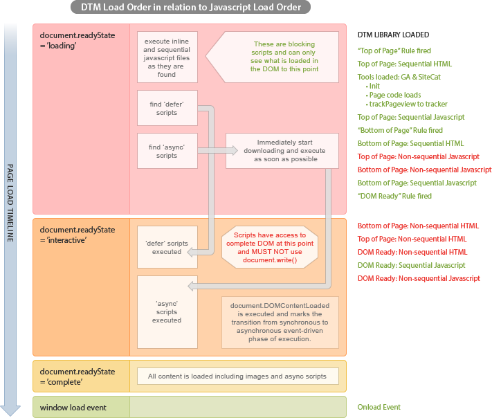

# Load order for rules{#load-order-for-rules}

The Dynamic Tag Management load order in relation to the JavaScript load order.

The following diagram shows the general page load order.



>[!NOTE]
>
>Red text on the above diagram represents non-sequential activity. Green text represents sequential activity.

The following section discusses how the different JavaScript/third-party tags script options are utilized within the four page-load phases:

* **Top of Page**

    * **Sequential HTML:** Injected into `<HEAD/>` below DTM library include script if `<SCRIPT/>` tags are used, otherwise is injected at top of `<BODY/>` 
    * **Sequential JavaScript global:** Injected into `<HEAD/>` below DTM include script as JavaScript include `<SCRIPT/>` 
    * **Sequential JavaScript local:** Injected into `<HEAD/>` below DTM include script as JavaScript include `<SCRIPT/>` 
    * **Non-sequential JavaScript:** Injected as asynchronous `<SCRIPT/>` in `<HEAD>` below DTM library include script 
    * **Non-sequential HTML:** Injected as hidden `IFRAME` and does not affect page HTML

## Bottom of Page

    * **Sequential HTML:** Injected after `_satellite.pageBottom()` callback script with `document.write()` prior to DOMREADY so that there is no destruction of the visible page 
    
    * **Sequential JavaScript global:** Injected after `_satellite.pageBottom()` as JavaScript include `<SCRIPT/>` 
    * **Sequential JavaScript local:** Injected after `_satellite.pageBottom()` as JavaScript include `<SCRIPT/>` 
    * **Non-sequential JavaScript:** Injected as asynchronous `<SCRIPT/>` in `<HEAD>` below DTM library include script 
    * **Non-sequential HTML:** Injected as hidden `IFRAME` and does not affect page HTML

* **DOM Ready**

    * **Sequential HTML:** Will not work because `DOMREADY` is active and `document.write()` will overwrite the page 
    * **Sequential JavaScript global:** Injected into `<HEAD/>` below DTM include script as JavaScript include `<SCRIPT/>` 
    * **Sequential JavaScript local:** Injected into `<HEAD/>` below DTM include script as JavaScript include `<SCRIPT/>` 
    * **Non-sequential JavaScript:** Injected as asynchronous `<SCRIPT/>` in `<HEAD>` below DTM library include script 
    * **Non-sequential HTML:** Injected as hidden `IFRAME` and does not affect page HTML

## Onload (window load)

    * **Sequential HTML:** Will not work because `DOMREADY` is active and `document.write()` will overwrite the page 
    * **Sequential JavaScript global:** Injected into `<HEAD/>` below DTM include script as JavaScript include `<SCRIPT/>` 
    * **Sequential JavaScript local:** Injected into `<HEAD/>` below DTM include script as JavaScript include `<SCRIPT/>` 
    * **Non-sequential JavaScript:** Injected as asynchronous `<SCRIPT/>` in `<HEAD>` below DTM library include script 
    * **Non-sequential HTML:** Injected as hidden `IFRAME` and does not affect page HTML

Non-sequential HTML third-party rules are always placed into iFrames. There is no such thing as asynchronous HTML so Dynamic Tag Management refers to the iFrame functionality with that name.

>[!NOTE]
>
>Even though scripts might be injected into the `<HEAD/>` later in the page processing like `DOMREADY` and `ONLOAD`, scripts will only appear in the proper timing sequence and be either global, local, synchronous, or asynchronous. Also, Dynamic Tag Management checks to make sure that the timing is being handled properly and if `DOMREADY` has already occurred, it will not attempt a page-destructive `document.write()`. Dynamic Tag Management is diligent about not breaking the visual page if at all possible. For this reason, you might see an "asyc installation" error when the installation might not actually be "async." It is simply an alert that helps you recognize that the timing on the page is somewhat questionable and that `DOMREADY` has fired prior to all of the synchronous scripts loading as they should. If that happens, check to make sure that the `pageBottom()` callback is actually in the correct place immediately prior to the `</body>` tag. If not then these types of errors can occur.

The Dynamic Tag Management queue processes them in the order listed above but does not distinguish between a JavaScript and an HTML script within the page load phase.

This means that the order of the page load rules in the queue determines the order in which they are de-queued.

A simple way to determine the queue order is to look at [!DNL `_satellite.configurationSettings.pageLoadRules`] in the JavaScript console and examine the sequence.

For example, a complete view of the page load rule queue order can be seen by entering the following code into the JavaScript console:

```javascript
 _satellite.each(_satellite.configurationSettings.pageLoadRules,function(i){(i.event=='pagetop')?_satellite.notify(i.event+': '+i.name,1):false})
 _satellite.each(_satellite.configurationSettings.pageLoadRules,function(i){(i.event=='pagebottom')?_satellite.notify(i.event+': '+i.name,1):false})
 _satellite.each(_satellite.configurationSettings.pageLoadRules,function(i){(i.event=='domready')?_satellite.notify(i.event+': '+i.name,1):false})
 _satellite.each(_satellite.configurationSettings.pageLoadRules,function(i){(i.event=='windowload')?_satellite.notify(i.event+': '+i.name,1):false})

```

