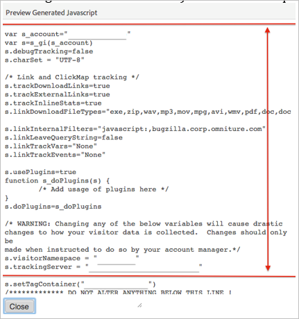
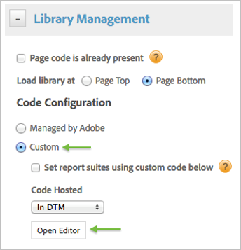

# Adobe Tag Manager 1.0 to Dynamic Tag Management mapping{#adobe-tag-manager-to-dynamic-tag-management-mapping}

How to migrate from each Adobe Tag Manager 1.0 tag to a Dynamic Tag Management tag.

## Custom Core JavaScript {#section_4ED3898D44994C71AC06E5B6AFB4E758}

|Tag Manager 1.0 tag|Dynamic Tag Management|Migration Instructions|
|---|---|---|
|Custom Core JavaScript|JavaScript / Third Party Tag|Custom JavaScript can be deployed directly into the JavaScript / Third Party Tags section of a rule. In most cases, you can paste the page code provided by the vendor directly into a tag with no additional configuration. If any product specific code was included in this section in Adobe Tag Management, it will need to be specifically migrated into the applicable tool in Dynamic Tag Management.|

## Product code {#section_97CE3C7BB84C48388F2991D7598F782C}

To convert from Demdex to the Adobe Audience Manager tool in DTM, add and configure an [audience management](../tools-reference/audiencemgmt.md#concept_F9887945039A473A9B2C6B16CBA5D822) tool.

To convert any of the following Tag Manager 1.0 product code tags to the Adobe Analytics tool:

* [!DNL SiteCatalyst] 
* [!DNL SiteCatalyst] > [!DNL Survey] 

* [!DNL SiteCatalyst] > Video Tracking 
* [!DNL SiteCatalyst] > [!DNL Genesis] Integrations

Use the following migration instructions.

Follow the instructions in [Adobe Analytics Settings](../tools-reference/analytics-dtm.md#concept_FBA6679A0B79490F8296437F11E5E4F8) to add an Adobe Analytics tool in Dynamic Tag Management.

### Option 1

Host code using the **[!UICONTROL Managed by Adobe]** option. This method leverages the base version of the [!DNL AppMeasurement] code and allows you to choose between the latest available code versions.


With this option, *above this line* customization can be configured in the available interface fields or pasted into the [!UICONTROL Customize Page Code] editor.

### Option 2

Manually host the s_code / [!DNL AppMeasurement] file in Dynamic Tag Management. This method is recommended when the current code is highly customized or if a legacy code version is used.

1. In [!DNL Adobe Tag Management] 1.0, click **[!UICONTROL Edit]** next to the latest container file. 

1. Click **[!UICONTROL Preview]** to view the generated file. 
1. Copy all of the *above this line* code.

This is all of the code beginning with the `s_account` declaration and ending with the first `s.setTagContainer` command. (Do not include this `s.setTagContainer` in this situation). Here is an example:



Paste this code into the Custom editor in the [!DNL Adobe Analytics] tool in Dynamic Tag Management.



Then, from the same preview file in ATM, copy the below the line code. This code begins with:

```
‘/************* DO NOT ALTER ANYTHING BELOW THIS LINE! **************/’
```

and ends with the second *`setTagContainer`* function. (In this case, include the *`setTagContainer`* function, because this code should not be altered). Ensure the code only in this block is included. Any code set in the Custom Code (after products) section is included after this code block in the preview file, so ensure that only the intended code block is included in the copy. For example:


Paste the code into the same Custom editor in Dynamic Tag Management after the *`above this line`* code.

>[!NOTE]
>
>Since mistakes can occur with copy / paste, please be sure to review the implementation in Dynamic Tag Management thoroughly and test extensively in staging before publishing to production to ensure the expected behavior is accomplished.

## Custom code (after products) {#section_7C14C9392E6A470FA9A2AB06D2D798A5}

<table id="table_EAF79577BEE441E7AB27301BB7B05A80"> 
 <thead> 
  <tr> 
   <th colname="col1" class="entry"> 1.0 Custom Code Tag </th> 
   <th colname="col2" class="entry"> Dynamic Tag Management </th> 
   <th colname="col3" class="entry"> Migration Instructions </th> 
  </tr> 
 </thead>
 <tbody> 
  <tr> 
   <td colname="col1"> <p>HTML </p> </td> 
   <td colname="col2"> <p>HTML </p> </td> 
   <td colname="col3"> <p> Create a rule with conditions mimicking the ATM firing rules. Copy all of the code into the <b>JavaScript / Third Party Tags</b> editor in the rule. Select between non-sequential and sequential HTML as applicable. </p> </td> 
  </tr> 
  <tr> 
   <td colname="col1"> <p>JavaScript </p> </td> 
   <td colname="col2"> <p>JavaScript </p> </td> 
   <td colname="col3"> <p> Create a rule with conditions mimicking the ATM firing rules. Copy all of the code into the <b>JavaScript / Third Party Tags</b> editor in the rule. Select between non-sequential and sequential JavaScript as applicable. </p> </td> 
  </tr> 
  <tr> 
   <td colname="col1"> <p> Image Beacon </p> </td> 
   <td colname="col2"> <p>HTML </p> </td> 
   <td colname="col3"> <p> Create a rule with conditions mimicking the ATM firing rules. Copy the image URL from the 1.0 tag into the <b>JavaScript / Third Party Tags</b> editor of the rule. Wrap the <b>image url</b> in &lt;img&gt; tags and configure as non-sequential or sequential HTML as applicable. For example: <span class="codeph"> &lt;img height="1" width="1" style="border-style:none;" alt="" src=" imageurl"/&gt; </span> </p> </td> 
  </tr> 
  <tr> 
   <td colname="col1"> <p>Remote Script </p> </td> 
   <td colname="col2"> <p>HTML </p> </td> 
   <td colname="col3"> <p> Create a rule with conditions mimicking the ATM firing rules. Copy the script URL from the 1.0 tag into the <b>JavaScript / Third Party Tags</b> editor of the rule. Wrap the <b>script url</b> in script tags and configure as non-sequential or sequential HTML as applicable. For example: <span class="codeph"> &lt;script type="text/javascript" src=" scripturl"&gt;&lt;/script&gt; </span> </p> </td> 
  </tr> 
  <tr> 
   <td colname="col1"> <p>IFrame </p> </td> 
   <td colname="col2"> <p>HTML </p> </td> 
   <td colname="col3"> <p> Create a rule with conditions mimicking the ATM firing rules. Copy the iframe URL from the 1.0 tag into the <b>JavaScript / Third Party Tags</b> editor of the rule. Wrap the <b>iframe url</b> in iframe tags and configure as non-sequential or sequential HTML as applicable. For example: <span class="codeph"> &lt;iframe height="0" width="0" style="display:none;visibility:hidden" src=" iframeurl"&gt;&lt;/iframe&gt; </span> </p> </td> 
  </tr> 
 </tbody> 
</table>

>[!NOTE]
>
>If the conditions set in the firing rules are the same between each custom tag, they can be placed into a single rule in Dynamic Tag Management.

