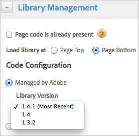
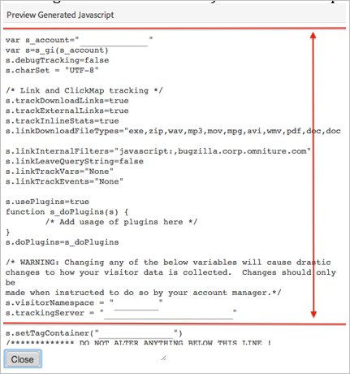
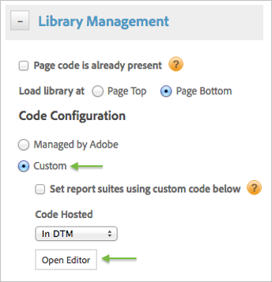
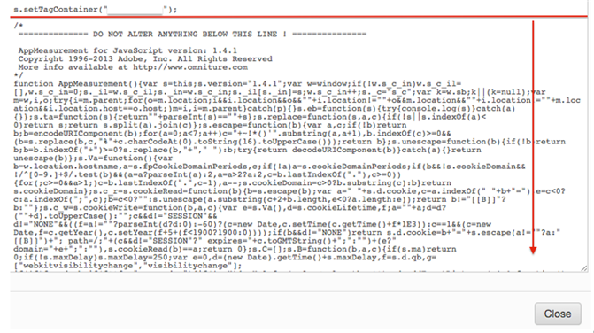

# Adobe Tag Manager 2.0 to Dynamic Tag Management mapping{#adobe-tag-manager-to-dynamic-tag-management-mapping}

This topic explains how to migrate from each Tag Manager 2.0 tag to a Dynamic Tag Management tag.

## Product code {#section_97CE3C7BB84C48388F2991D7598F782C}

* To convert from the Tag Manager 2.0 Target product code tag to the Target tool, configure [Adobe Target](../tools-reference/target.md#concept_90D4021A9B6E409D8101FA1AFADE1215). 
* To convert from the Tag Manager 2.0 Audience Management product code tag to the Adobe Audience Manager tool, configure [Adobe AudienceManager](../tools-reference/audiencemgmt.md#concept_F9887945039A473A9B2C6B16CBA5D822).

To convert any of the following Tag Manager 1.0 product code tags to the Adobe Analytics tool:

* [!DNL SiteCatalyst] 
* [!DNL SiteCatalyst] > [!DNL Survey] 

* [!DNL SiteCatalyst] > Video Tracking 
* [!DNL SiteCatalyst] > [!DNL Genesis] Integrations

Use the following migration instructions.

Follow the instructions in [Adobe Analytics Settings](../tools-reference/analytics-dtm.md#concept_FBA6679A0B79490F8296437F11E5E4F8) to add an Adobe Analytics tool in Dynamic Tag Management.

### Option 1

Host code using the **[!UICONTROL Managed by Adobe]** option. This method leverages the base version of the [!DNL AppMeasurement] code and allows you to choose between the latest available code versions.



With this option, *above this line* customization can be configured in the available interface fields or pasted into the [!UICONTROL Customize Page Code] editor.

### Option 2

Manually host the s_code / [!DNL AppMeasurement] file in Dynamic Tag Management. This method is recommended when the current code is highly customized or if a legacy code version is used.

1. In [!DNL Adobe Tag Management] 2.0, click **[!UICONTROL Edit]** next to the latest container file. 

1. Click **[!UICONTROL Preview]** to view the generated file. 
1. Locate the **[!UICONTROL sitecatalyst JS]** file and click **[!UICONTROL See content]**. 

1. Copy all of the *above this line* code.

This is all of the code beginning with the `s_account` declaration and ending with the first `s.setTagContainer` command. (Do not include this `s.setTagContainer` in this situation). Here is an example:



Paste this code into the Custom editor in the [!DNL Adobe Analytics] tool in Dynamic Tag Management.



Then, from the same preview file in ATM, copy the *below this line* code. This is code begins with:

```
‘/************* DO NOT ALTER ANYTHING BELOW THIS LINE! **************/’
```

and continues to the bottom of the file. For example:



Paste the code into the same Custom editor in Dynamic Tag Management after the *`above this line`* code.

>[!NOTE]
>
>Because mistakes can occur with copy / paste, please be sure to review the implementation in Dynamic Tag Management thoroughly and test extensively in staging before publishing to production to ensure the expected behavior is accomplished.

## Custom code {#section_7C14C9392E6A470FA9A2AB06D2D798A5}

<table id="table_EAF79577BEE441E7AB27301BB7B05A80"> 
 <thead> 
  <tr> 
   <th colname="col1" class="entry"> 2.0 Custom Code Tag </th> 
   <th colname="col2" class="entry"> Dynamic Tag Management </th> 
   <th colname="col3" class="entry"> Migration Instructions </th> 
  </tr> 
 </thead>
 <tbody> 
  <tr> 
   <td colname="col1"> <p>HTML </p> </td> 
   <td colname="col2"> <p>HTML </p> </td> 
   <td colname="col3"> <p> Create a rule with conditions mimicking the ATM firing rules. Copy all of the code into the <b>JavaScript / Third Party Tags</b> editor in the rule. Select between non-sequential and sequential HTML as applicable. </p> </td> 
  </tr> 
  <tr> 
   <td colname="col1"> <p>JavaScript </p> </td> 
   <td colname="col2"> <p>JavaScript </p> </td> 
   <td colname="col3"> <p> Create a rule with conditions mimicking the ATM firing rules. Copy all of the code into the <b>JavaScript / Third Party Tags</b> editor in the rule. Select between non-sequential and sequential JavaScript as applicable. </p> </td> 
  </tr> 
  <tr> 
   <td colname="col1"> <p>Remote Script </p> </td> 
   <td colname="col2"> <p>HTML </p> </td> 
   <td colname="col3"> <p> Create a rule with conditions mimicking the ATM firing rules. Copy the script URL from the 2.0 tag into the <b>JavaScript / Third Party Tags</b> editor of the rule. Wrap the <b>script url</b> in script tags and configure as non-sequential or sequential HTML as applicable. For example: <span class="codeph"> &lt;script type="text/javascript" src=" scripturl"&gt;&lt;/script&gt; </span> </p> </td> 
  </tr> 
  <tr> 
   <td colname="col1"> <p>IFrame </p> </td> 
   <td colname="col2"> <p>HTML </p> </td> 
   <td colname="col3"> <p> Create a rule with conditions mimicking the ATM firing rules. Copy the iframe URL from the 2.0 tag into the <b>JavaScript / Third Party Tags</b> editor of the rule. Wrap the <b>iframe url</b> in iframe tags and configure as non-sequential or sequential HTML as applicable. For example: <span class="codeph"> &lt;iframe height="0" width="0" style="display:none;visibility:hidden" src=" iframeurl"&gt;&lt;/iframe&gt; </span> </p> </td> 
  </tr> 
 </tbody> 
</table>

>[!NOTE]
>
>If the conditions set in the firing rules are the same between each custom tag, they can be placed into a single rule in Dynamic Tag Management.

