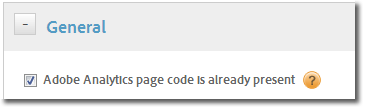
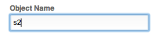

# Migrating to Dynamic Tag Management{#migrating-to-dynamic-tag-management}

Dynamic Tag Management provides several options to migrate from a typical JavaScript implementation or a Tag Manager implementation.

## Analytics - Migrate using existing page code {#section_4EF6A5A23DEF413DBC34DF9C62DF8402}

Dynamic Tag Management can use the existing page code you have deployed. It will not deploy any page code to the site, but you can still go ahead and add rules and expand upon your implementation without having to wait for all of the old code to be removed from the site.

Once the legacy code has been removed, you just uncheck this box and then Dynamic Tag Management will begin to deploy the Analytics page code to your site, allowing you to get the benefits of Dynamic Tag Management right away without having to wait.

{width="367"}

## Configure a second instance {#section_0B6A40B2E68E4648A18EA9149AD6E617}

Dynamic Tag Management provides the means for you to have a completely separate Analytics implementation while leaving your original one intact, allowing you to run them in parallel. To do this, you can simply rename the main *`s object`* for Analytics for the new installation.

{width="269"}

Once you rename the Analytics object then you are able to run both implementations: your original one and the one within Dynamic Tag Management. 
