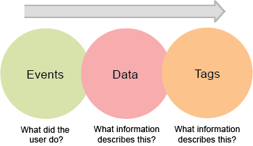
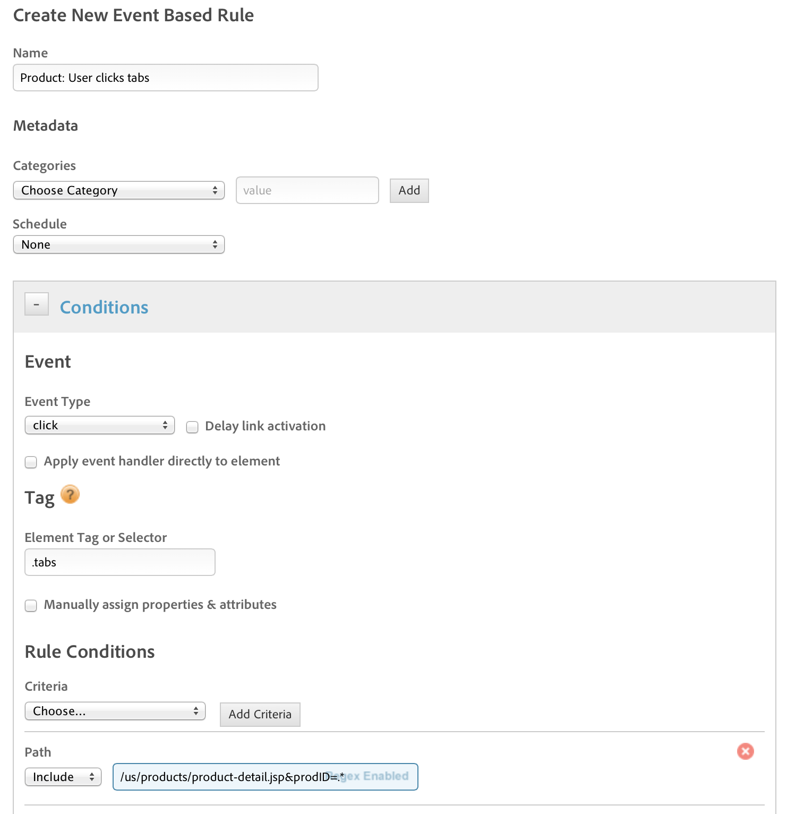
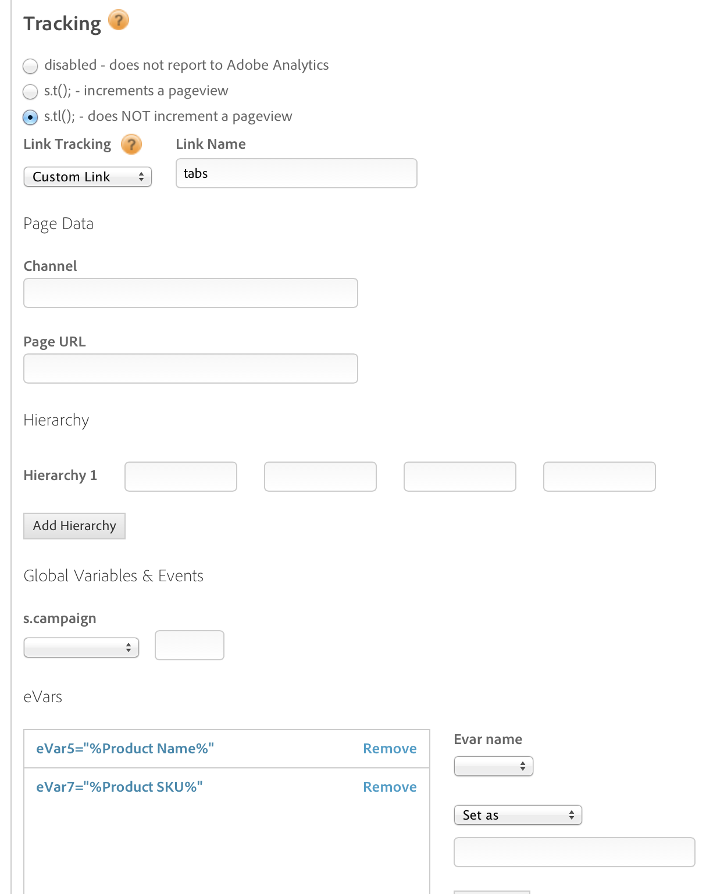
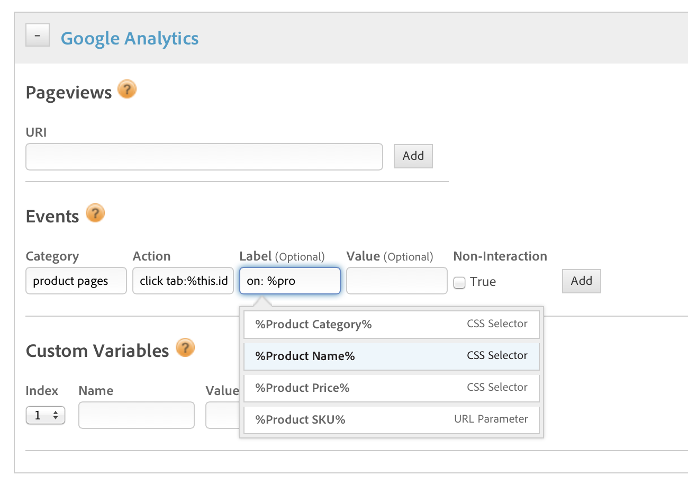
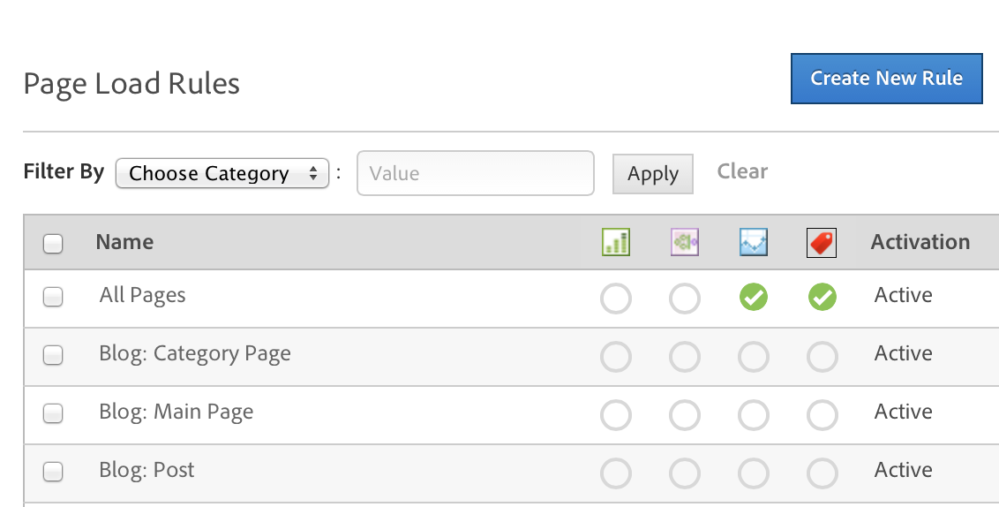
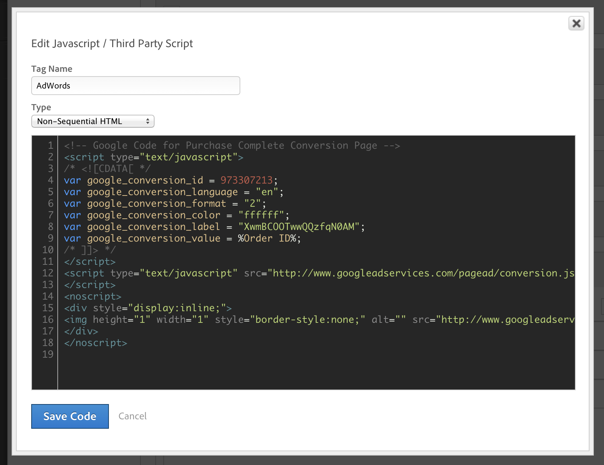
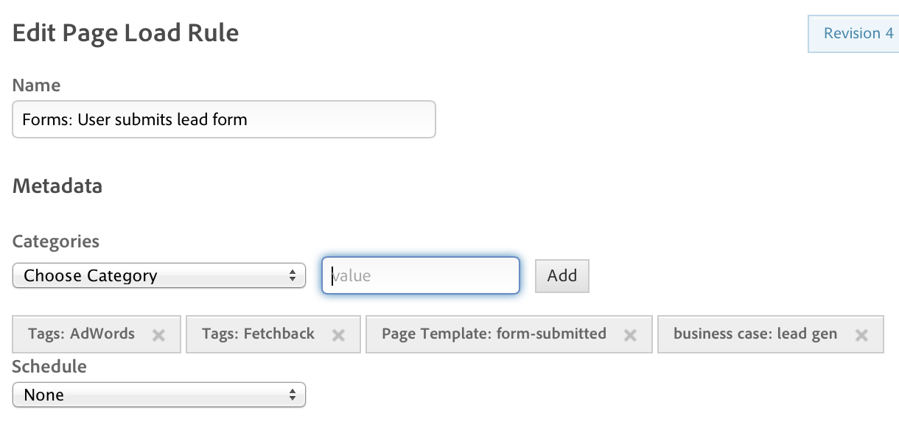
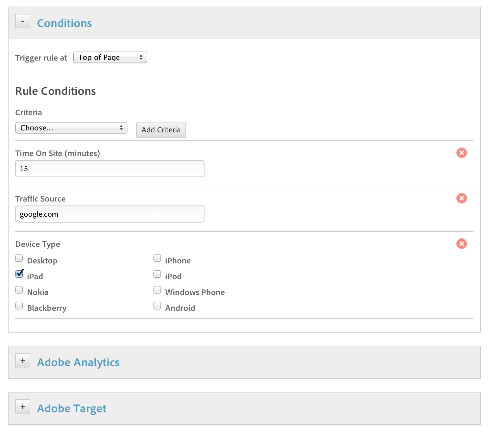
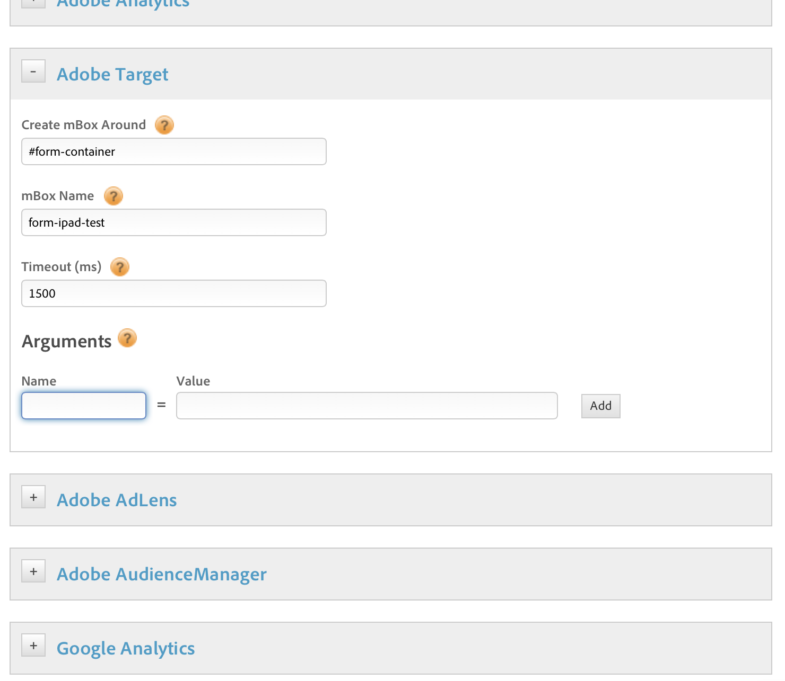
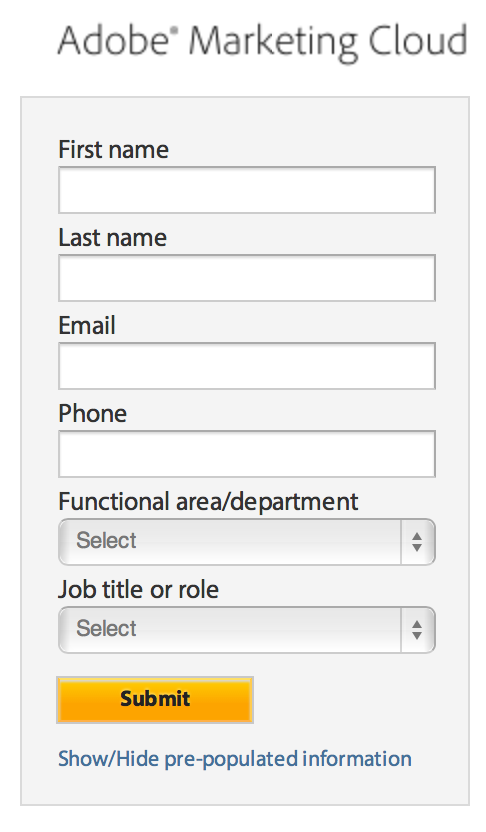

# Rules

Dynamic tag management is a rule-based system. It looks for user interaction and associated data. When the criteria outlined in your rules are met, the rule triggers the tool, script, or HTML you identified.

## Rules {#concept_2D3F296DD3BD418BAB7A0E2415DD9C92}

Dynamic tag management is a rule-based system. It looks for user interaction and associated data. When the criteria outlined in your rules are met, the rule triggers the tool, script, or HTML you identified. 

A rule consists of two parts: 

<table id="table_2208F337243A4105961C71F7506A079A"> 
 <tbody> 
  <tr> 
   <td colname="col1"> 
Identifier 
 </td> 
   <td colname="col2"> 
The identifier is what you want the rule to look for. The identifier you specify depends on the type of rule. 
 </td> 
  </tr> 
  <tr> 
   <td colname="col1"> 
Trigger 
 </td> 
   <td colname="col2"> 
Triggers occur after a rule's conditions are met. A rule in dynamic tag management can trigger as many discrete actions as you want. 
 
For example, a single rule for an e-commerce Thank You page can trigger your analytics tools and third-party tags from a single rule. There is no need to create separate rules for each tool or tag. 
 </td> 
  </tr> 
 </tbody> 
</table>

* [Types of Rules](../rules/rules.md#section_3D5763DAA6504934A3FAF90BFC1FAE9D) 
* [New vs Existing Rules](../rules/rules.md#section_0B4B7994A4EF47CDAC89DC6B82A3460B)

## Types of Rules {#section_3D5763DAA6504934A3FAF90BFC1FAE9D}

There are three types of rules in dynamic tag management as well as several default rules: 

<table id="table_7DEFB00A4EFC46AF9F28AC64CED458AE"> 
 <thead> 
  <tr> 
   <th colname="col1" class="entry"> Type of Rule </th> 
   <th colname="col2" class="entry"> Description </th> 
  </tr> 
 </thead>
 <tbody> 
  <tr> 
   <td colname="col1"> Event-based </td> 
   <td colname="col2"> 
Events are where the majority of interactions on sites take place. You can measure and react to these interactions in real-time, without the need for JavaScript. 
 
Event-based rules are executed when visitors interact with on-page elements. 
 
By leveraging in-page interactions and page-level tagging, you can optimize based on things like social media sharing, video interactions, tabbed interfaces, image galleries, and product sorting and filtering. 
 
See <a href="../rules/rules.md#concept_649E7BB6A7B3442C8F32F657BED77D54" format="dita" scope="local"> Event-Based Rules Example</a> for an example of how to set your condition to look for clicks on the various tabs on your product pages. 
 </td> 
  </tr> 
  <tr> 
   <td colname="col1"> Page load </td> 
   <td colname="col2"> 
Let you target by URL, site section, or set up scenarios that are independent of the site structure. For example, a page-load rule can load a survey on the fifth page view or in the seventh minute of a visitor’s session. 
 
Advanced page-load rules let you, for example, target specific user segments in rules. 
 
See <a href="../rules/rules.md#concept_811F4216145A4E3A91190DFFC9C2D223" format="dita" scope="local"> Page Load Rules Example</a>. 
 </td> 
  </tr> 
  <tr> 
   <td colname="col1"> Direct call </td> 
   <td colname="col2"> 
Designed to bypass dynamic tag management event detection and lookup systems. 
 
Direct call rules are ideal for situations where you want to tell dynamic tag management exactly what is happening. Also, they are ideal when dynamic tag management cannot detect an event in the DOM, such as with Adobe Flash. 
 
See <a href="../t_rules_create/t_rules_direct_conditions.md#task_85EB8F01775A402BA53B8298F0AADA09" format="dita" scope="local"> Creating conditions for Direct Call rules</a> for more information and to watch an EnterpriseTV video about direct-call rules. 
 </td> 
  </tr> 
  <tr> 
   <td colname="col1"> Default rules </td> 
   <td colname="col2"> 
When you activate a property, dynamic tag management includes several default rules. 
 
These rules track common interactions with your site and can help you analyze opportunities throughout your site. 
 
Dynamic tag management includes the following default rules: 
 
    <ul id="ul_071D5DD1CFA345ED8D100269753A447D"> 
     <li id="li_8C6BDDB8210644C0B5E0F3CA6A637ADB"> <b>Dead Header: </b>Tracks any clicks on "dead" (i.e. unlinked) header items. </li> 
     <li id="li_C7D3760E2280498A8F52CA2ED4B7B135"> 
 <b>Dead Image: </b>Tracks any clicks on "dead" (i.e. unlinked) images. 
 </li> 
     <li id="li_A5C2FE83050C402E92F415919E9AB69A"> <b>Download Link: </b>Tracks any clicks on downloadable site content. </li> 
     <li id="li_BFD3A606312F4C01A7D0390BF8D032EC"> <b>Email Link: </b>Tracks any clicks on linked emails. </li> 
     <li id="li_44C0B7A0F18646728A8717491D590F89"> <b>Orientation Changed: </b>Tracks any page orientation change (mobile relevant). </li> 
     <li id="li_4E3E1176FE1F454989D8E5C06854350D"> <b>Outbound Link: </b>Tracks any clicks on links driving off site. </li> 
     <li id="li_CEA9383680C741ECBEAD7E2CCC847FDC"> <b>Telephone Dial: </b>Tracks any click on a phone number. </li> 
     <li id="li_6398FA7F6C524CD5AA71A215C9E71D0F"> <b>Zoom Changed: </b>Tracks any change in page zoom. </li> 
    </ul> </td> 
  </tr> 
 </tbody> 
</table>

## New vs Existing Rules {#section_0B4B7994A4EF47CDAC89DC6B82A3460B}

You can create a new rule or add your script to an existing rule.

In each rule, you might notice that the screens look very similar: the Conditions section is listed first, then any Installed Tools, and finally the JavaScript / Third Party Tags section.

The reason the sections are listed in this order is that the Conditions (the visitor scenario being tracked) are the first things to think about when planning a new rule or a change to an existing rule.

What is the visitor doing? Where is it happening? When is it happening? If the Conditions are the same, if your scenario is the same, then you can add as many tool actions or variables, and as many third party tags as you would like to an existing rule, if one exists with the Conditions you need. If you have a different set of Conditions, you need to create another rule.

For example, if you have a new conversion pixel or tag to place on your site, and you have some existing rules, think about the scenario that must occur for the rule to execute. Consider whether you have a rule in your web property with the condition you need, to execute the conversion pixel. Suppose that you already have a page-load rule for your purchase confirmation page, and you are loading three conversion pixels in the JavaScript / Third Party Tags section. You can add your new pixel as a new Script in the same section of that rule, without creating a new rule.

If the Conditions are different, then you need to add a new rule. 

## Event-Based Rules Example {#concept_649E7BB6A7B3442C8F32F657BED77D54}

An example of how you to use event-based rules in click-tracking for a tabbed interface on a product page. 

<!-- 

rules_event.xml

 -->

When using event-based rules, it helps to have some knowledge of CSS selectors so that you can identify elements on the page.

The [!UICONTROL CSS Selector] lets you quickly and easily select CSS elements to use as triggers for event-based rules without leaving the DTM rule builder. For more information, see [Using the CSS Selector](../t_rules_create/t_rules_event_conditions.md#concept_DDF500DCB8214658AEDECDE69ED1D4AF).

The following links are useful resources to learn about CSS:

* [CSS Selector Pattern Matching Syntax](http://www.w3.org/TR/CSS2/selector.html#pattern-matching) 
* [CSS Selector Reference](http://docs.webplatform.org/wiki/css/selectors)

<table id="table_945212E5A33F414DB053569EAE2840DC"> 
 <thead> 
  <tr> 
   <th colname="col1" class="entry"> DTM Basics: Event-Based Rules, Part One </th> 
   <th colname="col2" class="entry"> Time: 7:02 </th> 
  </tr>
 </thead>
 <tbody> 
  <tr> 
   <td colname="col1"> 
 
     
 
      <iframe src="https://video.tv.adobe.com/v/17172/" frameborder="0" webkitallowfullscreen="true" mozallowfullscreen="true" oallowfullscreen="true" msallowfullscreen="true" allowfullscreen="allowfullscreen" scrolling="no" width="550" height="345">https://video.tv.adobe.com/v/17172/</iframe>
     
 
 </td> 
   <td colname="col2"> 
By then end of this video you should be able to: 
 
 
     <ul id="ul_6D341D136F5944F98229AD62937310F5"> 
      <li id="li_32CDF16E61EB42BC9A7CC10997ED7AC7">Understand what an event-based rule is </li> 
      <li id="li_876D99DD901D4DF7BC6FBC4FF612BD16">Explain the event-based rule types </li> 
      <li id="li_857F0162F08E47A08AD0B369C7F699EB">Create an event-based rule </li> 
     </ul> 
 </td> 
  </tr> 
 </tbody> 
</table>

<table id="table_0C277DDB4FD04C17B5279FC98B160326"> 
 <thead> 
  <tr> 
   <th colname="col1" class="entry"> DTM Basics: Event-Based Rules, Part Two </th> 
   <th colname="col2" class="entry"> Time: 5:20 </th> 
  </tr>
 </thead>
 <tbody> 
  <tr> 
   <td colname="col1"> 
 
     
 
      <iframe src="https://video.tv.adobe.com/v/17173/" frameborder="0" webkitallowfullscreen="true" mozallowfullscreen="true" oallowfullscreen="true" msallowfullscreen="true" allowfullscreen="allowfullscreen" scrolling="no" width="550" height="345">https://video.tv.adobe.com/v/17173/</iframe>
     
 
 </td> 
   <td colname="col2"> 
By then end of this video you should be able to: 
 
 
     <ul id="ul_EB6B76A11FDF496BB151686E6E9F5215"> 
      <li id="li_6C7B79D472FB4748867797C3B275A66B">Understand what an event-based rule is </li> 
      <li id="li_A3E2F85924074FF3A676CEF718A14875">Explain the event-based rule types </li> 
      <li id="li_509195A741CA454F83015CCA679832C8">Create an event-based rule </li> 
     </ul> 
 </td> 
  </tr> 
 </tbody> 
</table>

<table id="table_CFAC489B982A4A0AA551403AE492E4DF"> 
 <thead> 
  <tr> 
   <th colname="col1" class="entry"> DTM Basics: Event-Based Rules, Part Three </th> 
   <th colname="col2" class="entry"> Time: 7:53 </th> 
  </tr>
 </thead>
 <tbody> 
  <tr> 
   <td colname="col1"> 
 
     
 
      <iframe src="https://video.tv.adobe.com/v/17174/" frameborder="0" webkitallowfullscreen="true" mozallowfullscreen="true" oallowfullscreen="true" msallowfullscreen="true" allowfullscreen="allowfullscreen" scrolling="no" width="550" height="345">https://video.tv.adobe.com/v/17174/</iframe>
     
 
 </td> 
   <td colname="col2"> 
By then end of this video you should be able to: 
 
 
     <ul id="ul_0652A6D2FE034D9F97C94FE67D3765EC"> 
      <li id="li_3F64A21F12EC42B098EE8653311FB302">Understand what an event-based rule is </li> 
      <li id="li_F489336A56184F2F9ABC6DF00C7B58AE">Explain the event-based rule types </li> 
      <li id="li_056297B650B447A6B23F76532166FC56">Create an event-based rule </li> 
     </ul> 
 </td> 
  </tr> 
 </tbody> 
</table>

Set up how to track this click in [!DNL Adobe Analytics].

If you also have Google Analytics or any other platforms installed, you can leverage the same rule to configure or send data to as many platforms as you want.

When using event-based rules, dynamic tag management offers powerful tools to surface data from the page and page elements with which the user interacts. 

>[!MORE_LIKE_THIS]
>
>* [Creating conditions for event-based rules](t_rules_event_conditions.md#task_A122DE72110F4579A91F9D96D92D39FC)

## Page Load Rules Example {#concept_811F4216145A4E3A91190DFFC9C2D223}

You can implement rules that trigger during the course of a page load. For example, you can display a survey after a certain number of page views, or after a specified number of minutes into a session. Page load rules let you target by URL, site section, or set up scenarios that are independent of the site structure. 

<!-- 

rules_page.xml

 -->

<table id="table_EF9EF0A95D18450CA471EA0FEB3BC749"> 
 <thead> 
  <tr> 
   <th colname="col1" class="entry"> DTM Basics: Page Load Rules, Part One </th> 
   <th colname="col2" class="entry"> Time: 6:02 </th> 
  </tr>
 </thead>
 <tbody> 
  <tr> 
   <td colname="col1"> 
 
     
 
      <iframe src="https://video.tv.adobe.com/v/17177/" frameborder="0" webkitallowfullscreen="true" mozallowfullscreen="true" oallowfullscreen="true" msallowfullscreen="true" allowfullscreen="allowfullscreen" scrolling="no" width="550" height="345">https://video.tv.adobe.com/v/17177/</iframe>
     
 
 </td> 
   <td colname="col2"> 
By then end of this video you should be able to: 
 
 
     <ul id="ul_F06972E7EDDB4A62958FA53401DBD60F"> 
      <li id="li_382A7309EC964634A836B945DEC70CFC">Understand what a page load rule is </li> 
      <li id="li_68665DA0C8F643048C0646E87AC2D297">Understand the condition criteria options </li> 
      <li id="li_55A9DEA7B839421CA371D6F2B4F75FBA">Create a page load rule </li> 
     </ul> 
 </td> 
  </tr> 
 </tbody> 
</table>

<table id="table_04432B08AB3544D7910F7444299E0ACB"> 
 <thead> 
  <tr> 
   <th colname="col1" class="entry"> DTM Basics: Page Load Rules, Part Two </th> 
   <th colname="col2" class="entry"> Time: 7:00 </th> 
  </tr>
 </thead>
 <tbody> 
  <tr> 
   <td colname="col1"> 
 
     
 
      <iframe src="https://video.tv.adobe.com/v/17178/" frameborder="0" webkitallowfullscreen="true" mozallowfullscreen="true" oallowfullscreen="true" msallowfullscreen="true" allowfullscreen="allowfullscreen" scrolling="no" width="550" height="345">https://video.tv.adobe.com/v/17178/</iframe>
     
 
 </td> 
   <td colname="col2"> 
By then end of this video you should be able to: 
 
 
     <ul id="ul_D2161525FCFE4C85955A470FD285F043"> 
      <li id="li_3F69AD222C334076A659D63E95340B84">Understand what a page load rule is </li> 
      <li id="li_55D87D3F0A284832B6122DF283247632">Understand the condition criteria options </li> 
      <li id="li_C1349EF70FCD415DB9843D21DEF46270">Create a page load rule </li> 
     </ul> 
 </td> 
  </tr> 
 </tbody> 
</table>

**Google AdWords Example**

A marketer would like to trigger a Google AdWords conversion tag when a user fills out a form and arrives on the page [!DNL http://www.mysite.com/form/thank-you.html]

Here is how you can set up this scenario in dynamic tag management:

1. Create a new page load rule.

2. In the rule conditions, specify the page where this rule will be triggered.

3. Paste the tag your vendor gave you directly into the Third-Party Tags section.

Because dynamic tag management does not rely on templates, marketers can use any tag within a rule, even in formatted HTML.

4. Give your rule a name that describes the user interaction like “Forms: User submits form.”

You can also add descriptive metadata to your rule.

This description will help you and others identify this rule if they want to use it for their tags or tools later.

5. Save your rule, and you are ready to test it in a staging environment, request rule approval, and publish to the production site.

>[!NOTE]
>
>By default, page load rules load at page bottom. This setup works for most scenarios. However, if the rule you are setting up has some dependency on in page content, it might be better to configure the rule to load on DOM ready. Conversely, if you have other rules that rely on the outcome of the rule in question, load the rule at Top of Page or Onload to ensure that it fires first.

## Page Load Rules - Advanced {#section_7F8213A984D6447BA54DE188BA4F17EA}

<!-- 

rules_page_adv.xml

 -->

This example shows how to deliver an A/B test to users on iPads.

You may want to target specific user segments in your rules. The following example shows how you can deliver an A/B test to a form, using a segment specific to users on iPads who have been on our site for more than fifteen minutes and came to the site through Google search.

1. Create the conditions.

The following image shows the setting you use for this visitor segment:

2. Set up a test on the form using Adobe Target.

You are not required to modify the page, and there are no mbox containers to place in your markup.

3. Click **[!UICONTROL Save]**, configure your test in Adobe Target and your test is running.

 

>[!MORE_LIKE_THIS]
>
>* [Creating conditions for Page Load Rules](t_rules_page_conditions.md#task_69B41CB230EE4530A755D91233F73706)

## Rule Conditions and Functions {#reference_662A7B7D177C46C98980CD317A7A8861}

Describes all dynamic tag management rule conditions and their functions. 

<!-- 

r_rules_conditions.xml

 -->

## Custom Script in a Rule Condition {#section_9F2E0BD2AC844531840010CF8792A299}

When using custom code in rule conditions for a page load rule, you must use the boolean `return true` when you want the rule to fire.

## Conditions and Functions {#section_198A5095854F415C86ABBA9165D53370}

The following table describes condition types, conditions, functions, and applicable notes: 

<table id="table_375815C6BDBD4209BF7D72667774512B"> 
 <thead> 
  <tr> 
   <th colname="col1" class="entry"> Condition Type </th> 
   <th colname="col2" class="entry"> Condition </th> 
   <th colname="col3" class="entry"> Function </th> 
   <th colname="col4" class="entry"> Notes </th> 
  </tr>
 </thead>
 <tbody> 
  <tr> 
   <td colname="col1" morerows="3"> 
URL 
 </td> 
   <td colname="col2"> 
Protocol 
 </td> 
   <td colname="col3"> 
Indicate rule to fire on HTTP or HTTPS. 
 </td> 
   <td colname="col4"> </td> 
  </tr> 
  <tr> 
   <td colname="col2"> 
Subdomain 
 </td> 
   <td colname="col3"> 
Indicate rule to fire or not fire on specified subdomain(s). 
 </td> 
   <td colname="col4"> 
Enable regex on this condition to include multiple scenarios in a single condition. 
 </td> 
  </tr> 
  <tr> 
   <td colname="col2"> 
Path 
 </td> 
   <td colname="col3"> 
Indicate rule to fire or not fire on specified URL path(s). 
 </td> 
   <td colname="col4"> 
Enable regex on this condition to include multiple scenarios in a single condition. 
 
The path condition functions based on the  _satellite.data.URI, which is inclusive of query params. 
 </td> 
  </tr> 
  <tr> 
   <td colname="col2"> 
Parameter 
 </td> 
   <td colname="col3"> 
Indicate rule to fire if specific URL parameter(s) with specific values are present. 
 </td> 
   <td colname="col4"> 
Enable regex on this condition to include multiple scenarios in a single condition. 
 </td> 
  </tr> 
  <tr> 
   <td colname="col1" morerows="5"> 
Technology 
 </td> 
   <td colname="col2"> 
Cookie Opt-out 
 </td> 
   <td colname="col3"> 
Indicate rule to fire only if user accepts cookies based on presence of  sat_track cookie that is set to 'true' 
 </td> 
   <td colname="col4"> 
Requires data element setup. 
 
Cookie can be given custom name on the  Edit Property page. 
 </td> 
  </tr> 
  <tr> 
   <td colname="col2"> 
Browser 
 </td> 
   <td colname="col3"> 
Indicate rule to fire only in specified browsers. 
 </td> 
   <td colname="col4"> </td> 
  </tr> 
  <tr> 
   <td colname="col2"> 
Operating System 
 </td> 
   <td colname="col3"> 
Indicate rule to fire only in specified operating systems. 
 </td> 
   <td colname="col4"> </td> 
  </tr> 
  <tr> 
   <td colname="col2"> 
Device Type 
 </td> 
   <td colname="col3"> 
Indicate rule to fire only on specified devices. 
 </td> 
   <td colname="col4"> </td> 
  </tr> 
  <tr> 
   <td colname="col2"> 
Screen Resolution 
 </td> 
   <td colname="col3"> 
Indicate rule to fire within specified screen-resolution ranges. 
 </td> 
   <td colname="col4"> </td> 
  </tr> 
  <tr> 
   <td colname="col2"> 
Window Size 
 </td> 
   <td colname="col3"> 
Indicate rule to fire within specified window-size ranges. 
 </td> 
   <td colname="col4"> </td> 
  </tr> 
  <tr> 
   <td colname="col1" morerows="10"> 
Engagement 
 </td> 
   <td colname="col2"> 
Traffic Source 
 </td> 
   <td colname="col3"> 
Indicate rule to fire if visit came from specified source. 
 </td> 
   <td colname="col4"> 
Enable regex on this condition to include multiple scenarios in a single condition. 
 </td> 
  </tr> 
  <tr> 
   <td colname="col2"> 
Landing Page 
 </td> 
   <td colname="col3"> 
Indicate rule to fire if visit landed on specified page(s). 
 </td> 
   <td colname="col4"> 
Enable regex on this condition to include multiple scenarios in a single condition. 
 </td> 
  </tr> 
  <tr> 
   <td colname="col2"> 
New/Returning Visitor 
 </td> 
   <td colname="col3"> 
Indicate rule to fire only if new/returning visit. 
 </td> 
   <td colname="col4"> 
    <!--
Tied to browser session. 
--> </td> 
  </tr> 
  <tr> 
   <td colname="col2"> 
Sessions 
 </td> 
   <td colname="col3"> 
Indicate rule to fire if visitor has had &gt;, =, or &lt; specified number of sessions. 
 </td> 
   <td colname="col4"> 
    <!--
Tied to browser session. 
--> </td> 
  </tr> 
  <tr> 
   <td colname="col2"> 
Page Views 
 </td> 
   <td colname="col3"> 
Indicate rule to fire if visitor has had &gt;, =, or &lt; specified number of page views in this session or all sessions. 
 </td> 
   <td colname="col4"> 
    <!--
Tied to browser session. 
--> </td> 
  </tr> 
  <tr> 
   <td colname="col2"> 
Time on Site 
 </td> 
   <td colname="col3"> 
Indicate rule to fire if visit persists for specified # of minutes. 
 </td> 
   <td colname="col4"> 
    <!--
Tied to browser session. 
--> </td> 
  </tr> 
  <tr> 
   <td colname="col2"> 
Registered User 
 </td> 
   <td colname="col3"> 
Indicate rule to fire based on user registration status as indicated in data element. If the indicated data element has a value, then the condition evaluates as "true" (does not include the default value). 
 </td> 
   <td colname="col4"> 
Requires data element setup. 
 </td> 
  </tr> 
  <tr> 
   <td colname="col2"> 
Logged In 
 </td> 
   <td colname="col3"> 
Indicate rule to fire if user is / is not logged in as indicated in data element. If the indicated data element has a value, then the condition evaluates as "true" (does not include the default value). 
 </td> 
   <td colname="col4"> 
Requires data element setup. 
 </td> 
  </tr> 
  <tr> 
   <td colname="col2"> 
Previous Converter 
 </td> 
   <td colname="col3"> 
Indicate rule to fire if user is / is not a previous converter as indicated data element. If the indicated data element has a value, then the condition evaluates as "true" (does not include the default value). 
 </td> 
   <td colname="col4"> 
Requires data element setup. 
 </td> 
  </tr> 
  <tr> 
   <td colname="col2"> 
Cart Item Quantity 
 </td> 
   <td colname="col3"> 
Indicate rule to fire if user has certain number of items in cart as indicated in data element. 
 </td> 
   <td colname="col4"> 
Requires data element setup. 
 </td> 
  </tr> 
  <tr> 
   <td colname="col2"> 
Cart Amount 
 </td> 
   <td colname="col3"> 
Indicate rule to fire if user has certain dollar value in cart as indicated in data element. 
 </td> 
   <td colname="col4"> 
Requires data element setup. 
 </td> 
  </tr> 
  <tr> 
   <td colname="col1" morerows="3"> 
Data 
 </td> 
   <td colname="col2"> 
Cookie 
 </td> 
   <td colname="col3"> 
Indicate rule to fire if specified cookie with specified value is present. 
 </td> 
   <td colname="col4"> 
Enable regex on this condition to include multiple scenarios in a single condition. 
 </td> 
  </tr> 
  <tr> 
   <td colname="col2"> 
Data Element Value 
 </td> 
   <td colname="col3"> 
Indicate rule to fire if specified data element with specified value is present. 
 </td> 
   <td colname="col4"> 
Requires data element setup. 
 
Enable regex on this condition to include multiple scenarios in a single condition. 
 </td> 
  </tr> 
  <tr> 
   <td colname="col2"> 
Variable Set 
 </td> 
   <td colname="col3"> 
Indicate rule to fire if specified JS object with specified value is present. It may be necessary to prefix the object path with the appropriate scope depending on the scenario - 'this.', 'event.', 'target.', 'window.', or 'param.' 
 </td> 
   <td colname="col4"> 
Enable regex on this condition to include multiple scenarios in a single condition. 
 </td> 
  </tr> 
  <tr> 
   <td colname="col2"> 
Custom 
 </td> 
   <td colname="col3"> 
Opens a blank text box to input custom script. 
 </td> 
   <td colname="col4"> </td> 
  </tr> 
 </tbody> 
</table>

