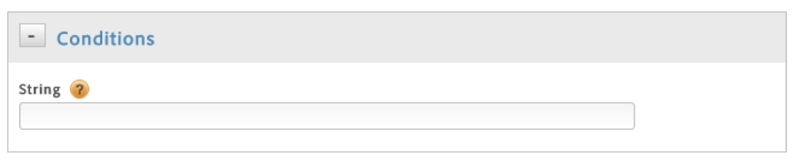

# Create conditions for direct-call rules

Create conditions for direct-call rules.

1. In the **[!UICONTROL Conditions]** dialog, specify the string that will be passed to `_satellite.track()` in your direct call, without quotes.

       

       Watch an Adobe training video demonstrating how to set up a direct-call rule in dynamic tag management:

       >[!VIDEO](https://video.tv.adobe.com/v/17170/)

       By then end of this video you should be able to:

    * Understand what direct call rules are 
    * Set up a direct call rule

       >[!NOTE]
       >
       >If you specify the string that will be passed to `_satellite.track()` in your direct call using the UI, as described above, do not use quotation marks. If you insert [customized page code](analytics_dtm.md#concept_7D6390823DFE4D29AF9505CCE1A79C3B) using the editor, you must use quotation marks.

