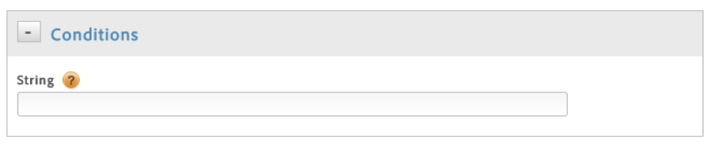

# Create conditions for direct-call rules

Create conditions for direct-call rules.

1. In the **[!UICONTROL Conditions]** dialog, specify the string that will be passed to `_satellite.track()` in your direct call, without quotes.

       

       Watch an Adobe training video demonstrating how to set up a direct-call rule in dynamic tag management:

    <table id="table_945212E5A33F414DB053569EAE2840DC"> 
 <thead> 
  <tr> 
   <th colname="col1" class="entry"> DTM Basics: Direct Call Rules </th> 
   <th colname="col2" class="entry"> Time: 3:01 </th> 
  </tr>
 </thead>
 <tbody> 
  <tr> 
   <td colname="col1"> 
 
     
 
      <iframe src="https://video.tv.adobe.com/v/17170/" frameborder="0" webkitallowfullscreen="true" mozallowfullscreen="true" oallowfullscreen="true" msallowfullscreen="true" allowfullscreen="allowfullscreen" scrolling="no" width="550" height="345">https://video.tv.adobe.com/v/17170/</iframe>
     
 
 </td> 
   <td colname="col2"> 
By then end of this video you should be able to: 
 
 
     <ul id="ul_6D341D136F5944F98229AD62937310F5"> 
      <li id="li_32CDF16E61EB42BC9A7CC10997ED7AC7">Understand what direct call rules are </li> 
      <li id="li_EFEFEB69D002473099668A2C606E9433">Set up a direct call rule </li> 
     </ul> 
 </td> 
  </tr> 
 </tbody> 
</table>

       >[!NOTE]
       >
       >If you specify the string that will be passed to `_satellite.track()` in your direct call using the UI, as described above, do not use quotation marks. If you insert [customized page code](../tools/analytics_dtm.md#concept_7D6390823DFE4D29AF9505CCE1A79C3B) using the editor, you must use quotation marks.

