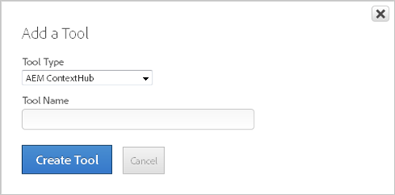

# Adobe Experience Manager ContextHub tool{#adobe-experience-manager-contexthub-tool}

Use the AEM ContextHub tool to integrate Dynamic Tag Management with the Adobe Experience Manager (AEM) ContextHub (AEM's version of the data layer). You can also use this tool to integrate DTM with any data layer, even for websites that do not use AEM.

DTM customers often use data elements to map to their websites' data layers. For example, the data layer might include information that a user is looking at a particular product or has placed an item into the shopping cart. DTM can use this information in rule conditions and actions in a number of ways. This includes the sending of data to Analytics for reporting purposes or to Target to display customized content for the user.

The AEM ContextHub tool solves many problems associated with data layers. Some data layers don't load at the top of the page. Other data layers are dynamic or asynchronous and change frequently as the page changes. In the past, both of these issues made it problematic for DTM to effectively send data or trigger actions.

The AEM ContextHub tool eliminates the need to write custom code that frequently checks to determine if the data layer changes, loads somewhere other than the top of the page, or is modified as the page changes.

As an example, suppose a customer places an item in the shopping cart and then removes that item. If the page doesn't refresh as the data layer changes, DTM will not recognize the change without a custom code addition. The AEM ContexHub tool contains a polling engine that checks every second to determine if there are changes.

Because DTM can now proactively populate data elements via the data layer, users can also use AEM ContextHub data elements in conjunction with previously released conditions, such as Data Element Value. This allows users to manage data layer values on a page load, or combine the Data Element Value condition with the [dataelementchanged](../managing-resources/create-rules/t-rules-event-conditions.md#concept_B1C6169D8B354207AEE0E4965E6421B1) event, in cases where the data layer has changed due to user interaction.

When you configure this tool, you can use the default setting to integrate with the AEM ContextHub or you can customize the structure to work with any website.

1. Click  *&lt;Web Property Name&gt;* > **[!UICONTROL Overview]** > **[!UICONTROL Add a Tool]** > **[!UICONTROL AEM ContextHub]** .

   

1. Specify a descriptive name for the tool.

   This name displays on the [!UICONTROL Overview] tab under [!UICONTROL Installed Tools]. 

1. Click **[!UICONTROL Create Tool]** to display the [!UICONTROL AEM ContextHub Settings] page.

   

1. Fill in the fields:

  | Element | Description |
  |---|---|
  |Use Default ContextHub Data Layer|Use the AEM ContextHub format. With this option selected, DTM references the default ContextHub schema for this integration. If you have made changes to your ContextHub schema, or want to use a different data layer, use the customized option.|
  |Customize ContextHub Data Layer|Use a custom format that maps to the data layer structure of any website, even if it does not use AEM. This option lets you edit your data layer schema. By default, it populates the edit window with the default ContextHub data layer, where you can make changes or completely replace it with your code.|
  |Open Editor |If you choose the Customize ContextHub Data Layer option, you can use the editor to insert your custom code.|
  |Add a Note |Add any notes regarding this implementation.|

1. Click **[!UICONTROL Save Changes]**.

## Data layer management using the ContextHub tool {#concept_90374780591E4D2D9A2C42C0C5471612}

The Dynamic Tag Management (DTM) AEM ContextHub tool can be used for both ContextHub and generic data layer implementations. The ContextHub data layer schema is loaded by default in the tool and provides a simple integration with [!DNL Adobe Experience Manager] (AEM) ContextHub stores. Examples for both the default ContextHub implementation and a custom generic data layer implementation are provided.

## Prerequisites {#section_F936420DCF8D40D7A2F1ECD5BE274DCC}

To use the ContextHub Tool, you must meet the following prerequisites:

* An existing ContextHub or Javascript object data layer on a website. 
* A JSON schema that properly defines the data layer in use on the website. 
* An active DTM web property in use on the website.

## AEM ContextHub tool components {#section_FB03DCE4CB284405B73187C7E6663F6D}

The AEM ContextHub Tool adds two pieces of functionality to DTM:

* The Data Layer Definition 
* The AEM ContextHub data layer type

Additionally, a new event type has been added to facilitate data layer monitoring called `dataelementchanged`. This event type can be used independently of the AEM ContextHub tool.

Each functional area corresponds to a configuration step described in both examples below.

## Data element monitoring {#section_D7B958D820D944A3A9D5D536ED5A53DA}

The new [`dataelementchanged`](../managing-resources/data-elements.md#concept_8A4591BD0F4241B6925D976482C43CD2) event type monitors any changes that occur to a specific data element value during a page view. The following observations should be noted when using this event type.

1. The data element must map to a simple Javascript value. Complex values like arrays and objects that are returned in a data element custom script will not work correctly. Cookies, CSS selectors, and URL parameters also produce unexpected results and might not work at all. Simple values like strings and integers work fine. 
1. Be conservative in the number of `dataelementchanged` event types that are referenced on a single page. Although the monitoring is efficient, large numbers of evaluations could impact page performance. 
1. The `dataelementchanged` event type works only within the current page view because it is a DOM-based monitoring system. 
1. The data element monitor polls for the values.

## ContextHub data layer default example {#section_113C939EA3F44372A44DA95AE54334D0}

<!-- 

c_contexthub-data-layer-default-example.xml

 -->

Example using the AEM ContextHub tool that references and uses the default ContextHub data layer within the [!DNL Dynamic Tag Management] configuration.

The ContextHub data layer will be loaded on a test [!DNL Adobe Experience Manager] (AEM) website, but ContextHub can be used independently of AEM. Contact your Adobe representative if you would like to use ContextHub independently of AEM.

All of the ContextHub stores can be referenced from the browser console.


The DTM data layer monitor starts before any other DTM functions, so the examples will not deploy the data layer through DTM even though it is possible to do so. Instead they will depend on the server-generated data layer. Otherwise Javascript warnings might occur because certain data layer values may not be available.

### Define the data layer

The first step in configuring the AEM ContextHub tool is to add it to a web property.

>[!NOTE]
>
>At this time only one AEM ContextHub tool is allowed per DTM web property.

1. Click  *&lt;Web Property Name&gt;* > **[!UICONTROL Overview]** > **[!UICONTROL Add a Tool]** > **[!UICONTROL AEM ContextHub]** .

   

1. Specify a descriptive name for the tool. 
1. Click **[!UICONTROL Create Tool]** to display the [!UICONTROL AEM ContextHub Settings] page.

   

1. Select **[!UICONTROL Use Default ContextHub Data Layer]** to leverage the standard ContextHub stores.

   Or

   Select **[!UICONTROL Customize ContextHub Data Layer]** to modify the schema. It is necessary to use the customized option if a non-default ContextHub data layer is being used in the implementation.

   The default Data Layer Root enables access to all of the ContextHub stores. Given the dynamic nature of the ContextHub stores, there are additional functions available with this data layer that are not available in the simple Javascript object reference used by the generic data layer approach. 

1. (Conditional) To use a custom data layer, click **[!UICONTROL Open Editor]** to view the data layer schema definition. If the custom data layer is a modification of the ContextHub schema be sure to add “ContextHub” in the [!UICONTROL Data Layer Root] field.

   

   The default ContextHub schema is populated in the editor.

   

    1. Modify the schema as necessary to match the site data layer schema. 
    1. Click **[!UICONTROL Save and Close]** to save the schema and close the editor.

1. Click **[!UICONTROL Save Changes]**.

### Create a data layer data element

1. In the web property, click the **[!UICONTROL Rules]** tab, then click **[!UICONTROL Data Elements]** in the left menu.

   

1. Click **[!UICONTROL Create New Data Element]**. 
1. Specify a name for the data element. In this example, name the data element "total_price." 
1. From the **[!UICONTROL Type]** drop-down list, select **[!UICONTROL AEM ContextHub]**.

   The name of the AEM ContextHub Tool is populated in the “Source,” but only one AEM ContextHub Tool can be defined in the current version. 

1. Map the data element to the data layer by selecting a path in the Object selector.

   In this example, select the `cart.totalPriceFloat` object. 

1. Click **[!UICONTROL Save Data Element]**.

### Create an event-based rule that uses the data element change event type

1. In the web property, click the **[!UICONTROL Rules]** tab, then click **[!UICONTROL Event Based Rules]** in the left menu.

   

1. Click **[!UICONTROL Create New Rule]**. 
1. Name the rule. In this example, name the rule "cart_total_update." 
1. Expand the Conditions section.

   

1. From the **[!UICONTROL Event Type]** drop-down list, select **[!UICONTROL dataelementchanged]**. 
1. Select the data element that was created in the previous section (total_price).

   

1. Under **[!UICONTROL Rule Conditions]**, select **[!UICONTROL Data Element Value]** from the drop-down list, then click **[!UICONTROL Add Criteria]**.

   

1. Select the data element that was created in the previous section (total_price) and assign a value to cause the rule to fire.

   In this example, a regular expression is used to evaluate anything greater than or equal to 50: `^([5-9]\d|[1-9]\d{2,})$`

   

   >[!NOTE]
   >
   >If data element values are used in this way as conditions, it is important that the data element settings are considered in the match. For example, selecting the [!UICONTROL Force Lowercase Value] option in the data element settings would convert the value to all lowercase before evaluation. Because Javascript is case sensitive “test” is not the same as “Test” and the condition would not fire as expected.

1. Expand the **[!UICONTROL Javascript / Third Party Tags]** section.

   

1. Click **[!UICONTROL Add New Script]**. 
1. Add a non-sequential Javascript that provides a notification if the rule fires. Name the rule “big_money_alert,” then add an alert script similar to the following example:

   `alert('$' + _satellite.getVar(‘total_price’) + ‘ is big money!’);`

   

1. Click **[!UICONTROL Save Code]**, then click **[!UICONTROL Save Rule]**.

### Validate the implementation

On the DTM-enabled website that runs the above web property, validate the implementation.

* In the developer console check for the existence of the data layer ( `ContextHub`). 
* Change the data layer object that is being monitored to a value that does NOT match the condition above: `ContextHub.setItem('/store/cart/totalPriceFloat','5');` 
* Change the data layer object that is being monitored to a value that DOES match the condition above: `ContextHub.setItem('/store/cart/totalPriceFloat','52');` 
* In the example implementation, an alert box should appear:

  

If DTM debugging is turned on, the failed evaluation should appear in the console.


## Custom data layer example {#section_F8BC6E51E9F74DCF95FBCE4EAB1327FF}

<!-- 

c_custom-data-layer-example.xml

 -->

Example using the AEM ContextHub tool that references and uses a custom, non-ContextHub data layer within the [!DNL Dynamic Tag Management] configuration.

The example data layer ( `_dl`) will be loaded on the test web page as a Javascript object definition in the `<head/>` section of the page before the DTM embed code is referenced.

```
<head> 
    <script> 
        window._dl = { 
            page: { 
                name: 'homepage', 
                quantity: 1, 
                friend: 'No one' } 
        } 
    </script> 
    <script src="//assets.adobedtm.com/satelliteLib-*.js"></script> 
</head> 

```

The DTM data layer monitor (see below) starts before any other DTM functions, so the examples will not deploy the data layer through DTM. Otherwise Javascript warnings might occur because certain data layer values may not be available.

### Define the data layer

The first step in configuring the AEM ContextHub tool is to add it to a web property.

>[!NOTE]
>
>At this time only one AEM ContextHub tool is allowed per DTM web property.

1. Click  *&lt;Web Property Name&gt;* > **[!UICONTROL Overview]** > **[!UICONTROL Add a Tool]** > **[!UICONTROL AEM ContextHub]** .

   

1. Specify a descriptive name for the tool. 
1. Click **[!UICONTROL Create Tool]** to display the [!UICONTROL AEM ContextHub Settings] page. 
1. Select **[!UICONTROL Customize ContextHub Data Layer]** to modify the schema.

   

   A root Javascript object name must be added to the [!UICONTROL Data Layer Root] field for non-ContextHub data layers. The `_dl` definition is used in the generic examples in this section. 

1. Click **[!UICONTROL Open Editor]** to view the data layer schema definition.

   By default, the default ContextHub schema is populated in the editor.

   

1. Delete the default schema and paste in the site data layer schema.

   The following sample non-ContextHub schema is used in the generic examples:

   ```
   { 
     "$schema": "https://json-schema.org/draft-04/schema#", 
     "type": "object", 
     "properties": { 
       "page": { 
         "type": "object", 
         "properties": { 
           "name": { 
             "type": "string" 
           }, 
           "quantity": { 
             "type": "number" 
           }, 
           "friend": { 
             "type": "string" 
           } 
         }, 
         "required": [ 
           "name", 
           "quantity", 
           "friend" 
         ] 
       } 
      }, 
     "required": [ 
       "page" 
     ] 
   } 
   
   ```

1. Click **[!UICONTROL Save and Close]** to save the schema and close the editor, then click **[!UICONTROL Save Changes]**.

### Create a data layer data element

1. In the web property, click the **[!UICONTROL Rules]** tab, then click **[!UICONTROL Data Elements]** in the left menu.

   

1. Click **[!UICONTROL Create New Data Element]**. 
1. Specify a name for the data element. In this example, name the data element "my_friend." 
1. From the **[!UICONTROL Type]** drop-down list, select **[!UICONTROL AEM ContextHub]**.

   The name of the AEM ContextHub Tool is populated in the “Source,” but only one AEM ContextHub Tool can be defined in the current version. 

1. Map the data element to the data layer by selecting a path in the Object selector.

   In this example, select the `page.friend` object.

   

1. Click **[!UICONTROL Save Data Element]**.

### Create an event-based rule that uses the data element change event type

1. In the web property, click the **[!UICONTROL Rules]** tab, then click **[!UICONTROL Event Based Rules]** in the left menu.

   

1. Click **[!UICONTROL Create New Rule]**. 
1. Name the rule. In this example, name the rule "find_a_friend." 
1. Expand the Conditions section.

   

1. From the **[!UICONTROL Event Type]** drop-down list, select **[!UICONTROL dataelementchanged]**. 
1. Select the data element that was created in the previous section (my_friend).

   

1. Under **[!UICONTROL Rule Conditions]**, select **[!UICONTROL Data Element Value]** from the drop-down list, then click **[!UICONTROL Add Criteria]**.

   

1. Select the data element that was created in the previous section (my_friend) and assign a value to cause the rule to fire.

   In this example use “Carl” as the value.

   

   >[!NOTE]
   >
   >If data element values are used in this way as conditions, it is important that the data element settings are considered in the match. For example, selecting the [!UICONTROL Force Lowercase Value] option in the data element settings would convert the value to all lowercase before evaluation. Because Javascript is case sensitive “test” is not the same as “Test” and the condition would not fire as expected.

1. Expand the **[!UICONTROL Javascript / Third Party Tags]** section.

   

1. Click **[!UICONTROL Add New Script]**. 
1. Add a non-sequential Javascript that provides a notification if the rule fires. Name the rule “found_my_friend,” then add an alert script similar to the following example:

   `alert(_satellite.getVar(‘my_friend’) + ‘ is my friend.’);`

   

1. Click **[!UICONTROL Save Code]**, then click **[!UICONTROL Save Rule]**.

### Validate the implementation

On the DTM-enabled website that runs the above web property, validate the implementation.

* In the developer console check for the existence of the data layer ( `_dl`). 
* Change the data layer object that is being monitored to the value that was set in the condition above ( `_dl.page.friend = ‘Carl’`).

  • In the example implementation, an alert box should appear:

  

* Change the object to a different value ( `_dl.page.friend = ‘Bob’`) and no alert should display.

  >[!NOTE]
  >
  >If DTM debugging is turned on, the failed evaluation should appear in the console.

* Change the object to a lowercase value of the match ( `_dl.page.friend = ‘carl’`) and no alert should display. 
* Change the object to the correct case value of the match ( `_dl.page.friend = ‘Carl’`) and the alert should once again display.

  

