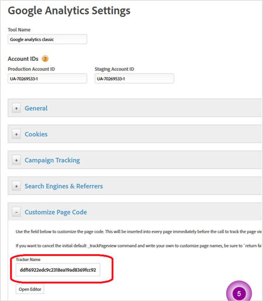
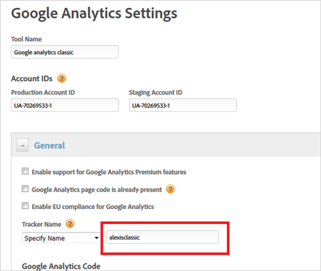

# Google Analytics tool{#google-analytics-tool}

Configuration options in Dynamic Tag Management for Google Analytics.

**[!UICONTROL <Web Property Name>]** > **[!UICONTROL Overview]** > **[!UICONTROL Add a Tool]** > **[!UICONTROL Google Analytics]**

Google Analytics is configured as a tool in the Dynamic Tag Management interface. 

<table id="table_E9348A7B9F984198AF444A06D5373A99"> 
 <thead> 
  <tr> 
   <th colname="col1" class="entry"> Setting </th> 
   <th colname="col2" class="entry"> Description </th> 
  </tr> 
 </thead>
 <tbody> 
  <tr> 
   <td colname="col1"> Tool Name </td> 
   <td colname="col2"> <p>The name of this instance of Google Analytics. </p> </td> 
  </tr> 
  <tr> 
   <td colname="col1"> Production Account ID </td> 
   <td colname="col2" morerows="1"> <p>You can point to production or staging accounts for data collection. Your staging account number is used in your development or test environment. It keeps your testing data separate from production. Dynamic Tag Management automatically installs the correct account in each environment. </p> </td> 
  </tr> 
  <tr> 
   <td colname="col1"> Staging Account ID </td> 
  </tr> 
  <tr> 
   <td colname="col1"> Enable support for Google Analytics Premium features </td> 
   <td colname="col2"> <p>Enable if you are a Google Analytics Premium customer. </p> </td> 
  </tr> 
  <tr> 
   <td colname="col1"> Google Analytics page code is already present </td> 
   <td colname="col2"> <p>Check this box to prevent Dynamic Tag Management from installing Google Analytics code if it is already present on your site. This way, you can use Dynamic Tag Management to add to your existing implementation, rather than starting a new implementation. Ensure that you properly set your tracker name when checking this box. </p> </td> 
  </tr> 
  <tr> 
   <td colname="col1"> Enable EU compliance for Google Analytics </td> 
   <td colname="col2"> <p> Enables or disables tracking based on the EU privacy cookie. </p> <p>When a page is loaded, the system checks to see if a cookie called <span class="filepath"> sat_track </span> is set (or the custom cookie name specified on the <span class="wintitle"> Edit Property </span> page). Consider the following information: 
     <ul id="ul_9D89EFC6538E4B5BA776C2CC0C002521"> 
      <li id="li_E740BB1CD90D442E82221EDA2CAF5945"> If the cookie does not exist or if the cookie exists and is set to anything but <span class="term"> true </span>, the loading of the tool is skipped when this setting is enabled. Meaning, any portion of a rule that uses the tool will not apply. <p>If a rule has analytics with EU compliance on and third-party code, and the cookie is set to <span class="term"> false </span>, the third-party code still runs. However, the analytics variables will not be set. </p> </li> 
      <li id="li_1E26B058806B443B84B4CD382740C338"> If the cookie exists but it is set to <span class="term"> true </span>, the tool loads normally. </li> 
     </ul> </p> <p>You are responsible for setting the <span class="filepath"> sat_track </span> (or custom named) cookie to <span class="term"> false </span> if a visitor opts out. You can accomplish this using custom code: </p> <p> 
     <codeblock>
       _satellite.setCookie(“sat_track”,&amp;nbsp;“false”); 
     </codeblock> </p> <p> You must also have a mechanism to set that cookie to <span class="term"> true </span> if you want a visitor to be able to opt in later: </p> <p> 
     <codeblock>
       _satellite.setCookie(“sat_track”,&amp;nbsp;“true"); 
     </codeblock> </p> </td> 
  </tr> 
  <tr> 
   <td colname="col1"> Tracker Name </td> 
   <td colname="col2"> <p>The tracker name you want to use for your Google Analytics installation. If you specified that Google Analytics is already installed on your site's pages, you must use the same name here for proper data collection. The default tracker name for Google Analytics is blank. </p> </td> 
  </tr> 
  <tr> 
   <td colname="col1"> Google Analytics Code </td> 
   <td colname="col2"> <p>There are two ways to host Google Analytics code: </p> 
    <ul id="ul_3690E98F1F8A451D9F0E5A259D12FC49"> 
     <li id="li_6FA7A5088AB246F5AFB8470312DBB0BE"> <b>Google Hosted</b>: You can host the code through Google. </li> 
     <li id="li_D4D3B50C07DB44C2AF783C76AE31A746"> <b>URL</b>: Or you can simply provide the URL to the file here. Dynamic Tag Management then consumes this code for its implementation of Google Analytics. </li> 
    </ul> </td> 
  </tr> 
  <tr> 
   <td colname="col1"> Sample Defaults - Data Sample </td> 
   <td colname="col2"> <p>To have Google Analytics capture only a sample of your site's data, specify the sample rate. To gather all data, leave 100%. </p> </td> 
  </tr> 
  <tr> 
   <td colname="col1"> Sample Defaults - Site Speed </td> 
   <td colname="col2"> <p>You can specify the sample rate for capturing data on site speed and page performance. The default is 1%. </p> </td> 
  </tr> 
  <tr> 
   <td colname="col1"> Social - Track Facebook like, unlike, and share </td> 
   <td colname="col2"> <p>Enables automatic link tracking on the above social buttons on your site. </p> </td> 
  </tr> 
  <tr> 
   <td colname="col1"> Social - Track official Twitter button use </td> 
   <td colname="col2"> <p>Enables automatic link tracking on the Twitter button on your site. </p> </td> 
  </tr> 
  <tr> 
   <td colname="col1"> Force lowercase on all pageview, event, and custom variable calls </td> 
   <td colname="col2"> <p> Force all page views, events, and custom variables sent to GA to be in all lowercase letters (a best-practice recommendation). </p> </td> 
  </tr> 
  <tr> 
   <td colname="col1"> Load Google Analytics page code at Page Top or Page Bottom </td> 
   <td colname="col2"> <p>You can control where and when to load the page code (on a rule-by-rule basis). </p> </td> 
  </tr> 
  <tr> 
   <td colname="col1"> Global Settings - Enable automatic linker link tracking </td> 
   <td colname="col2"> <p> Automates the tracking of cross-domain property. Google Analytics customers need to implement JavaScript codes for links to different but internal domains, so that cookies are shared across internal domains. </p> <p>For more information from Google, click <a href="https://support.google.com/analytics/answer/1034342?hl=en" format="https" scope="external"> here </a>. </p> </td> 
  </tr> 
  <tr> 
   <td colname="col1"> Element Tag or Selector to INCLUDE </td> 
   <td colname="col2"> <p>Specify the name of the tag you would like to track. Examples: A, IMG, INPUT, DIV, etc. </p> </td> 
  </tr> 
  <tr> 
   <td colname="col1"> Element Tag or Selector to EXCLUDE </td> 
   <td colname="col2"> <p>Specify the name of any tags or selectors you do not wish to track. </p> <p>Example: <span class="codeph"> a[target="_blank"] </span> </p> </td> 
  </tr> 
  <tr> 
   <td colname="col1"> Session Cookie Timeout </td> 
   <td colname="col2"> <p>How much time elapses before Google Analytics expires a session. Default is 30 minutes. </p> </td> 
  </tr> 
  <tr> 
   <td colname="col1"> Visitor Cookie Timeout </td> 
   <td colname="col2"> <p>Control how long a cookie lasts for a visitor to count as a repeat visitor. Default is two years. </p> </td> 
  </tr> 
  <tr> 
   <td colname="col1"> Cookie Path </td> 
   <td colname="col2"> <p>You can restrict whether a Google Analytics cookie only functions with a specific folder on your site. </p> </td> 
  </tr> 
  <tr> 
   <td colname="col1"> Cookie Domain </td> 
   <td colname="col2"> <p>You can change the default cookie domain. If you specified that your web property spans multiple domains or subdomains, Dynamic Tag Management configures this automatically. </p> </td> 
  </tr> 
  <tr> 
   <td colname="col1"> Set # as a query string delimiter </td> 
   <td colname="col2"> <p>Allows Dynamic Tag Management to recognize values in the URL after the # symbol as URL parameters. </p> </td> 
  </tr> 
  <tr> 
   <td colname="col1"> Campaign Keys in URL Parameters </td> 
   <td colname="col2"> <p>If your campaign parameters do not show up in the default variables (like utm_source, etc.), configure them here. </p> </td> 
  </tr> 
  <tr> 
   <td colname="col1"> Enable campaign tracking for cookies </td> 
   <td colname="col2"> <p>Allows you to set campaigns around cookies. </p> </td> 
  </tr> 
  <tr> 
   <td colname="col1"> Campaign Cookie Timeout </td> 
   <td colname="col2"> <p>Control how long a cookie lasts for a campaign. Default is 30 days. </p> </td> 
  </tr> 
  <tr> 
   <td colname="col1"> Classify the following keywords as direct </td> 
   <td colname="col2"> <p>Create a list of organic keywords that are automatically classified as direct traffic, comma separated. This list is most often used to classify brand searches as direct. Adobe does not recommend this practice. </p> </td> 
  </tr> 
  <tr> 
   <td colname="col1"> Classify the following referrers as direct </td> 
   <td colname="col2"> <p>Create a list of referral sources that are automatically classified as direct traffic, comma separated. This is most often used to classify affiliate or in-network searches as direct. Adobe does not recommend this practice. </p> </td> 
  </tr> 
  <tr> 
   <td colname="col1"> Clear Keywords &amp; Referrers from User Cookies </td> 
   <td colname="col2"> <p>Removes keyword and referrer data from the Google Analytics user cookies set from your site. </p> </td> 
  </tr> 
  <tr> 
   <td colname="col1"> Open Editor </td> 
   <td colname="col2"> <p>Use the editor to customize the page code. This code is inserted into every page immediately before the call to track the page view. If you want to cancel the initial default <span class="codeph"> _trackPageview </span> command and write your own to customize page names, be sure to <span class="codeph"> "return false;" </span> at the end of the script. </p> </td> 
  </tr> 
 </tbody> 
</table>

## Call Google Analytics objects in DTM using scripts {#concept_CE6BE22F0985473FAA7E9987012B7D3F}

<!-- 

call-google-analytics-objects-using-scripts.xml

 -->

When you set up a Google Analytics Classic tool, you can choose between using the GA Default Name, DTM Generated Name, or Specific Name. 

### GA default name {#section_CDB1E93ECDCA4576BE48363B8AFD3326}

When using the GA default name, you can use Google Analytics as follows in a script.

Without trackerName as variable:

```
_gaq._getAsyncTracker()._trackPageview();
```

With trackerName:

```
tracker = _gaq._getAsyncTracker(); 
tracker._trackPageview() 

```

### DTM generated name {#section_E01B75FB26CF4740841669F8820DB3FB}

When using the GA DTM generated name, you can use Google analytics as follows in script.

Get the tracker name in DTM Google analytics classic interface:



Without trackerName as variable:

```
_gaq._getAsyncTracker("ddf16922edc9c2318ea19ad8369fcc92")._trackPageview();
```

With trackerName:

```
tracker = _gaq._getAsyncTracker("ddf16922edc9c2318ea19ad8369fcc92"); 
tracker._trackPageview()
```

### Specific name {#section_E3DA4F5641F841F590D472F8F35752CE}

When using the specific name option, you can use Google Analytics classic as follows in script.



Without trackerName as variable:

```
_gaq._getAsyncTracker("alexisclassic")._trackPageview();
```

With trackerName:

```
tracker = _gaq._getAsyncTracker("alexisclassic"); 
tracker._trackPageview() 

```

