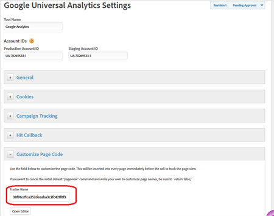
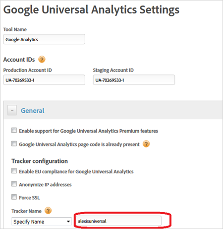

# Google Universal Analytics tool{#google-universal-analytics-tool}

Configuration options in dynamic tag management for Google Universal Analytics.

## Google Universal Analytics tool {#concept_224428EBB8E4466B93328EC5AE87FF04}

Configuration options in dynamic tag management for Google Universal Analytics. 

**[!UICONTROL <Web Property Name>]** > **[!UICONTROL Overview]** > **[!UICONTROL Add a Tool]** > **[!UICONTROL Google Universal Analytics]**

Google Universal Analytics is configured as a tool in the dynamic tag management interface.

* [Add a Tool](../tools-reference/google-universal-analytics.md#section_9FE7D51B3A0F4B2D889172381DB82AC2) 
* [General](../tools-reference/google-universal-analytics.md#section_7187797AA8154F32B23DED888F8C8ED1) 
* [Cookies](../tools-reference/google-universal-analytics.md#section_E94374CE48B245549D73228B1021DE96) 
* [Campaign Tracking](../tools-reference/google-universal-analytics.md#section_9C8FBD065B9045CFA1D86FAE1210D163) 
* [Hit Callback](../tools-reference/google-universal-analytics.md#section_1FAC2B15B85F465E92FBE116FDDF55DC) 
* [Customize Page Code](../tools-reference/google-universal-analytics.md#section_7706BB0721464C56AE0D37FB4EFD55DB)

## Add a tool {#section_9FE7D51B3A0F4B2D889172381DB82AC2}

<table id="table_E9348A7B9F984198AF444A06D5373A99"> 
 <thead> 
  <tr> 
   <th colname="col1" class="entry"> Setting </th> 
   <th colname="col2" class="entry"> Description </th> 
  </tr> 
 </thead>
 <tbody> 
  <tr> 
   <td colname="col1"> Tool Name </td> 
   <td colname="col2"> <p>The name of this instance of Google Analytics. </p> </td> 
  </tr> 
  <tr> 
   <td colname="col1"> Production Account ID </td> 
   <td colname="col2" morerows="1"> <p> Dynamic tag management allows you to point to production and staging accounts for data collection. Your staging account number will be used in your development or test environment, and will keep your testing data separate from production. Dynamic tag management will automatically install the correct account in each environment. </p> </td> 
  </tr> 
  <tr> 
   <td colname="col1"> Staging Account ID </td> 
  </tr> 
 </tbody> 
</table>

## General {#section_7187797AA8154F32B23DED888F8C8ED1}

<table id="table_4146A155A9274E7EB6B34DF4B594BB0B"> 
 <thead> 
  <tr> 
   <th colname="col1" class="entry"> Element </th> 
   <th colname="col2" class="entry"> Description </th> 
  </tr> 
 </thead>
 <tbody> 
  <tr> 
   <td colname="col1"> <p>Enable support for Google Universal Analytics Premium features </p> </td> 
   <td colname="col2"> <p>Enables the max dimensions and metrics increase from 20 to 200. </p> </td> 
  </tr> 
  <tr> 
   <td colname="col1"> <p>Google Universal Analytics page code is already present </p> </td> 
   <td colname="col2"> <p> Prevents dynamic tag management from installing Google Analytics page code if it is already present on your site. This feature allows you to use dynamic tag management to add to your existing implementation, rather than starting from scratch. Ensure that you properly set your tracker name when checking this box. </p> </td> 
  </tr> 
  <tr> 
   <td colname="col1"> <p>Enable EU compliance for Google Universal Analytics </p> </td> 
   <td colname="col2"> <p> Enables or disables tracking based on the EU privacy cookie. </p> <p>When a page is loaded, the system checks to see if a cookie called <span class="filepath"> sat_track </span> is set (or the custom cookie name specified on the <span class="wintitle"> Edit Property </span> page). Consider the following information: 
     <ul id="ul_42A6D728F0BC4FBABB0069EFB66DCB01"> 
      <li id="li_227CB14326344AA3980F20C7EACF2AD2"> If the cookie does not exist or if the cookie exists and is set to anything but <span class="term"> true </span>, the loading of the tool is skipped when this setting is enabled. Meaning, any portion of a rule that uses the tool will not apply. <p>If a rule has analytics with EU compliance on and third-party code, and the cookie is set to <span class="term"> false </span>, the third-party code still runs. However, the analytics variables will not be set. </p> </li> 
      <li id="li_1E74E02D7E4646ACA86D862A1D3C6679"> If the cookie exists but it is set to <span class="term"> true </span>, the tool loads normally. </li> 
     </ul> </p> <p>You are responsible for setting the <span class="filepath"> sat_track </span> (or custom named) cookie to <span class="term"> false </span> if a visitor opts out. You can accomplish this using custom code: </p> <p> 
     <codeblock>
       _satellite.setCookie(“sat_track”,&amp;nbsp;“false”); 
     </codeblock> </p> <p> You must also have a mechanism to set that cookie to <span class="term"> true </span> if you want a visitor to be able to opt in later: </p> <p> 
     <codeblock>
       _satellite.setCookie(“sat_track”,&amp;nbsp;“true"); 
     </codeblock> </p> </td> 
  </tr> 
  <tr> 
   <td colname="col1"> <p>Anonymize IP addresses </p> </td> 
   <td colname="col2"> <p>Ensures that IP addresses are never recorded. </p> </td> 
  </tr> 
  <tr> 
   <td colname="col1"> <p>Force SSL </p> </td> 
   <td colname="col2"> <p>Forces the use of HTTPS. </p> </td> 
  </tr> 
  <tr> 
   <td colname="col1"> <p>Tracker Name </p> </td> 
   <td colname="col2"> <p>The tracker name you want to use for your Google Analytics installation. If you specified that Google Analytics is already installed on your site's pages, you must use the same name here for proper data collection. The default tracker name for Google Analytics is blank. </p> </td> 
  </tr> 
  <tr> 
   <td colname="col1"> <p>Google Analytics Code </p> </td> 
   <td colname="col2"> <p>There are two ways to host Google Analytics code: </p> 
    <ul id="ul_3690E98F1F8A451D9F0E5A259D12FC49"> 
     <li id="li_6FA7A5088AB246F5AFB8470312DBB0BE"> <b>Google Hosted</b>: You can host the code through Google. </li> 
     <li id="li_D4D3B50C07DB44C2AF783C76AE31A746"> <b>URL</b>: Or you can simply provide the URL to the file here. Dynamic tag management then consumes this code for its implementation of Google Analytics. </li> 
    </ul> </td> 
  </tr> 
  <tr> 
   <td colname="col1"> <p>Data Sample </p> </td> 
   <td colname="col2"> <p>To have Google Analytics only capture a sample of your site's data, specify the sample rate for Data Sample. To gather all data, leave at 100%. </p> </td> 
  </tr> 
  <tr> 
   <td colname="col1"> <p>Site Speed Sample </p> </td> 
   <td colname="col2"> <p>You can also specify the sample rate for capturing data on site speed and page performance. The Google Analytics default is 1%. </p> </td> 
  </tr> 
  <tr> 
   <td colname="col1"> <p>Social - Track Facebook like, unlike, and share </p> </td> 
   <td colname="col2"> <p>Enables automatic link tracking on the above social buttons on your site. </p> </td> 
  </tr> 
  <tr> 
   <td colname="col1"> <p>Social - Track official Twitter button use </p> </td> 
   <td colname="col2"> <p>Enables automatic link tracking on the Twitter button on your site. </p> </td> 
  </tr> 
  <tr> 
   <td colname="col1"> Force lowercase on all pageview, event, and custom variable calls </td> 
   <td colname="col2"> <p> Force all page views, events, and custom variables sent to GA to be in all lowercase letters (a best-practice recommendation). </p> </td> 
  </tr> 
  <tr> 
   <td colname="col1"> <p>Always send HTTP referrer URL </p> </td> 
   <td colname="col2"> <p>Typically, HTTP referrals come from outside the domain on which you implemented Google Universal Analytics. Enable this setting if you have many subdomains and want all URLs to be sent. </p> </td> 
  </tr> 
  <tr> 
   <td colname="col1"> <p>Load Google Analytics page code at Page Top or Page Bottom </p> </td> 
   <td colname="col2"> <p>You can control where and when to load the page code (on a rule-by-rule basis). </p> </td> 
  </tr> 
  <tr> 
   <td colname="col1"> <p>Global Settings - Enable automatic linker link tracking </p> </td> 
   <td colname="col2"> <p> Automates the tracking of cross-domain property. Google Analytics customers need to implement JavaScript codes for links to different but internal domains, so that cookies are shared across internal domains. </p> <p>For more information from Google, click <a href="https://support.google.com/analytics/answer/1034342?hl=en" format="https" scope="external"> here </a>. </p> </td> 
  </tr> 
 </tbody> 
</table>

## Cookies {#section_E94374CE48B245549D73228B1021DE96}

<table id="table_3C63639E07CA4C158DB9C76023D9BEA4"> 
 <thead> 
  <tr> 
   <th colname="col1" class="entry"> Element </th> 
   <th colname="col2" class="entry"> Description </th> 
  </tr> 
 </thead>
 <tbody> 
  <tr> 
   <td colname="col1"> Visitor Cookie Timeout </td> 
   <td colname="col2"> <p>Control how long a cookie lasts for a visitor to count as a repeat visitor. The default value is two years. </p> </td> 
  </tr> 
  <tr> 
   <td colname="col1"> Cookie Name </td> 
   <td colname="col2"> <p> Name of the cookie used to store analytics data. </p> </td> 
  </tr> 
  <tr> 
   <td colname="col1"> Cookie Path </td> 
   <td colname="col2"> <p>You can restrict whether a Google Analytics cookie only functions with a specific folder on your site. </p> </td> 
  </tr> 
  <tr> 
   <td colname="col1"> Cookie Domain </td> 
   <td colname="col2"> <p>You can change the default cookie domain. If you specified that your web property spans multiple domains or subdomains, dynamic tag management configures this automatically. </p> </td> 
  </tr> 
  <tr> 
   <td colname="col1"> <p>Legacy Cookie Domain </p> </td> 
   <td colname="col2"> <p> This field is used to configure how <span class="filepath"> analytics.js </span> searches for cookies generated by earlier Google Analytics tracking scripts such as <span class="filepath"> ga.js </span> and <span class="filepath"> urchin.js </span>. </p> </td> 
  </tr> 
 </tbody> 
</table>

## Campaign tracking {#section_9C8FBD065B9045CFA1D86FAE1210D163}

If your campaign parameters do not show up in the default variables (like utm_source, etc.) configure those here. 

<table id="table_1EB0605558B94621A0E79098165AE5CB"> 
 <thead> 
  <tr> 
   <th colname="col1" class="entry"> Element </th> 
   <th colname="col2" class="entry"> Description </th> 
  </tr> 
 </thead>
 <tbody> 
  <tr> 
   <td colname="col1"> <p>Set # as a query string delimiter </p> </td> 
   <td colname="col2"> <p>Allows dynamic tag management to recognize values in the URL after the # symbol as URL parameters. </p> </td> 
  </tr> 
 </tbody> 
</table>

## Hit callback {#section_1FAC2B15B85F465E92FBE116FDDF55DC}

The code you add here is executed after each hit has successfully been reported to Google Analytics. 

<table id="table_4F39C2D4F70540AA88558674E8CE04D1"> 
 <thead> 
  <tr> 
   <th colname="col1" class="entry"> Element </th> 
   <th colname="col2" class="entry"> Description </th> 
  </tr> 
 </thead>
 <tbody> 
  <tr> 
   <td colname="col1"> <p>Open Editor </p> </td> 
   <td colname="col2"> <p>Use the editor to customize the page code. This code is inserted into every page immediately before the call to track the page view. If you want to cancel the initial default <span class="codeph"> _trackPageview </span> command and write your own to customize page names, be sure to <span class="codeph"> "return false;" </span> at the end of the script. </p> </td> 
  </tr> 
 </tbody> 
</table>

## Customize page code {#section_7706BB0721464C56AE0D37FB4EFD55DB}

Use [!UICONTROL Tracker Name] field to customize the page code. This code is inserted into every page immediately before the call to track the page view.

If you want to cancel the initial default *`pageview`* command and write your own to customize page names, be sure to "return false;" 

## Call Google Universal Analytics objects in DTM using scripts {#concept_7AE9C479460D4BEB9C341A102706E64A}

When you create a Google Analytics Universal tool, you can choose between using the GA Default Name, DTM Generated Name, or Specific Name. 

<!-- 

call-google-universal-analytics-objects-using-scripts.xml

 -->

This section contains the following information:

* [GA Default Name](../tools-reference/google-universal-analytics.md#section_370701ADB4B442DDB179344730A3638E) 
* [DTM Generated Name](../tools-reference/google-universal-analytics.md#section_60B6D3DFD26A43ADAB14EC1F5021C8D1) 
* [Specific Name](../tools-reference/google-universal-analytics.md#section_18928E9656E1471BA3078C2181F9517B)

## GA default name {#section_370701ADB4B442DDB179344730A3638E}

When using the GA default name, you can use Google Analytics Universal as follows in script:

```
ga('send', 'pageview');
```

## DTM generated name {#section_60B6D3DFD26A43ADAB14EC1F5021C8D1}

When using the GA DTM generated name, you can use Google Analytics Universal as follows in script.

In this example, the tracker name is pulled from the DTM Google Analytics Universal interface:



For example:

```
ga('38f91ccf1ca252deaaba3c2fc421f0f3.send', 'pageview');
```

## Specific name {#section_18928E9656E1471BA3078C2181F9517B}

When using Specific Name, you can use Google Analytics Universal as follows in script.



For example:

```
ga('alexisuniversal.send', 'pageview');
```

