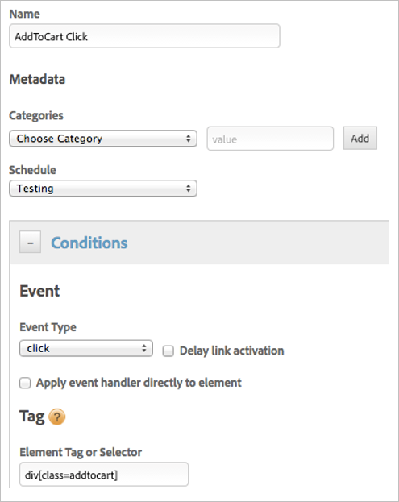
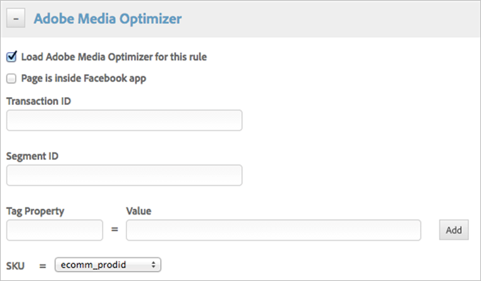

# Adobe Media Optimizer tool{#adobe-media-optimizer-tool}

Information about deploying Adobe Media Optimizer using dynamic tag management.

## Adobe Media Optimizer tool {#concept_1A33BC0F5B6A4709929EC6F876236657}

Information about deploying Adobe Media Optimizer using dynamic tag management. 

**[!UICONTROL <Web Property Name>]** > **[!UICONTROL Overview]** > **[!UICONTROL Add a Tool]** > **[!UICONTROL Adobe Media Optimizer]**

<!-- 

Values are applied to every rule using this Tool. Getting new content from Anna, she'll route to Greg/Cory then me. 

 -->

## Tool name {#section_824615D8E6914331B423CC50B3427B9E}

A descriptive name for this implementation.

**User ID**

Your advertising management account has an associated numeric user ID. It is displayed in the JavaScript generated for a pixel.

For example: `1234`

**Transaction ID **

Indicate a transaction ID property (ev_transid= *`<transid>`*) to include in the tag. When you include the ID, the advertiser must generate a unique value for < *`transid`*> (for example, an actual order ID) when the transaction is complete. The value is passed back to advertising management. Advertising management uses the transaction ID to eliminate duplicate transactions with the same transaction ID and property value.

The transaction ID is included in the Transaction Report in advertising management, which you can use to validate advertising management data with the advertiser's data.

If the advertiser's data does not include a unique ID per transaction, Media Optimizer still generates one, based on transaction time.

The transaction ID cannot contain ampersand symbols (&), which are reserved as parameter separators.

>[!NOTE]
>
>If you use the [!DNL Media Optimizer] combo tracking service, you must submit the transaction ID ( *`ev_transid`*) for the online part of the transaction in the feed data for offline parts of the transaction. 
>
>For more information, see the Tracking section of the advertising management online help.

*`Transaction ID`* can be set globally at the tool level or conditionally at the rule level. A globally configured transaction ID is inherited by any dynamic tag management rules utilizing the Adobe Media Optimizer tool, unless specifically overridden in the rule.

**Load Media Optimizer page code at (Page Top or Page Bottom)**

Determines where and when the page code loads. The recommended location is selected by default.

**Media Optimizer page code already present **

Prevents dynamic tag management from installing advertising management code if the code exists on your site. This method lets you use dynamic tag management to add to your existing advertising management implementation, rather than starting a new implementation.

**Conversion Property Name / Value**

A conversion property to be tracked when an end user views a page containing the conversion tag.

>[!NOTE]
>
>Properties added to this list are not integrated with the client's Transaction Properties list in the Admin view in advertising management. However, properties are added to the client's Transaction Properties list automatically, once advertising management actually gathers data for a property. Gathering happens when the conversion tag is implemented on a page and an end user completes a transaction that opens that page.

Conversion properties can be set globally at the tool level and conditionally at the rule level. A globally configured Conversion Property is inherited by any dynamic tag management rules utilizing the Adobe Media Optimizer tool *`in addition`* to any conversion properties set in the rule.

**Segment ID (optional) **

Indicate the numeric ID for an advertising management segment in which to add the users who complete the tracked transaction. (For JavaScript tags and for display campaigns only)

>[!NOTE]
>
>If you associate multiple conversion tags with the same audience segment, the segment will include all of the users who complete those transaction types.

Segment ID can be set globally at the tool level or conditionally at the rule level. A globally configured Segment ID is inherited by any dynamic tag management rules utilizing the Adobe Media Optimizer tool, unless specifically overridden in the rule.

**Tag Property / Value**

A conversion property name / value to be included in the tag when the specific rule is fired.

>[!NOTE]
>
>Properties added to this list are not integrated with the client's Transaction Properties list in the Admin view in advertising management. However, properties are added to the client's Transaction Properties list automatically, once advertising management gathers data for a property. Gathering happens when the conversion tag is implemented on a page and an end user completes a transaction.

Conversion properties can be set globally at the tool level and conditionally at the rule level. If a rule uses the Adobe Media Optimizer tool, the configured global value is inherited and used *`in addition`* to any conversion properties configured in the rule.

**SKU**

Select the configured data element to populate the SKU value in the tag.

See [Data Elements](../managing-resources/data-elements.md#concept_8A4591BD0F4241B6925D976482C43CD2) for more information.

SKU can be set globally at the tool level or conditionally at the rule level. If a rule uses the Adobe Media Optimizer tool and the rule does not specifically set a SKU, the configured global value is inherited and used. If the rule sets a SKU, any global SKU configuration is overridden in that rule. 

## Media Optimizer rule example {#task_FC14320055254A30BD7F71FA6E905216}

An example of how to enable Adobe Media Optimizer in dynamic tag management for a specific rule when an Adobe Media Optimizer tool is installed. 

<!-- 

t_media_opt_rule.xml

 -->

In this example, when this rule fires, Adobe Media Optimizer loads and fires a tag including the SKU value for the data element *`ecomm_prodid`* instead of the SKU configured at the tool level. The tag also includes any Transaction ID, Segment ID, and Conversion tags configured globally in the installed Adobe Media Optimizer tool. 

1. Click **[!UICONTROL Property]** > **[!UICONTROL Rules]** > **[!UICONTROL Event Based Rules]** > **[!UICONTROL Create New Rule]**.
1. Name and configure the rule condition.

   

   Configure the rule so that it fires only in the desired cases. In this example, the rule fires on the click of *`Add to cart`* as indicated by the selector *`div`* with a class of *`addtocart`*.

   >[!NOTE]
   >
   >Adobe Media Optimizer is also available in page load and direct call rules in dynamic tag management once an Adobe Media Optimizer tool is installed in the property. See [Conditions and Functions](../managing-resources/rules.md#section_198A5095854F415C86ABBA9165D53370) for information about available rule criteria.

1. Expand **[!UICONTROL Adobe Media Optimizer]** in the rule.

   

1. Enable **[!UICONTROL Load Adobe Media Optimizer for this rule]**.
1. Configure the settings you want to apply in this rule.

   All of the settings are optional, because global configurations from the installed Adobe Media Optimizer tool are inherited. 

