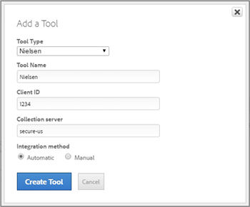
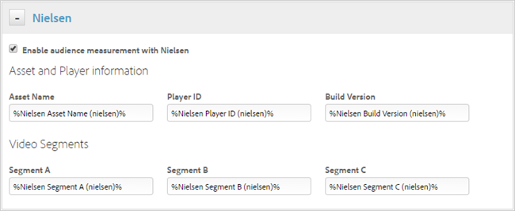

# Nielsen tool{#nielsen-tool}

You can enable Nielsen tracking using Dynamic Tag Management by creating the Nielsen tool and configuring the page code either automatically or manually. The automatic method is recommended for most users.

## Prerequisites {#section_44B0B2C13E5E495FA1F6C424C7239B6D}

You must perform the following tasks before you deploy the Nielsen tool:

<table id="table_5F72D90F206C4D1B9D67FDF62D7EB61F">
 <thead>
  <tr>
   <th colname="col1" class="entry"> Task </th>
   <th colname="col2" class="entry"> Description </th>
  </tr>
 </thead>
 <tbody>
  <tr>
   <td colname="col1"> 
<b>1.</b> Embed Dynamic Tag Management on the site (all site webpages). 
 </td>
   <td colname="col2"> 
 You can add header and footer code that determines the loading of JavaScript and page content on your site. You must install both the header and footer code on every page of your site, regardless of the <a href="../client-side-information/deployment.md#concept_09612483C4934E16B20F5E9DA3B7EB7D" format="dita" scope="local"> hosting option </a> used. For more information, see <a href="../client-side-information/deployment.md#concept_3F6A0A508F294FCBABEBA1DF540B781B" format="dita" scope="local"> Header and Footer Code </a>. 
 </td>
  </tr>
  <tr>
   <td colname="col1"> 
<b>2.</b> Add the Experience Cloud ID Service tool. 
 </td>
   <td colname="col2"> 
The  Experience Cloud Visitor ID Service  provides a universal visitor ID across  Experience Cloud solutions. The visitor ID service replaces the legacy Analytics visitor ID mechanism, and is required by  Analytics  for  Target ;  video heartbeat ; and  Experience Cloud  integrations, including the Adobe/Nielsen integration. For general information about the service, see the <a href="https://docs.adobe.com/content/help/en/id-service/using/intro/overview.html" format="https" scope="external"> Experience Cloud Visitor ID Service Guide </a>. For information about adding the Experience Cloud ID Service tool in DTM, see <a href="https://docs.adobe.com/content/help/en/id-service/using/implementation/standard.html" format="html" scope="external"> Experience Cloud ID Services settings </a>. 
 </td> 
  </tr>
  <tr>
   <td colname="col1"> 
<b>3.</b> Add the Adobe Analytics tool. 
 </td>
   <td colname="col2"> 
You can deploy  Adobe Analytics  (Standard and Premium) using Dynamic Tag Management by creating the  Adobe Analytics  tool and configuring the page code either automatically or manually. The automatic method is recommended for most users. For more information, see <a href="../tools-reference/analytics-dtm.md#concept_FBA6679A0B79490F8296437F11E5E4F8" format="dita" scope="local"> Add Adobe Analytics Tool </a>. 
 </td>
  </tr>
 </tbody>
</table>

## Add the Nielsen tool {#section_E656FC0A6CD24EC2AB12130E8E043BE2}

1. Click  *&lt;Web Property Name&gt;* > **[!UICONTROL Overview]** > **[!UICONTROL Add a Tool]** > **[!UICONTROL Nielsen]** .

   

1. Fill in the fields:

    <table id="table_1CFB53FE72E74CCB8CAA5D4E3873D286">
     <thead>
      <tr>
       <th colname="col1" class="entry"> Element </th>
       <th colname="col2" class="entry"> Description </th>
      </tr>
     </thead>
     <tbody>
      <tr>
       <td colname="col1"> 
Tool Type 
 </td>
       <td colname="col2"> 
The type of tool, such as  Nielsen . 
 </td>
      </tr>
      <tr>
       <td colname="col1"> 
Tool Name 
 </td>
       <td colname="col2"> 
A descriptive name for this tool. This name displays on the  Overview  tab under  Installed Tools . 
 </td>
      </tr>
      <tr>
       <td colname="col1"> 
Client ID 
 </td>
       <td colname="col2"> 
Specify the Client ID you obtained from Nielsen. 
 </td>
      </tr>
      <tr>
       <td colname="col1"> 
Collection Server 
 </td>
       <td colname="col2"> 
Specify the collection server you obtained from Nielsen (secure-us or secure-au, for example). 
 </td>
      </tr>
      <tr>
       <td colname="col1" morerows="1"> 
Integration Method 
 </td>
       <td colname="col2"> 
 <b>Automatic</b>: Use Dynamic Tag Management to manage the integration. After the accounts are connected, Dynamic Tag Management pulls the  Adobe Analytics  report suite IDs and names into the tool configuration interface, allowing for increased speed in tool deployment with less possibility for user errors. 
 </td>
      </tr>
      <tr>
       <td colname="col2"> 
 <b>Manual</b>: Manually manage the integration. Adobe strongly suggests that you use the Automatic integration method. 
 </td>
      </tr>
     </tbody>
    </table>

1. Click **[!UICONTROL Create Tool]** to create the tool and display it for editing.
1. Fill in the fields:

    <table id="table_F2635DE3831B4476AD1B12041DB16FBD">
     <thead>
      <tr>
       <th colname="col1" class="entry"> Element </th>
       <th colname="col2" class="entry"> Description </th>
      </tr>
     </thead>
     <tbody>
      <tr>
       <td colname="col1"> 
Application ID 
 </td>
       <td colname="col2"> 
Specify the application's ID that you obtained from Nielsen. 
 </td>
      </tr>
      <tr>
       <td colname="col1"> 
Application Name 
 </td>
       <td colname="col2"> 
Specify the application's name that you obtained from Nielsen. 
 </td>
      </tr>
      <tr>
       <td colname="col1"> 
Collection Server 
 </td>
       <td colname="col2"> 
Specify the collection server you obtained from Nielsen (secure-us or secure-au, for example). The collection server carries over from the information you specified above. 
 </td>
      </tr>
      <tr>
       <td colname="col1"> 
Content Group 
 </td>
       <td colname="col2"> 
Specify the content group you obtained from Nielsen. 
 </td>
      </tr>
      <tr>
       <td colname="col1"> 
VCID 
 </td>
       <td colname="col2"> 
Specify the VCID you obtained from Nielsen. 
 </td>
      </tr>
     </tbody>
    </table>

1. Click **[!UICONTROL Save Changes]**.

## Set up Nielsen rules in Dynamic Tag Management {#section_C3D440E62D4B487BB2D30F06CEC51BA5}

[!DNL Dynamic Tag Management] is a rule-based system. It looks for user interaction and associated data. When the criteria outlined in your rules are met, the rule triggers the tool, script, or HTML you identified. For general information, see [Rules](../managing-resources/rules.md#concept_2D3F296DD3BD418BAB7A0E2415DD9C92).

When you add the Nielsen tool, Dynamic Tag Management automatically creates a default Nielsen Time Tracking rule.

1. Click the **[!UICONTROL Rules]** tab > **[!UICONTROL Page Load Rules]** > **[!UICONTROL Nielsen]**.
1. Set up the rules as desired by specifying when this page rule should fire.

    1. Click **[!UICONTROL Conditions]**, then specify where the rule fires (bottom of page, top of page, DOM ready, or onload).
    1. Specify the criteria for firing the rule.
    1. Include the path to the pages on which you want the rule to fire (for example, "videos").
    1. Click **[!UICONTROL Nielsen]** to see a set of pre-populated data elements.

       

    1. Click **[!UICONTROL Data Elements]** to map where you want Dynamic Tag Management to pull the information in these pre-populated data elements (Asset Name, Player ID, and so forth).

       For example, Asset Name might be pulled from a DIV to which you need to point.

   The following topics provide in-depth information:

    * [Page Load Rules Example](../managing-resources/rules.md#concept_811F4216145A4E3A91190DFFC9C2D223)
    * [Rule Conditions and Functions](../managing-resources/rules.md#reference_662A7B7D177C46C98980CD317A7A8861)
    * [Data Elements](../managing-resources/data-elements.md#concept_8A4591BD0F4241B6925D976482C43CD2)

## Approve and publish all changes {#section_9948D02D35FC423FA44101C221265C0B}

You must approve the changes you made in the previous sections before those changes become effective.

1. Click the **[!UICONTROL Approvals]** tab > **[!UICONTROL Approve]**.
