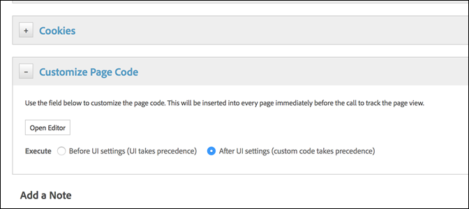

# Deploy JavaScript tags to opt in to DTM{#deploy-javascript-tags-to-opt-in-to-dtm}

The combination of the European Union [General Data Protection Regulation (GDPR)](https://gdpr-info.eu/art-7-gdpr/) and [ePrivacy](https://medium.com/mydata/consent-lost-gdpr-and-found-eprivacy-e85cf881ffb) legislation requires companies to be able to manage consent for their users. Adobe customers may require visitors to opt-in before Adobe solutions execute for any given visitor. Visitors should have the ability to manage their opt-in and opt-out status.

Adobe Experience Cloud customers require a variety of implementations of these requirements. Some use enterprise-level consent managers and others build their own.

For DTM, use tools to define opt-in and opt-out solutions.

This document contains information about how to prevent Adobe tags from firing until consent is acquired.

## Adobe Media Optimizer {#section_787F318A5A8C4185B62A6EE95135293D}

DTM does not fire AMO automatically. AMO only fires if you specifically tell it to in a rule action. Use the rule conditions to determine when and what to fire. For example, to use cookies to determine opt-in status, set a data element to read that cookie and use it as a condition in the rule to determine when to fire the "Load Media Optimizer for this rule" action.

## Analytics {#section_722D7FA88DC14F34B0DC01CE28775709}

The Adobe Analytics tool fires an Analytics beacon automatically. To stop this:

1. Add the Adobe Analytics tool. 
1. In the Link Tracking section of the Analytics tool configuration, make sure the "Track download links" and "Track outbound links" options are *not* selected. 
1. Click edit on the Analytics tool, expand the Customize Page Code section and open the custom code editor in the Analytics tool and enter the code below:

   

   ```
   if(track == false) {  
    return false; 
   }
   ```

1. Use the rule conditions for Page Load or Event Based rules to determine when and what to fire.

   For example, use cookies to determine opt-in status, have a data element read that cookie and use it as a condition in the rule to determine when to trigger the rule for Adobe Analytics.

    * Page load rules

        1. Once the condition is set, open the Adobe Analytics tool section and then open the Custom Code editor at the bottom of the page 
        1. Add `s.t()` or `s.tl()` in the code editor, depending on which kind of call you want to make.

    * Event based rules

      Once the condition is set, open the Adobe Analytics tool section and select the type of call you want DTM to make.

## Audience Manager {#section_21D1B7309B0A4CF692E2FA09B3373329}

DIL is currently set to fire automatically if it is placed on a customer page. There is currently no way to stop it from firing. Adobe is developing a way to pause the DIL from automatically firing while maintaining the correct cross-solution sequencing. This will be released soon. Adobe recommends that you use server-side forwarding within Analytics via custom code.

>[!IMPORTANT]
>
>DIL has a dependency on Experience Cloud ID Service 3.3+. It relies on Experience Cloud ID Service to fire ID syncs and URL destinations. An error occurs if Experience Cloud ID Service is missing, old, or not configured.

## Experience Cloud ID {#section_02C0B1B52D1F46289ECF63505284C295}

Experience Cloud ID service currently fires automatically if it is placed on a customer page. At this time, there is no way to stop it from firing. Adobe is developing a way to pause Experience Cloud ID service from automatically firing while maintaining the correct cross-solution sequencing. This will be released soon.

## Target {#section_DF1706D7819D4CA7AC79C96C26AEB729}

The Target tool for DTM fires Target on every page that's it's on. There are multiple ways to change this.

* Add the Target tool:

    1. Select the "Custom" Library Management option in the Tool configuration. 
    1. Wrap the Target code in whatever logic you are using to determine opt-in stats.

* Don't add the Target Tool

    1. Create a "Top of the page" page load rule. 
    1. Use the rule conditions to determine when and what to fire. For example, use cookies to determine opt-in status, have a data element read that cookie and use it as a condition in the rule to determine when to trigger the rule. 
    1. Deploy the Target code via custom JavaScript at the bottom of the rule builder.

       Adobe strongly suggests you use at.js and not mbox.js, which is no longer supported. 
    1. Set any additional parameters manually within the code editor.

