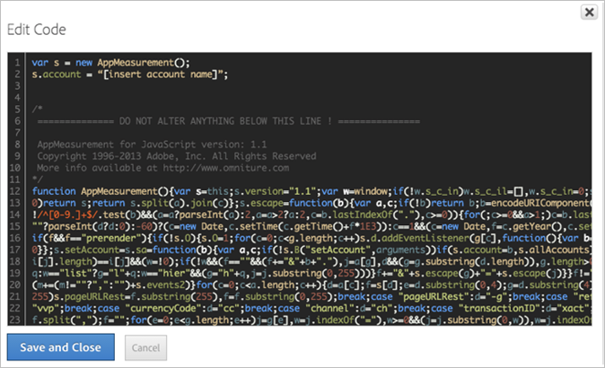
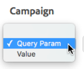
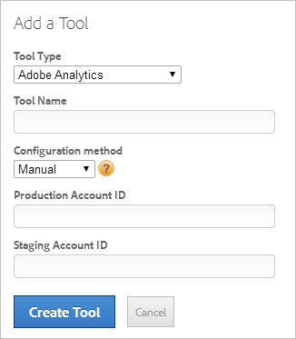
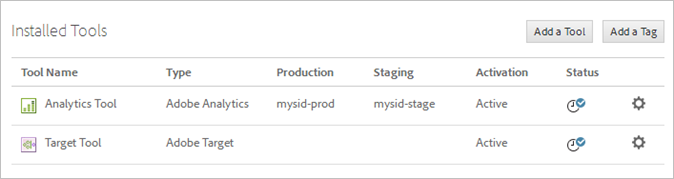

# Adobe Analytics Tool

You can deploy Adobe Analytics (Standard and Premium) using dynamic tag management by creating the Adobe Analytics tool and configuring the page code either automatically or manually. The automatic method is recommended for most users.

## Adobe Analytics Tool {#concept_FBA6679A0B79490F8296437F11E5E4F8}

You can deploy Adobe Analytics (Standard and Premium) using dynamic tag management by creating the Adobe Analytics tool and configuring the page code either automatically or manually. The automatic method is recommended for most users.

>[!NOTE]
>
>For improved visitor tracking, it is strongly recommended that you enable [Experience Cloud ID Service](https://marketing.adobe.com/resources/help/en_US/mcvid/).

This section contains the following information:

* [Add an Adobe Analytics Tool](../tools/analytics_dtm.md#section_D5066B21581B4F7F811AD0027BF44EA5) 
* [Edit an Existing Adobe Analytics Tool](../tools/analytics_dtm.md#section_148B16AF429B4949B06238D90635B726) 
* [Enabling Adobe Analytics Premium](../tools/analytics_dtm.md#section_AEAA44566B5A46D2922E17A11D7EA217)

## Add an Adobe Analytics Tool {#section_D5066B21581B4F7F811AD0027BF44EA5}

1. Click  **[!UICONTROL  *`Web Property Name`*]** > **[!UICONTROL Overview]** > **[!UICONTROL Add a Tool]** > **[!UICONTROL Adobe Analytics]** .

    

1. Fill in the fields: 

<table id="table_1CFB53FE72E74CCB8CAA5D4E3873D286"> 
 <thead> 
  <tr> 
   <th colname="col1" class="entry"> Element </th> 
   <th colname="col2" class="entry"> Description </th> 
  </tr> 
 </thead>
 <tbody> 
  <tr> 
   <td colname="col1"> <p>Tool Type </p> </td> 
   <td colname="col2"> The type of tool, such as <span class="keyword"> Adobe Analytics </span>. </td> 
  </tr> 
  <tr> 
   <td colname="col1"> <p>Tool Name </p> </td> 
   <td colname="col2"> A descriptive name for this tool. This name displays on the <span class="wintitle"> Overview </span> tab under <span class="wintitle"> Installed Tools </span>. </td> 
  </tr> 
  <tr> 
   <td colname="col1" morerows="1"> <p>Configuration Method </p> </td> 
   <td colname="col2"> <p> <b>Automatic</b> (Recommended): Use dynamic tag management to manage the configuration. This method enables automatic synchronization of <span class="keyword"> Adobe Analytics </span> report suites via an <span class="keyword"> Experience Cloud </span> login or Web Services ID, and manages the AppMeasurement code. </p> <p>After the accounts are connected, dynamic tag management pulls the <span class="keyword"> Adobe Analytics </span> report suite IDs and names into the tool configuration interface, allowing for increased speed in tool deployment with less possibility for user errors. </p> <p> <p>Note:  You must choose the <span class="wintitle"> Automatic </span> option if you are an <span class="keyword"> Adobe Analytics Premium </span> customer. See <a href="../tools/analytics_dtm.md#section_AEAA44566B5A46D2922E17A11D7EA217" format="dita" scope="local"> Enabling Adobe Analytics Premium </a> below. </p> </p> <p>Fill in the fields specific to automatic configuration: </p> 
    <ul id="ul_8D9797B01E444B9C85B862A9F96B447C"> 
     <li id="li_0AC84C1F37B24C658F2178E50ECCC4B0"> <p> <b>Experience Cloud</b>: (Default) Uses <span class="keyword"> Experience Cloud </span> single sign-on. Specify your Experience Cloud ID and password. </p> </li> 
     <li id="li_6C80468835D04CC09F4AEC46D1300310"> <p><b>Web Services</b>: Specify your Web Services username and shared secret. </p> <p>Shared secret credentials are located in <span class="uicontrol"> Admin Tools </span> &gt; <span class="uicontrol"> Company Settings </span> &gt; <a href="http://microsite.omniture.com/t2/help/en_US/reference/web_services_admin.html" format="dita" scope="local"> Web Services </a>. </p> <p>Developers, see <a href="https://marketing.adobe.com/developer/en_US/get-started/enterprise-api/c-get-web-service-access-to-the-enterprise-api" format="https" scope="external"> Get Web Service Access to the Enterprise API </a> for help with obtaining Web Services credentials. </p> </li> 
    </ul> </td> 
  </tr> 
  <tr> 
   <td colname="col2"> <p> <b>Manual</b>: Manually manage the AppMeasurement code. You can download the <span class="keyword"> Analytics </span> <span class="keyword"> AppMeasurement </span> code from <span class="ignoretag"> <span class="uicontrol"> Admin Tools </span>  &gt; <span class="uicontrol"> Code Manager </span> </span>. </p> <p>Click <a href="https://marketing.adobe.com/resources/help/en_US/sc/implement/appmeasure_mjs.html" format="https" scope="external"> JavaScript (new) </a> for information about downloading the code locally to copy and paste in the <span class="wintitle"> Edit Code </span> field in <a href="../tools/analytics_dtm.md#concept_24654766343B4E82A9416A112D2125FE" format="dita" scope="local"> Library Management </a>. </p> <p>Fill in the fields specific to a manual configuration: </p> 
    <ul id="ul_CFB6CE78AEB743EF8B47BAAC42E2DB0A"> 
     <li id="li_5B7046CD95AB416F8C113B381A264D91"> <p><b>Production Account ID: </b>(Required) Your production account for data collection. For Analytics, this is your report suite ID. Dynamic tag management automatically installs the correct account in the production and staging environment. </p> </li> 
     <li id="li_14E840FD79A0451BABEDD15DC0584768"> <p><b>Staging Account ID: </b>(Required) Used in your development or test environment. For Analytics, this is your report suite ID. A staging account keeps your testing data separate from production. </p> </li> 
     <li id="li_69E6C6A41F5240E1ABE8ABE0B9D151FC"> <p><b>Tracking Server: </b>Specify the information for your tracking server. </p> <p>The <span class="wintitle"> Tracking Server </span> and <span class="wintitle"> SSL Tracking Server </span> variables are used for first-party cookie implementation to specify the domain at which the image request and cookie is written. For more information, see the <a href="https://helpx.adobe.com/analytics/kb/determining-data-center.html" format="html" scope="external"> Correctly Populate the trackingServer and trackingServerSecure Variable </a> article. </p> </li> 
     <li id="li_1A7271C68205428F8CA5548A96CACBEC"> <p><b>SSL Tracking Server: </b>Specify the information for your SSL tracking server. </p> </li> 
    </ul> </td> 
  </tr> 
 </tbody> 
</table>

1. Click **[!UICONTROL Create Tool]** to create the tool and display it for editing.

   Tools are displayed on the [!UICONTROL Overview] tab, under [!UICONTROL Installed Tools]. 

1. (Conditional) Configure the tool further as necessary by following the directions in the links below ( [!UICONTROL General], [!UICONTROL Library Management], [!UICONTROL Global Variables], [!UICONTROL Pageviews & Content], [!UICONTROL Link Tracking], [!UICONTROL Referrers & Campaigns], [!UICONTROL Cookies], and [!UICONTROL Customize Page Code]).

See [FAQ - Adobe Analytics Tool](../faq/faq.md#section_75E724E86D0D4952B199A9B850AE0A3E) for additional information about this tool.

## Edit an Existing Adobe Analytics Tool {#section_148B16AF429B4949B06238D90635B726}

You can edit an existing Adobe Analytics tool to change its configuration settings.

1. Click the   icon next to an installed tool from the [!UICONTROL Overview] tab. 
1. Edit the fields as desired.

   The following table includes only those elements that differ from the elements available when you are creating an Analytics tool, as described above. However, you can change any element on the page, as described in both tables. 

<table id="table_2B60CD109CFF4839AB7F91D61125EDFF"> 
 <thead> 
  <tr> 
   <th colname="col1" class="entry"> Element </th> 
   <th colname="col2" class="entry"> Description </th> 
  </tr> 
 </thead>
 <tbody> 
  <tr> 
   <td colname="col1"> <p>Enable Automatic Configuration </p> </td> 
   <td colname="col2"> <p>Note:  Enabling this setting changes a manually configured implementation to the automatic configuration method described in <span class="term"> Configuration Method </span>. </p> <p>This option lets dynamic tag management automatically retrieve your <span class="keyword"> Adobe Analytics </span> account's configuration. </p> <p>The latest available AppMeasurement code is used and upgrade notifications are displayed for selection as new versions become available. You can also roll back to previous AppMeasurement versions as necessary, such as for compatibility reasons. Up to five previous versions are displayed. </p> </td> 
  </tr> 
  <tr> 
   <td colname="col1"> <p>Update Credentials </p> </td> 
   <td colname="col2"> <p>Refresh the API, for example, to update report suites associated with a user. </p> </td> 
  </tr> 
 </tbody> 
</table>

1. (Conditional) Configure the tool further as necessary by following the directions in the links below ( [!UICONTROL General], [!UICONTROL Library Management], [!UICONTROL Global Variables], [!UICONTROL Pageviews & Content], [!UICONTROL Link Tracking], [!UICONTROL Referrers & Campaigns], [!UICONTROL Cookies], and [!UICONTROL Customize Page Code]). 
1. Click **[!UICONTROL Save Changes]**.

## Enabling Adobe Analytics Premium {#section_AEAA44566B5A46D2922E17A11D7EA217}

If you are an [!DNL Adobe Analytics Premium] customer, dynamic tag management lets you take advantage of advanced features and additional eVars and events. For more information, see [Adobe Analytics Premium](http://wwwimages.adobe.com/content/dam/Adobe/en/solutions/digital-marketing/digital-analytics/pdfs/solution-overview-analytics-premium-ue.pdf).

The following table displays the number of eVars and events available in each [!DNL Analytics] account type: 

|   | [!DNL Adobe Analytics (Point Product)]  | [!DNL Adobe Analytics] (Standard)  | [!DNL Adobe Analytics Premium]  |
|---|---|---|---|
|  **eVars** | 75  | 100  | 250  |
|  **Events** | 100  | 1,000  | 1,000  |

You add the [!DNL Adobe Analytics Premium] tool using dynamic tag management the same way you add [!DNL Adobe Analytics] (Standard). In order to get the [!DNL Analytics Premium] functionality (if applicable), you must do the following:

* Use the [!UICONTROL Automatic] configuration method (explained above). 
* Use the [!UICONTROL Experience Cloud] or [!UICONTROL Web Services] authentication method (explained above).

There is no "switch" to enable [!UICONTROL Analytics Premium] functionality. Verification is done behind the scenes by API checks via the automatic configuration. The additional eVars are added to the UI if the account is authenticated as an [!UICONTROL Analytics Premium] customer.

>[!NOTE]
>
>If you downgrade to standard [!UICONTROL Analytics] in the future, the added premium eVars that are out of the standard range will be grayed out in both tools/rules. You can view any configured variables that are now out of range and make any necessary changes to an in-range variable. You cannot add or edit any of these out-of-range variables, but you will be able to view them and delete them.

## General {#concept_1905D35C1BC84D25973725F64E3AD700}

Field descriptions for the General settings in dynamic tag manager, for deploying Adobe Analytics. 

<!-- 

general_settings_analyitcs.xml

 -->

**[!UICONTROL  *`Property`*]** > **[!UICONTROL    Edit Tool]** > **[!UICONTROL General]** 

<table id="table_DD8DA303698041D296DD5DB080AF7971"> 
 <thead> 
  <tr> 
   <th colname="col1" class="entry"> Element </th> 
   <th colname="col2" class="entry"> Description </th> 
  </tr> 
 </thead>
 <tbody> 
  <tr> 
   <td colname="col1"> <p>Enable EU compliance for <span class="keyword"> Adobe Analytics </span> </p> </td> 
   <td colname="col2"> <p> Enables or disables tracking based on the EU privacy cookie. </p> <p>When a page is loaded, the system checks to see if a cookie called <span class="filepath"> sat_track </span> is set (or the custom cookie name specified on the <span class="wintitle"> Edit Property </span> page). Consider the following information: </p> 
    <ul id="ul_42A6D728F0BC4FBABB0069EFB66DCB01"> 
     <li id="li_227CB14326344AA3980F20C7EACF2AD2"> <p> If the cookie does not exist or if the cookie exists and is set to anything but <span class="term"> true </span>, the loading of the tool is skipped when this setting is enabled. Meaning, any portion of a rule that uses the tool will not apply. </p> <p>If a rule has analytics with EU compliance on and third-party code, and the cookie is set to <span class="term"> false </span>, the third-party code still runs. However, the analytics variables will not be set. </p> </li> 
     <li id="li_1E74E02D7E4646ACA86D862A1D3C6679"> If the cookie exists but it is set to <span class="term"> true </span>, the tool loads normally. </li> 
    </ul> <p>You are responsible for setting the <span class="filepath"> sat_track </span> (or custom named) cookie to <span class="term"> false </span> if a visitor opts out. You can accomplish this using custom code: </p> <p> 
     <codeblock>
       _satellite.setCookie(“sat_track”,&amp;nbsp;“false”); 
     </codeblock> </p> <p> You must also have a mechanism to set that cookie to <span class="term"> true </span> if you want a visitor to be able to opt in later: </p> <p> 
     <codeblock>
       _satellite.setCookie(“sat_track”,&amp;nbsp;“true"); 
     </codeblock> </p> </td> 
  </tr> 
  <tr> 
   <td colname="col1"> <p>Character Set </p> </td> 
   <td colname="col2"> <p>Displays the available character encoding sets. </p> </td> 
  </tr> 
  <tr> 
   <td colname="col1"> <p>Currency Code </p> </td> 
   <td colname="col2"> <p>Displays the supported currency codes for selection. </p> </td> 
  </tr> 
  <tr> 
   <td colname="col1"> <p>Tracking Server </p> </td> 
   <td colname="col2"> <p>The domain at which the image request and cookie is written. </p> <p>See <a href="https://marketing.adobe.com/resources/help/en_US/sc/implement/?f=trackingServer" format="http" scope="external"> trackingServer </a>. </p> </td> 
  </tr> 
  <tr> 
   <td colname="col1"> <p>SSL Tracking Server </p> </td> 
   <td colname="col2"> <p>The domain at which the image request and cookie is written. Used for secure pages. If not defined, SSL data goes to <span class="term"> trackingServer </span>. </p> <p>See <a href="https://marketing.adobe.com/resources/help/en_US/sc/implement/trackingServerSecure.html" format="http" scope="external"> trackingServerSecure </a>. </p> </td> 
  </tr> 
  <tr> 
   <td colname="col1"> <p>Data Center </p> </td> 
   <td colname="col2"> <p>The Adobe data center used for data collection. </p> </td> 
  </tr> 
 </tbody> 
</table>

## Library Management {#concept_24654766343B4E82A9416A112D2125FE}

Descriptions of the fields and options in the Library Management settings in dynamic tag management. 

<!-- 

library_management.xml

 -->

**[!UICONTROL  *`Property`*]** > **[!UICONTROL    Edit Tool]** > **[!UICONTROL Library Management]**

>[!NOTE]
>
>If more than one Adobe Analytics tool is used in a single web property, each tool must have a unique tracker variable name. Duplicative object variable names between Adobe Analytics tools within a single web property will cause conflicts.

<table id="table_2758C770C91B4025AD74009B360D71F7"> 
 <thead> 
  <tr> 
   <th colname="col1" class="entry"> Element </th> 
   <th colname="col2" class="entry"> Description </th> 
  </tr> 
 </thead>
 <tbody> 
  <tr> 
   <td colname="col1"> <p>Page code is already present </p> </td> 
   <td colname="col2"> <p> Prevents dynamic tag management from installing <span class="keyword"> Adobe Analytics </span> page code if the code is already present on your site. </p> <p>This feature allows you to use dynamic tag management to add to your existing implementation rather than starting from scratch. Be sure to properly set your tracker variable name when checking this box. </p> </td> 
  </tr> 
  <tr> 
   <td colname="col1"> <p>Load library at &lt; <span class="term"> Page Top </span> or <span class="term"> Page Bottom </span>&gt; </p> </td> 
   <td colname="col2"> <p>Specifies where and when to load the page code. Regardless of your selection, any rules using the Analytics tool will need to have the same setting. </p> </td> 
  </tr> 
  <tr> 
   <td colname="col1"> <p>Managed by Adobe (Recommended) </p> </td> 
   <td colname="col2"> <p>Enable dynamic tag management to manage your library. </p> <p>If you select this option, the following option becomes available: </p> <p> <b>Library Version: </b>Select the latest version from the <span class="wintitle"> Library Version </span> menu. Dynamic tag management notifies you when new versions are available. You can revert to a previous version as necessary. </p> </td> 
  </tr> 
  <tr> 
   <td colname="col1"> <p> Custom </p> </td> 
   <td colname="col2"> <p>You can configure the library code. </p> <p>If you select this option, the following options become available: </p> <p> <b>Set report suites using custom code below: </b>When this box is checked, dynamic tag management looks for a variable in your custom code called <span class="varname"> s_account </span>. This variable should contain a comma-separated list of the report suites to which you want to send data. </p> <p> <b>Code Hosted: </b>Choose an option to host the <span class="filepath"> s_code </span>: </p> 
    <ul id="ul_FC395283365A4BBAA8A5FE5871D16EC6"> 
     <li id="li_36D733C533CE40F1868309130551D4DE"> <b>In DTM</b>: You can host the <span class="filepath"> s_code </span> within dynamic tag management. Click <span class="uicontrol"> Edit Code </span> to cut and paste the file directly into the editor. </li> 
     <li id="li_A64734C66D254079A5E16DC8DBEDA3F6"> <b>URL</b>: If you have a good <span class="filepath"> s_code </span> file and are happy with the process of updating it, you can provide the URL to the file here. Dynamic tag management then consumes that <span class="filepath"> s_code </span> file for its implementation of <span class="keyword"> Adobe Analytics </span>. </li> 
    </ul> <p> <b>Open Editor: </b>Lets you <a href="../tools/analytics_dtm.md#task_068D72664B2743359A64ADB8692D3658" format="dita" scope="local"> insert core AppMeasurement code </a>. This code is populated automatically when using the automatic configuration method described in <a href="../tools/analytics_dtm.md#concept_FBA6679A0B79490F8296437F11E5E4F8" format="dita" scope="local"> Adobe Analytics Settings </a>. </p> <p> <b>Tracker Variable Name: </b>If you want to run two instances of <span class="keyword"> Adobe Analytics </span> in parallel (one within dynamic tag management and one natively), you can rename the main <span class="term"> s </span> object. Renaming the object name avoids collisions. </p> </td> 
  </tr> 
 </tbody> 
</table>

## Insert core AppMeasurement code {#section_E497974E41454C979A8C90A84E2FE537}

<!-- 

t_appmeasurement_code.xml

 -->

Insert AppMeasurement code when manually deploying dynamic tag management in Adobe Analytics.

1. On the [!DNL Adobe Analytics] tool page, expand the **[!UICONTROL General]** section, then click **[!UICONTROL Open Editor]**. 

1. Unzip the [!DNL AppMeasurement_JavaScript*.zip] file you downloaded in [deploy Adobe Analytics](../tools/analytics_dtm.md#steps_B11DB32553794813ADEF9F515CC6C108).

   If you opt for custom library, when you open the window it will already have the most recent code version present. There is no need to download the zip from the Admin Console. 

1. Open [!DNL AppMeasurement.js] in a text editor. 
1. Copy and paste the contents into the **[!UICONTROL Edit Code]** window.

    

1. Adobe recommends adding the following code above the *`Do Not Alter Anything Below This Line`*:

   ```
   var s_account="INSERT-RSID-HERE" 
   var s=s_gi(s_account) 
   
   ```

   >[!IMPORTANT]
   >
   >If you add this code, it is recommended that you also select the **[!UICONTROL Set report suites using custom code below]** checkbox in the overall library settings.

1. Click **[!UICONTROL Save and Close]**.

   If you are using the Media Module, Integrate Module, or implementation plug-ins, you can copy them into the code section as well. The managed code in dynamic tag manager can be configured exactly like the JavaScript file in a typical implementation.

## Global Variables {#concept_080C1319773943FD82A718F42093F6BB}

Field descriptions and information about variables when using dynamic tag management to deploy [!DNL Adobe Analytics]. 

<!-- 

global_variables.xml

 -->

These variables fire on all page load rule beacons. You can accomplish the same effect by using a [Page-Load rule](../rules/rules.md#concept_811F4216145A4E3A91190DFFC9C2D223) set to fire on all pages. These variables might not fire in [Direct Call](../rules/rules.md#concept_2D3F296DD3BD418BAB7A0E2415DD9C92) and [Event-Based](../rules/rules.md#concept_649E7BB6A7B3442C8F32F657BED77D54) rules.

## Global Variables - Field Descriptions {#section_2917F62FCC8D43F982B2612A702DEF81}

**[!UICONTROL  *`Property`*]** > **[!UICONTROL    Edit Tool]** > **[!UICONTROL Global Variables]** 

<table id="table_04BEB6895A4F4D46A2F0B202179173AF"> 
 <thead> 
  <tr> 
   <th colname="col1" class="entry"> Element </th> 
   <th colname="col2" class="entry"> Description </th> 
  </tr> 
 </thead>
 <tbody> 
  <tr> 
   <td colname="col1"> <p>Server </p> </td> 
   <td colname="col2"> <p>The predefined variable populates the <span class="wintitle"> Servers </span> report in Adobe Analytics. </p> <p>See <a href="https://marketing.adobe.com/resources/help/en_US/sc/implement/server.html" format="http" scope="external"> server </a>. </p> </td> 
  </tr> 
  <tr> 
   <td colname="col1"> <p>eVars </p> </td> 
   <td colname="col2"> <p> The eVar variables are used for building custom conversion reports. </p> <p>See <a href="https://marketing.adobe.com/resources/help/en_US/sc/implement/eVarN.html" format="http" scope="external"> eVarN </a>. </p> </td> 
  </tr> 
  <tr> 
   <td colname="col1"> <p>Props </p> </td> 
   <td colname="col2"> <p>Property (prop) variables are used for building custom traffic reports. </p> <p>See <a href="https://marketing.adobe.com/resources/help/en_US/sc/implement/propN.html" format="http" scope="external"> propN </a>. </p> </td> 
  </tr> 
  <tr> 
   <td colname="col1"> <p>Dynamic Variable Prefix </p> </td> 
   <td colname="col2"> <p> A special prefix to the start of the value. The default prefix is "D=". </p> <p>See <a href="https://marketing.adobe.com/resources/help/en_US/sc/implement/dynvars_overview.html" format="http" scope="external"> Dynamic Variables </a>. </p> </td> 
  </tr> 
 </tbody> 
</table>

## Page Views and Content {#concept_6575DFCDEEB04E33805AA5175B8121DE}

Field descriptions in dynamic tag management for page views and content settings when deploying [!DNL Analytics]. 

<!-- 

pageviews_content.xml

 -->

**[!UICONTROL  *`Property`*]** > **[!UICONTROL    Edit Tool]** > **[!UICONTROL Page Views & Content]** 

<table id="table_654149A8A66B404BBF9BAF8EC67F5F8F"> 
 <thead> 
  <tr> 
   <th colname="col1" class="entry"> Element </th> 
   <th colname="col2" class="entry"> Description </th> 
  </tr> 
 </thead>
 <tbody> 
  <tr> 
   <td colname="col1"> Page Name </td> 
   <td colname="col2"> <p>The name of each page on your site. </p> <p>See <a href="https://marketing.adobe.com/resources/help/en_US/sc/implement/pageName.html" format="http" scope="external"> pageName </a>. </p> </td> 
  </tr> 
  <tr> 
   <td colname="col1"> Page URL Override </td> 
   <td colname="col2"> <p> Overrides the actual URL of the page. </p> <p>See <a href="https://marketing.adobe.com/resources/help/en_US/sc/implement/pageURL.html" format="http" scope="external"> pageURL </a>. </p> </td> 
  </tr> 
  <tr> 
   <td colname="col1"> Channel (Site Section) </td> 
   <td colname="col2"> <p>Identifies a section of your site. </p> <p>See <a href="https://marketing.adobe.com/resources/help/en_US/sc/implement/channel.html" format="http" scope="external"> channel </a>. </p> </td> 
  </tr> 
  <tr> 
   <td colname="col1"> Hierarchy </td> 
   <td colname="col2"> <p>Determines the location of a page in your site's hierarchy. </p> <p>Se <a href="https://marketing.adobe.com/resources/help/en_US/sc/implement/hierN.html" format="http" scope="external"> hierN </a>. </p> </td> 
  </tr> 
 </tbody> 
</table>

## Link Tracking {#concept_A8491D966FD04F20980D7728C4EC07B5}

Field descriptions in dynamic tag management for link tracking when deploying [!DNL Analytics]. 

<!-- 

link_tracking.xml

 -->

**[!UICONTROL  *`Property`*]** > **[!UICONTROL    Edit Tool]** > **[!UICONTROL Link Tracking]** 

<table id="table_F23FB0B284E74B66A107B1D69D22A51C"> 
 <thead> 
  <tr> 
   <th colname="col1" class="entry"> Element </th> 
   <th colname="col2" class="entry"> Description </th> 
  </tr> 
 </thead>
 <tbody> 
  <tr> 
   <td colname="col1"> Enable ClickMap </td> 
   <td colname="col2"> <p>Determines whether visitor click map data is gathered. </p> <p>See <a href="https://marketing.adobe.com/resources/help/en_US/sc/implement/?f=trackInlineStats.html" format="https" scope="external"> trackInlineStats </a>. </p> </td> 
  </tr> 
  <tr> 
   <td colname="col1"> Track download links </td> 
   <td colname="col2"> <p>Tracks links to downloadable files on your site. </p> <p>See <a href="https://marketing.adobe.com/resources/help/en_US/sc/implement/?f=trackDownloadLinks.html" format="https" scope="external"> trackDownLoadLinks </a>. </p> </td> 
  </tr> 
  <tr> 
   <td colname="col1"> Download Extensions </td> 
   <td colname="col2"> <p>If your site contains links to files with any of the listed extensions, the URLs of these links will appear in reporting. </p> <p>See <a href="https://marketing.adobe.com/resources/help/en_US/sc/implement/?f=linkDownloadFileTypes.html" format="https" scope="external"> linkDownloadFileTypes </a>. </p> </td> 
  </tr> 
  <tr> 
   <td colname="col1"> Track outbound links </td> 
   <td colname="col2"> <p>Determines whether any link clicked is an exit link. </p> <p>See <a href="https://marketing.adobe.com/resources/help/en_US/sc/implement/?f=trackExternalLinks.html" format="https" scope="external"> trackExternalLinks </a>. </p> <p><b>Single-Page App Considerations: </b>Because of the way some SPA websites are coded, an internal link to a page on the SPA site might look like it is an outbound link. </p> <p>You can use one of the following methods to track outbound links from SPA sites: </p> 
    <ul id="ul_A4179633ED0644C3BA5F548A58CA4EC9"> 
     <li id="li_1959FBF14E42469FA8724B37EB58BC54"> <p>If you do not want to track any outbound links from your SPA, insert an entry into the <span class="wintitle"> Never Track </span> section. </p> <p>For example, <span class="filepath"> http://testsite.com/spa/# </span> </p> <p>All # links to this host are ignored. All outbound links to other hosts are tracked, such as <span class="filepath"> http://www.google.com </span>. </p> </li> 
     <li id="li_37DD4D37887243FB928C9C04ACE9D39E"> <p>If there are some links that you want to track on your SPA, use the <span class="wintitle"> Always Track </span> section. </p> <p>For example, if you have a <span class="filepath"> spa/#/about </span> page, you could put "about" in the <span class="wintitle"> Always Track </span> section. </p> <p>The "about" page is the only outbound link that is tracked. Any other links on the page (for example, <span class="filepath"> http://www.google.com </span>) are not tracked. </p> </li> 
    </ul> <p>Note that these two options are mutually exclusive. </p> </td> 
  </tr> 
  <tr> 
   <td colname="col1"> Keep URL Parameters </td> 
   <td colname="col2"> <p>Preserves query strings. </p> <p>See <a href="https://marketing.adobe.com/resources/help/en_US/sc/implement/?f=linkLeaveQueryString.html" format="https" scope="external"> linkLeaveQueryString </a>. </p> </td> 
  </tr> 
 </tbody> 
</table>

## Referrers and Campaigns {#concept_D6BD8E6E42724BE4ADDB6F05D50A9D82}

Field descriptions in dynamic tag management for referrers and campaign options when deploying dynamic tag management in [!DNL Adobe Analytics]. 

<!-- 

referrers_campaigns.xml

 -->

**[!UICONTROL  *`Property`*]** > **[!UICONTROL    Edit Tool]** > **[!UICONTROL Referrers & Campaigns]**

<table id="table_09AE3BFF0F12442F9C19CD96451F93E4"> 
 <thead> 
  <tr> 
   <th colname="col1" class="entry"> Element </th> 
   <th colname="col2" class="entry"> Description </th> 
  </tr> 
 </thead>
 <tbody> 
  <tr> 
   <td colname="col1"> Referrer Override </td> 
   <td colname="col2"> <p>Overrides the value set in the <span class="varname"> s.referrer </span> variable, which is typically populated by the referrer set in the browser. </p> <p>See <a href="https://marketing.adobe.com/resources/help/en_US/sc/implement/referrer.html" format="http" scope="external"> referrer </a>. </p> </td> 
  </tr> 
  <tr> 
   <td colname="col1"> Campaign </td> 
   <td colname="col2"> <p>A variable that identifies marketing campaigns used to bring visitors to your site. The value of campaign is usually taken from a query string parameter. </p> <p>See <a href="https://marketing.adobe.com/resources/help/en_US/sc/implement/campaign.html" format="http" scope="external"> campaign </a>. </p> </td> 
  </tr> 
 </tbody> 
</table>

Use the DTM interface to choose whether you want to use a Query String or Value (which could pull from a data element):



You can either enter your query string directly in the interface, or you can reference a separate data element if you have other means of tracking a campaign. 

## Cookies {#concept_C167BE0B4B6D42149496ACD15682DC59}

Field descriptions for the Cookies global settings used for deploying dynamic tag management in [!DNL Adobe Analytics]. 

<!-- 

cookies_analytics.xml

 -->

**[!UICONTROL  *`Property`*]** > **[!UICONTROL    Edit Tool]** > **[!UICONTROL Cookies]** 

<table id="table_DEEB7682995E47CBB17DE21C353B64B3"> 
 <thead> 
  <tr> 
   <th colname="col1" class="entry"> Element </th> 
   <th colname="col2" class="entry"> Description </th> 
  </tr> 
 </thead>
 <tbody> 
  <tr> 
   <td colname="col1"> Visitor ID </td> 
   <td colname="col2"> <p>Unique value that represents a customer in both the online and offline systems. </p> <p>See <a href="https://marketing.adobe.com/resources/help/en_US/sc/implement/?f=visitorid" format="https" scope="external"> visitorID </a>. </p> </td> 
  </tr> 
  <tr> 
   <td colname="col1"> Visitor Namespace </td> 
   <td colname="col2"> <p>Variable to identify the domain with which cookies are set. </p> <p>See <a href="https://marketing.adobe.com/resources/help/en_US/sc/implement/?f=visitorNamespace.html" format="https" scope="external"> visitorNamespace </a>. </p> </td> 
  </tr> 
  <tr> 
   <td colname="col1"> Domain Periods </td> 
   <td colname="col2"> <p>The domain on which the Analytics cookie <span class="codeph"> s_cc </span> and <span class="codeph"> s_sq </span> are set by determining the number of periods in the domain of the page URL. This variable is also used by some plug-ins in determining the correct domain to set the plug-in's cookie. </p> <p>See <a href="https://marketing.adobe.com/resources/help/en_US/sc/implement/?f=cookiedomainperiods.html" format="https" scope="external"> cookieDomainPeriods </a>. </p> </td> 
  </tr> 
  <tr> 
   <td colname="col1"> FP Domain Periods </td> 
   <td colname="col2"> <p>The <span class="term"> fpCookieDomainPeriods </span> variable is for cookies set by JavaScript ( <span class="codeph"> s_sq </span>, <span class="codeph"> s_cc </span>, plug-ins) that are inherently first-party cookies, even if your implementation uses the third-party <span class="filepath"> 2o7.net </span> or <span class="filepath"> omtrdc.net </span> domains. </p> <p>See <a href="https://marketing.adobe.com/resources/help/en_US/sc/implement/?f=fpCookieDomainPeriods.html" format="https" scope="external"> fpCookieDomainPeriods </a>. </p> </td> 
  </tr> 
  <tr> 
   <td colname="col1"> Transaction ID </td> 
   <td colname="col2"> <p>Unique value that represents an online transaction that resulted in offline activity. </p> <p>See <a href="https://marketing.adobe.com/resources/help/en_US/sc/implement/?f=transactionid" format="https" scope="external"> transactionID </a>. </p> </td> 
  </tr> 
  <tr> 
   <td colname="col1"> Cookie Lifetime </td> 
   <td colname="col2"> <p>Determines the life span of a cookie. </p> <p>See <a href="https://marketing.adobe.com/resources/help/en_US/sc/implement/?f=cookielifetime.html" format="https" scope="external"> cookieLifetime </a>. </p> </td> 
  </tr> 
 </tbody> 
</table>

## Customize Page Code {#concept_7D6390823DFE4D29AF9505CCE1A79C3B}

Use field descriptions in dynamic tag management to customize page code when deploying [!DNL Analytics]. 

<!-- 

customize_page_code.xml

 -->

Add plugins to ensure that the code runs at the same time as the Analytics tool.

**[!UICONTROL  *`Property`*]** > **[!UICONTROL    Edit Tool]** > **[!UICONTROL Customize Page Code]** 

<table id="table_A4676A5FEE814DF9A05DA0E56F8B4C6D"> 
 <thead> 
  <tr> 
   <th colname="col1" class="entry"> Element </th> 
   <th colname="col2" class="entry"> Description </th> 
  </tr> 
 </thead>
 <tbody> 
  <tr> 
   <td colname="col1"> <p>Open Editor </p> </td> 
   <td colname="col2"> <p>You can insert any JavaScript call that must be triggered before the final <span class="codeph"> s.t() </span> call, which is contained in the <span class="codeph"> s_code </span>. </p> </td> 
  </tr> 
  <tr> 
   <td colname="col1"> <p>Execute </p> </td> 
   <td colname="col2"> <p> <b>Before UI settings</b>: Interface settings take precedence over the custom code (for example, if you want to override an eVar if a setting in the interface was enabled). </p> <p> <b>After UI settings</b>: Custom code takes precedence over interface settings. </p> </td> 
  </tr> 
 </tbody> 
</table>

## FAQ for Adobe Analytics Release - July 24 2014 {#concept_3C2761855B2D49DEBFAD8E2F7BB78003}

Dynamic tag management feature information and FAQ for Adobe Analytics released on July 24, 2014. 

<!-- 

whatsnew_adbe_an.xml

 -->

* [New Features](../tools/analytics_dtm.md#section_C36DF90DD3814A6E971E173B8B5A73A9) 
* [Frequently Asked Questions](../tools/analytics_dtm.md#section_75E724E86D0D4952B199A9B850AE0A3E) 
* [Potential Pitfalls](../tools/analytics_dtm.md#section_201BF9E0EB7D4BC2B72A617543C2030B)

## New Features {#section_C36DF90DD3814A6E971E173B8B5A73A9}

<!-- 

<p> August 7: Experience Cloud ID Service deployment can be complicated from a sequencing standpoint. The new DTM feature makes sure the VisitorAPI is deployed in the correct sequence, based on the other Adobe tools that are implemented by DTM. </p>

 -->

This release offers several key usability improvements for Adobe Analytics:

**Automatic Configuration Method**

Enables automatic synchronization of [!DNL Adobe Analytics] report suites via a [!DNL Experience Cloud] login or Web Services ID.

**[!UICONTROL Add a Tool]** > **[!UICONTROL Adobe Analytics]**


## Frequently Asked Questions {#section_75E724E86D0D4952B199A9B850AE0A3E}

<table id="table_A50D00E2C47A473B92DA800FB08FE640"> 
 <thead> 
  <tr> 
   <th colname="col1" class="entry"> Question </th> 
   <th colname="col2" class="entry"> Answer </th> 
  </tr> 
 </thead>
 <tbody> 
  <tr> 
   <td colname="col1"> <p>Is this a new <span class="keyword"> Adobe Analytics </span> tool, or a change to the existing tool? </p> </td> 
   <td colname="col2"> <p>A change to the existing tool. If you currently have an implementation of <span class="keyword"> Adobe Analytics </span> in dynamic tag management, it will continue to function. </p> </td> 
  </tr> 
  <tr> 
   <td colname="col1"> <p>If I make configuration changes in the new version of the tool, can I test in staging before publishing to production? </p> </td> 
   <td colname="col2"> <p>Yes. </p> <p>All changes can be tested in staging just like you normally would before deploying to a production environment. If you choose not to publish, because you notice issues in staging, the production code will continue to function as it did before the new integration was released. </p> </td> 
  </tr> 
  <tr> 
   <td colname="col1"> <p>If I switch from manual configuration (the default setting for existing tools) to automatic configuration, will my current settings be affected? </p> </td> 
   <td colname="col2"> <p>No. </p> </td> 
  </tr> 
  <tr> 
   <td colname="col1"> <p>If I switch from manual library management to Managed by Adobe, will my current settings or code be affected? </p> </td> 
   <td colname="col2"> <p>Any user code that you have specified is overwritten with the base <span class="keyword"> AppMeasurement </span> library. You must move this code to the new <span class="wintitle"> Custom Page Code </span> section at the end of the tool configuration so that the code continues executing. This method allows the <span class="keyword"> AppMeasurement </span> library to be managed (and upgraded) separately from the user's custom code. </p> </td> 
  </tr> 
  <tr> 
   <td colname="col1"> <p>Will the revision history for the <span class="keyword"> Adobe Analytics </span> tool be retained when the new integration is released? </p> </td> 
   <td colname="col2"> <p>Yes. </p> </td> 
  </tr> 
 </tbody> 
</table>

## Potential Pitfalls {#section_201BF9E0EB7D4BC2B72A617543C2030B}

There is a small chance that the new integration could cause data collection issues if you currently use [!DNL Adobe Analytics]. These issues could arise only if you publish your library to production subsequent to the release. (Production code remains intact until publishing occurs.)

To avoid these issues, ensure that:

* Report suite IDs are correctly entered in the tool. 
* Report suite IDs in the tool match the IDs in the [!DNL AppMeasurement] code. 
* The currency code, character set, tracking server, and SSL tracking server configuration fields are correctly set with supported values. 
* Custom code is defined in [!DNL Library Management].

## Manually implement Adobe Analytics (legacy) {#task_3A00639CADF14C9C844F962222077E4E}

Create an Adobe Analytics tool for deployment using dynamic tag management. This procedure describes a manual (legacy) implementation. 

<!-- 

t_analytics_deploy.xml

 -->

For information about automatic implementation management, see [Configure Adobe Analytics](../tools/analytics_dtm.md#concept_FBA6679A0B79490F8296437F11E5E4F8).

If you want to change a manual configuration to automatic, edit a tool and click **[!UICONTROL Enable Automatic Configuration]**. 

1. Download [!DNL Analytics] measurement code:
   1. In [!DNL Adobe Experience Cloud], click  **[!UICONTROL Reports & Analytics]** > **[!UICONTROL Admin Tools]** .
   1. Click **[!UICONTROL Code Manager]**.
   1. Click [JavaScript (new)](https://marketing.adobe.com/resources/help/en_US/sc/implement/?f=appmeasure_mjs) to download the code locally.
1. In dynamic tag management, [create a web property](../web_property.md#concept_8413810BEAEC4AA48996BE9AFCF141DD).

   

   After you create the web property, it is available for editing on the [!UICONTROL Web Properties] tab on the [!UICONTROL Dashboard]. Activating the web property is not required 

1. Add an [!DNL Adobe Analytics] tool to the property:
   1. On the [!UICONTROL Web Properties] tab, click the property.
   1. On the [!UICONTROL Overview] tab, click **[!UICONTROL Add a Tool]**.
   1. From the [!UICONTROL Tool Type] menu, select **[!UICONTROL Adobe Analytics]**.

       
   1. Configure the following fields:

      |  Element  | Description  |
      |---|---|
      |  Tool Type  | The Experience Cloud solution, such as Analytics, Target, Social, and so on.  |
      |  Tool Name  | The name for this tool. This name displays on the [!UICONTROL Overview] tab under [!UICONTROL Installed Tools].  |
      |  Production Account ID  | A number for your production account for data collection. Dynamic tag management automatically installs the correct account in the production and staging environment.  |
      |  Staging Account ID  | A number used in your development or test environment. A staging account keeps your testing data separate from production.  |

1. Click **[!UICONTROL Create Tool]**.

   The installed tool displays on the [!UICONTROL Overview] tab.

    
1. To configure the code, click **[!UICONTROL Settings]** (  ).

   At a minimum, click **[!UICONTROL Cookies]** and configure your tracking server and SSL tracking server. 

1. Click **[!UICONTROL General]** and [insert the core AppMeasurement code](../tools/analytics_dtm.md#task_068D72664B2743359A64ADB8692D3658).
1. Define a [page load rule](../rules/rules.md#concept_2D3F296DD3BD418BAB7A0E2415DD9C92) to collect [!DNL Analytics]data.

   You are now ready to define rules to collect analytics data. You might want to define a few data elements first. Data elements let you extract data from the page that you can use to configure your rule. To get started, you can define a page load rule that does not have any conditions to collect [!DNL Analytics] data on each page. 
1. [Add the header and footer code](../deployment/deployment.md#concept_09612483C4934E16B20F5E9DA3B7EB7D) on the Embed tab.

   For staging, you can leave the default Amazon hosting option. You can change it if needed before your production rollout. 
1. (Optional) Click **[!UICONTROL Settings]** (  ) on the Options tab, and configure the [!UICONTROL Adobe Analytics] code.

   >[!NOTE]
   >
   >The settings on the [!UICONTROL Adobe Analytics] page (General, Cookies, and so on) override settings in your `s_code`. If these settings exist in your `s_code`, there is no need to reiterate them here.

