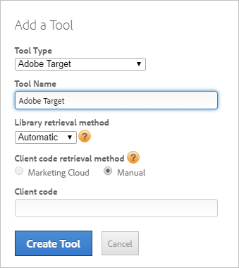
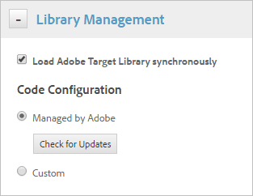
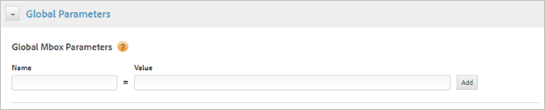
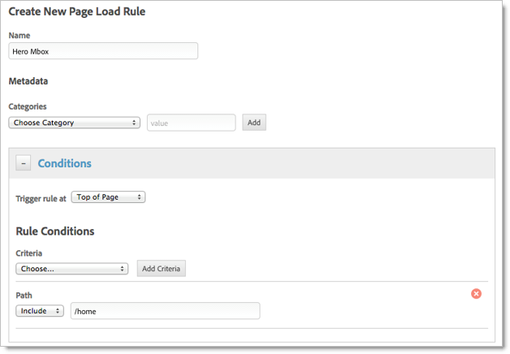
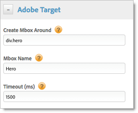
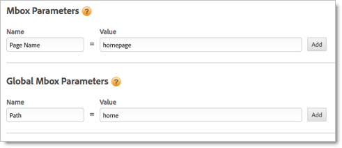
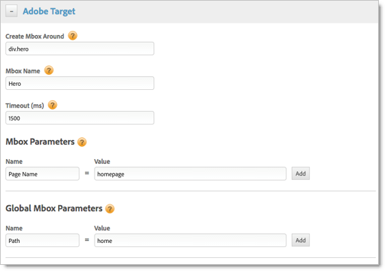

# Adobe Target Tool

Information about creating the Adobe Target tool for deploying Adobe Target in dynamic tag management. You can configure the library automatically (recommended) or manually.

## Adobe Target Tool {#concept_90D4021A9B6E409D8101FA1AFADE1215}

Information about creating the Adobe Target tool for deploying Adobe Target in dynamic tag management. You can configure the library automatically (recommended) or manually.

>[!NOTE]
>
>For best practices, see [Best Practices for Implementing Adobe Target Using Dynamic Tag Management](https://marketing.adobe.com/resources/help/en_US/target/dtm/).

**[!UICONTROL <Web Property Name>]** > **[!UICONTROL Overview]** > **[!UICONTROL Add a Tool]** > **[!UICONTROL Adobe Target]**

## Field Descriptions - Add a Tool (Adobe Target) {#section_957AFF495DC04E548D0084C0F3063DBF}

The following table describes the fields and options on the [!UICONTROL Add a Tool] page (and the tool edit page) for [!DNL Adobe Target]. This table provides information for the automatic and manual configuration settings. 

<table id="table_CA5DF97568E64EDEACC0859DA5CA7D7F"> 
 <thead> 
  <tr> 
   <th colname="col1" class="entry"> Setting </th> 
   <th colname="col2" class="entry"> Description </th> 
  </tr> 
 </thead>
 <tbody> 
  <tr> 
   <td colname="col1"> 
Tool Type 
 </td> 
   <td colname="col2"> 
 The type of tool, such as  Adobe Target. 
 </td> 
  </tr> 
  <tr> 
   <td colname="col1"> 
Tool Name 
 </td> 
   <td colname="col2"> 
 The name for this tool. This name displays on the  Overview tab under  Installed Tools. 
 </td> 
  </tr> 
  <tr> 
   <td colname="col1"> 
Library retrieval method 
 </td> 
   <td colname="col2"> 
 Specifies whether Adobe should manage your  Adobe Target code automatically, or whether you would like to provide your own custom code manually. 
 
 <b> Manual Configuration Method</b> 
 
You can manually manage the  Adobe Target code. You can download the  at.js or  mbox.js file from the Target solution interface as follows: 
 
    <ul id="ul_CD6362924F5F486B8036B4A1F3E731AC"> 
     <li id="li_261F495AF88041E9A48F99A8BF74FFCD">Target Standard:  Setup &gt;  Implementation &gt;  Download at.js </li> 
     <li id="li_E1D96647B04844909C61806D9BCDAD27">Target Standard:  Setup &gt;  Implementation &gt;  Download mbox.js </li> 
     <li id="li_68A9E7B987A348BA9E11D8415BFD7CE6">Target Classic:  Configuration- &gt;  mbox.js &gt;  Download </li> 
    </ul> 
 After you download the code locally, copy and paste the code into the editor field in the Library Management section of the tool settings. You also have the option of hosting the code at a specific URL as an alternative to manually pasting in the code. 
 
 <b>Automatic Configuration Method</b> 
 
 
Note:  This works for mbox.js only. 
 
 
 Dynamic tag management automatically retrieves the latest  mbox.js code from your  Adobe Target account configuration. If you select  Automatic, you must either be logged in via the Experience Cloud, or you must provide a Client Code value described below. 
 </td> 
  </tr> 
  <tr> 
   <td colname="col1"> 
Client code retrieval method 
 </td> 
   <td colname="col2"> 
(Automatic method) A code unique to your  Adobe Target account. It is required for your code to be provided and managed automatically by Adobe. If you chose the Automatic method, you must either be logged in via the Experience Cloud, or provide your Client Code value after selecting  Manual as the retrieval method. 
 </td> 
  </tr> 
  <tr> 
   <td colname="col1"> 
Client Code 
 </td> 
   <td colname="col2"> 
 (Automatic method) The Client Code value can be retrieved from the  Adobe Target solution interface as follows: 
 
    <ul id="ul_1744D4D51DFE44158C5AC5A77FF5198C"> 
     <li id="li_D9CE4F3E201241BABA81D3C527D5CB77">Target Classic:  Configuration &gt;  mbox.js &gt;  Edit &gt; <i>copy value for Client</i>. </li> 
     <li id="li_AA670B39F39446A282FD684F83340735">Target Standard:  Setup &gt;  Implementation &gt;  Download mbox.js &gt; <i>copy value for Client from within mbox.js file</i>. </li> 
    </ul> </td> 
  </tr> 
 </tbody> 
</table>

## Library Management - Adobe Target {#concept_DD6234BB44134EE88F7CD67191366CBC}

Descriptions of the fields and options in the Adobe Target Library Management settings in dynamic tag management. 

<!-- 

target_library_management.xml

 -->

<!-- 

TAGS for ditamap 

 -->

**[!UICONTROL Property]** > **[!UICONTROL    Edit Tool]** > **[!UICONTROL Library Management]**

 

<table id="table_12095D9D6F124374B921573FFFFC5987"> 
 <thead> 
  <tr> 
   <th colname="col1" class="entry"> Element </th> 
   <th colname="col2" class="entry"> Description </th> 
  </tr> 
 </thead>
 <tbody> 
  <tr> 
   <td colname="col1"> 
 Load Adobe Target Library synchronously 
 </td> 
   <td colname="col2"> 
 This option ensures the  at.js or  mbox.js code is loaded synchronously in the  &lt;head&gt; section. It is generally recommended that you leave this option enabled. It is an  Adobe Target best practice to load the code in this way. 
 </td> 
  </tr> 
  <tr> 
   <td colname="col1"> 
 Code Configuration 
 </td> 
   <td colname="col2"> 
 <b> Managed by Adobe:</b>(mbox.js only) This option is equivalent to the Automatic configuration method available when creating the tool. This option loads the  mbox.js code directly from Adobe. 
 
This feature optimizes the configuration process when using a manual method, because no more copying or pasting from the  Adobe Target admin console is required. 
 
    <ul id="ul_54AC746FFAB145909B0B034D41454497"> 
     <li id="li_8F8C980369E64412B8921B06FC39657E">You must be logged in via Experience Cloud or have provided the appropriate <a href="../tools/target.md#section_957AFF495DC04E548D0084C0F3063DBF" format="dita" scope="local"> Client Code</a> for this option to be available. </li> 
     <li id="li_1B2263F4D63741E38223C2C04F9526D4">Clicking  Check for Updates automatically checks for new versions of the  mbox.js code within your associated  Adobe Target account. If a new version is identified, you have the option to use it or retain the current version. </li> 
    </ul> 
 <b> Custom:</b> You can manually configure the at.js or  mbox.js code. Two methods are available to manually host the code in dynamic tag management: 
 
    <ul id="ul_FF7CA4BE72484558AFECD8B85868C7F3"> 
     <li id="li_40115E76F6D54640B12D9200458957EA"> <b>In DTM:</b> Click  Edit Code and paste the code in the editor. If you were using  Managed by Adobe and switch to  custom, the editor automatically populates with your  mbox.js code. You can replace this with the content of the  at.js library. </li> 
     <li id="li_F8A46A7A25934A4BA37DA6CC75B2DB1F"> <b>At URL:</b> If your  at.js or  mbox.js is configured as desired, you can provide the URL to the file. Dynamic tag management will consume it for use in the  Adobe Target tool. </li> 
    </ul> </td> 
  </tr> 
 </tbody> 
</table>

## Global Parameters - Adobe Target {#concept_0946C2AAB8044A9297FF498DB7157F42}

Descriptions of the fields and options in the Global Parameters settings in dynamic tag management for an Adobe Target Tool. 

<!-- 

target_global_params.xml

 -->

Global parameters let you pass additional data to the global [!DNL Adobe Target] mbox, and also on a per-page basis via page load rules.

The parameters configured in dynamic tag management do not override parameters already defined on the page, but instead appends and sequences to create maximum flexibility and customization on a per page basis.

**[!UICONTROL Property]** > **[!UICONTROL    Edit Tool]** > **[!UICONTROL Library Management]**

 

<table id="table_1BC88AFFC99648C7995D3B88BB0DAA8C"> 
 <thead> 
  <tr> 
   <th colname="col1" class="entry"> Element </th> 
   <th colname="col2" class="entry"> Description </th> 
  </tr> 
 </thead>
 <tbody> 
  <tr> 
   <td colname="col1"> 
Name 
 </td> 
   <td colname="col2"> 
 Indicate the name of the additional parameter(s) you wish to pass to the global mbox. 
 
    <!--
Adobe Target does not accept the usage of <i>&amp;</i> in this field. Using it leads to errors on the web page. 
--> </td> 
  </tr> 
  <tr> 
   <td colname="col1"> 
Value 
 </td> 
   <td colname="col2"> 
 Indicate the value of the additional parameter(s) you want to pass to the global mbox. The value is typically a data element. 
 </td> 
  </tr> 
 </tbody> 
</table>

## Mbox rule example for Dynamic Tag Management {#task_2642B010AB204834A2AF7CEACDAC23F7}

An example of how to place wrapping mboxes with built-in flicker handling via dynamic tag management when an Adobe Target tool is installed. 

<!-- 

t_target_example.xml

 -->

This functionality currently uses the *`mboxUpdate`* method. 

1. Click **[!UICONTROL Property]** > **[!UICONTROL Rules]** > **[!UICONTROL Page Load Rules]** > **[!UICONTROL Create New Rule]**.
1. Name and configure the rule.

   

   Configure the rule so that it fires only on the pages where you want to deploy the mbox.

   >[!NOTE]
   >
   >Adobe recommends load rules triggering mboxes at *`Top of Page`* to ensure the default content is hidden until the mbox response has been received.

   See [Rule Conditions and Functions](../rules/rules.md#reference_662A7B7D177C46C98980CD317A7A8861) for information about available rule criteria. 

1. Expand **[!UICONTROL Adobe Target]**.

   

   Specify the element to wrap with the mbox using a CSS selector, name the mbox, then configure the timeout if needed. (It is generally recommended to leave this at the default 1500 ms). 

1. Configure the parameters you want to add to the [!DNL Target] mbox or to the global [!DNL Target mbox].

   

   In this example, this rule deploys an mbox named `Hero` that wraps a `div` element with an `id` of `hero` and includes an mbox parameter named `Page Name` with a value of `homepage`. It also includes a parameter named `Path` with a value of `home` that it passes to the global mbox.

   

   >[!NOTE]
   >
   >You can also use data elements in the parameter UI fields to dynamically populate the value. See [Data Elements](../data_elements.md#concept_8A4591BD0F4241B6925D976482C43CD2) for more information on data elements.

